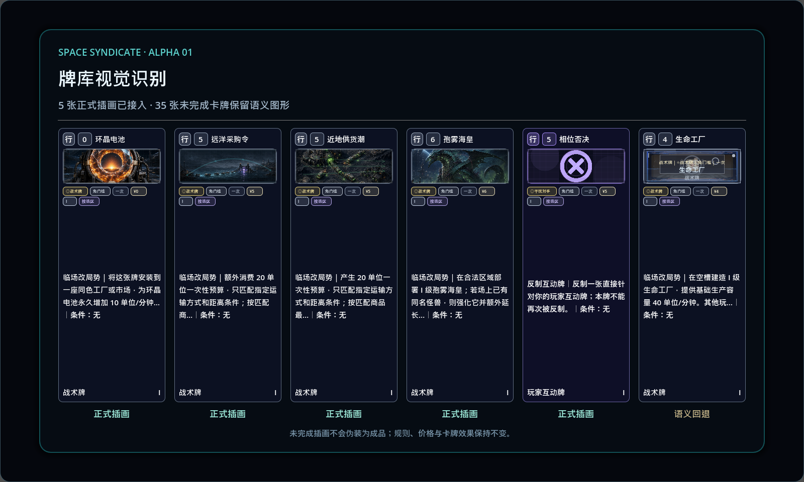

# Alpha 0.1 card illustration production cutover

## Result

The Alpha 0.1 playtest pool contains exactly 40 rank-I card identities. Five existing, evidence-backed illustrations now reach the production card presentation path; the remaining 35 cards intentionally retain the existing semantic `CardArtView` fallback.

This cutover changes presentation only. It does not change card identity, effect fields, legality, price, targets, save data, acquisition, or resolution.



## Coverage

| State | Count | Contract |
|---|---:|---|
| Production illustration | 5 | A typed catalog maps a card identity to an opaque `alpha01_art_*` presentation key. |
| Semantic fallback | 35 | An empty presentation key keeps the existing procedural/semantic art visible. |
| Fake rendered entries | 0 | Missing art is never labelled or rendered as completed art. |

The authoritative QA status list is `res://data/art/alpha01_card_illustration_status_manifest.json`. Its union is checked against `Alpha01ContentManifest.card_family_ids` and must remain exactly 40 identities.

## Production paths

```text
Hand / region supply
  CardPresentationRuntimeService
    -> CardIllustrationCatalog (read-only)
    -> opaque illustration_key
    -> CardViewSnapshot / DistrictSupplySnapshotService
    -> CardUI
    -> CardIllustrationLayer or semantic CardArtView fallback

Card Codex
  CardCodexPublicSourceService
    -> CardIllustrationCatalog (read-only)
    -> CardCodexPublicSourceAdapter
    -> CardCodexPublicSnapshotService
    -> CardCodexThumbnailCard / CardFace detail
```

`CardIllustrationCatalog` is presentation-only and does not own cards or gameplay state. `CardIllustrationLayer` resolves only catalog-issued presentation keys. No UI consumer reads the QA manifest or asset paths.

## Privacy and provenance boundary

Player-facing snapshots may contain only `illustration_key`, using opaque values such as `alpha01_art_001`. They must not contain:

- asset paths;
- SHA-256 hashes;
- license or attribution text;
- authoring source IDs;
- upstream repository IDs;
- private card ownership, hand, cash, AI plan, or hidden-owner facts.

Paths, hashes, source type, license, attribution, and release-review status remain in the QA manifest and existing license evidence only.

## Rendered identities

| Card identity | Source class | Release note |
|---|---|---|
| `commodity.ring_crystal_battery.rank_1` | project-authored candidate | Review before commercial release. |
| `supply_demand.remote_sea_order.rank_1` | project-authored candidate | Review before commercial release. |
| `supply_demand.near_land_supply.rank_1` | project-authored candidate | Review before commercial release. |
| `unit.monster.spore_tide_emperor.rank_1` | project-authored candidate | Review before commercial release. |
| `interaction.phase_veto.rank_1` | CC-BY-3.0 game-icons asset | Attribution is required unless replaced. |

Exact paths, hashes, and evidence files are intentionally kept out of player-facing data and are recorded in the status manifest.

## Acceptance gates

- exact 40-ID parity;
- exactly 5 rendered and 35 fallback identities;
- asset existence and SHA-256 parity for all five rendered entries;
- license evidence exists for all five rendered entries;
- opaque-key parity across CardUI, hand, region supply, Codex thumbnail, and Codex detail;
- no provenance fields in player ViewModels;
- low-resolution CardUI remains functional with both rendered and fallback art;
- production Bench renders five illustrations and one honest fallback;
- UI text smoke, visual snapshot, and smoke check-only remain green.
