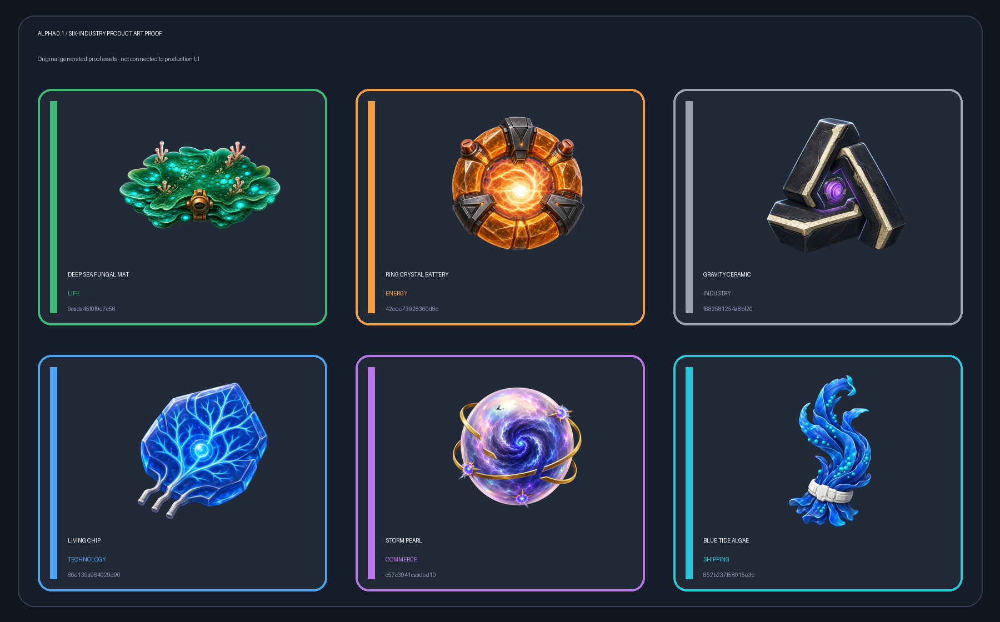

# Alpha 0.1 six-industry product-art proof

This QA surface shows one proof commodity from each authoritative Alpha 0.1 industry. It is generated from `data/art/alpha01_product_art_manifest.json` and is not a production gameplay or UI consumer.

Hard review criteria:

- six stable Alpha product IDs;
- one item from each of the six industries;
- six different silhouettes, material families, palettes, and compositions;
- `512×512` RGBA PNGs with usable transparent silhouettes;
- unique committed and raw-source SHA-256 values;
- generated-art provenance and prompts recorded;
- no production hot-file or shared-manifest modification.

The integration handoff is recorded at `docs/integration_requests/P2-ALPHA01-SIX-INDUSTRY-PRODUCT-ART-PROOF.json`.
