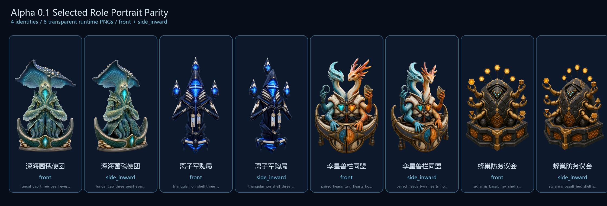
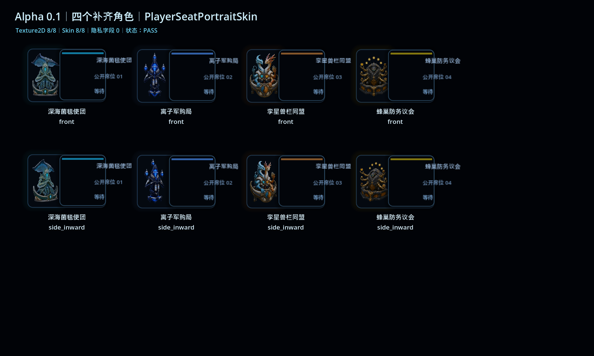

# Alpha 0.1 selected-role portrait parity

This proof closes the portrait gap for four roles already selected by the
Alpha 0.1 content manifest:

| Role | Identity read | Front | Side inward |
|---|---|---:|---:|
| 深海菌毯使团 | broad fungal cap, three pearl eyes, crescent seat | ready | ready |
| 离子军购局 | triangular ion shell, archive collar, three capacitors | ready | ready |
| 孪星兽栏同盟 | paired heads, twin heart cores, horseshoe saddle | ready | ready |
| 蜂巢防务议会 | basalt hex shell, six voting arms, six staff nodes | ready | ready |

## Hard acceptance

- 4 distinct role identities and 8 unique PNG hashes.
- Every runtime PNG is `512x768`, imported as RGBA8, with transparent corners.
- Subject coverage stays between 28% and 62%.
- Subject height is at least 80% and its bottom anchor reaches the lower 6% of
  the canvas, keeping the command-seat pivot consistent.
- Same-role front/side perceptual distance is at least 140 combined dHash bits.
- Cross-role perceptual distance is at least 180 combined dHash bits.
- `front` is authored straight-on; `side_inward` is authored as a genuine
  left-facing three-quarter view. Right-side seats may mirror that authored
  inward view through the unchanged Skin contract.
- No text, watermark, named IP, third-party model, weapon, or gradient
  placeholder is present.

The machine-readable thresholds are in `art_contract.json`; measured evidence
is in `validation_report.json`.

## Godot component evidence

The scoped Bench loads all eight files through `RolePortraitCatalog`, applies
them through the existing `PlayerSeatPortraitSkin`, and does not modify the
Skin, player-seat host, GameScreen, PlanetBoard, PlayerBoard, Main, rules, or
content catalog.

The shared historical fallback Bench still uses 深海菌毯使团 as a missing-art
sentinel. That stale fixture is deliberately left untouched here and listed in
`docs/integration_requests/alpha01_selected_role_art_parity.json` for the
integration owner.

## Verification

- Alpha image/provenance validator: PASS, 4 roles / 8 images / 8 unique
  runtime hashes / 8 unique source hashes.
- Godot asset-and-Skin test: PASS, 138 checks.
- Existing selected-role consumer: PASS, 14 checks.
- Existing seat portrait component test: PASS, 153 checks.
- Godot MCP Skin Bench: PASS, 8/8 textures, no runtime or stop errors.
- UI text smoke: PASS.
- Smoke `--check-only`: exit 0; only the repository's existing NUL-character
  scan warnings were reported.

The historical all-role `validate_role_portraits.py` still stops on the
pre-existing source-model hash mismatch for 环港走私议会. This branch does not
alter that third-party source asset or weaken the assertion; its scoped Alpha
validator is the acceptance gate for these generated originals.
