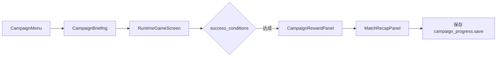

# Campaign Chapter Settings

本文件独立记录战役关卡配置规则。它面向开发者和测试，不进入玩家主 UI。

目标：战役不是另一套游戏，而是把真实运行路径切成可试玩的学习章节。每个 chapter 必须能加载真实 scenario/runtime fixture、进入 `main.tscn` 的 `RuntimeGameScreen`，并在完成后输出奖励和复盘。

## 配置入口

| 层级 | 位置 | 职责 |
|---|---|---|
| 战役定义 | `data/campaign/tutorial_campaign.json` | 章节顺序、解锁关系、标题、目标、奖励摘要。 |
| 场景定义 | `data/scenarios/*.json` | 该章节使用的真实剧本、桌面状态、目标状态。 |
| 运行夹具 | `scripts/scenario/scenario_fixture_factory.gd` | 把 `scenario_id` 转成 runtime fixture，供主桌加载。 |
| 战役读取 | `scripts/campaign/campaign_definition.gd` | 读取 campaign 数据。 |
| 进度 | `scripts/campaign/campaign_progress.gd` / `campaign_save.gd` | 已完成、已解锁、当前选中章节。 |
| 奖励/复盘 | `scripts/campaign/campaign_reward_service.gd` | 完成后进入 RewardPanel，再进入 MatchRecapPanel。 |

## Chapter 字段契约

每个 chapter 至少要能形成以下结构：

| 字段 | 类型 | 规则 |
|---|---|---|
| `id` | String | 稳定唯一 ID，例如 `01_first_table`。不要复用旧 ID。 |
| `scenario_id` | String | 必须能被 scenario loader 读到，并能由 fixture factory 生成 runtime fixture。 |
| `title` | String | 玩家可读标题，只写当前要学/玩的内容。 |
| `objective` | String | 这一关主目标，CampaignCoach 只显示一个主目标。 |
| `primary_cta` | Dictionary | 主桌只显示一个主 CTA，例如“点选区域”“购买一张牌”。 |
| `success_conditions` | Array | 必须能由真实运行状态触发，不应只靠 demo flag。 |
| `unlock_after` | Array/String | 解锁依赖；初始章节可为空。 |
| `reward` | Dictionary | 可展示奖励，不泄露隐藏信息。 |
| `recap_prompts` | Array | 复盘要回答“关键行动、学到什么、下次建议”。 |

## 运行夹具契约

`scenario_fixture_factory.gd` 生成的 fixture 必须至少包含：

| 字段 | 用途 |
|---|---|
| `scenario` | 剧本公共配置。 |
| `coach` | 当前目标、主 CTA、简短提示。 |
| `table_state` | 主桌公开状态，不含对手手牌/现金/真实计划。 |
| `replay` | 复盘和测试使用的公开行动摘要。 |
| `visual_events` | 给 `ScenarioLabShowcaseAdapter` 消费的演出事件。 |

以下章节必须输出 `visual_events`：

- `first_table`
- `monster_pressure`
- `public_track_intro`
- `bid_practice`

`visual_events` 只放公开演出，例如牌轨亮起、星球区域高亮、怪兽压力、竞价提示。禁止放 `true_owner`、`hidden_owner`、`owner_truth`、对手现金、对手手牌、AI 私有计划。

## CampaignCoach 规则

主桌上的 CampaignCoach 必须像桌边提示卡：

1. 只显示一个当前 objective。
2. 只突出一个主 CTA。
3. 辅助操作进入低权重菜单。
4. 不展示长规则，不展示开发术语。
5. 不展示 AI 评分、隐藏路线、真实现金、真实手牌。

玩家文案优先短句：

- “点一个区域。”
- “建一座城市开始赚钱。”
- “从怪兽附近买一张牌。”
- “看牌轨，猜这张牌是谁打的。”

## 完成与复盘流程

RewardPanel 只负责奖励确认；MatchRecapPanel 负责解释本关：

- 关键行动：玩家/AI/怪兽/牌轨发生了什么。
- 学到什么：本关训练的核心规则。
- 下次建议：下一关如何继续。

## 解锁与保存

`campaign_progress.save` 至少保存：

- `campaign_id`
- `completed_chapter_ids`
- `unlocked_chapter_ids`
- `selected_chapter_id`

保存文件是本地进度，不应包含对手真实现金、手牌、AI 私有计划或 hidden owner truth。

## 隐私边界

玩家 UI 禁止出现：

- 对手现金
- 对手手牌
- 对手弃牌
- AI 私有计划
- AI 评分拆解
- `true_owner`
- `hidden_owner`
- `owner_truth`

允许存在于测试/dev-only 报告中的内容，必须明确标记为 developer/test only，不得注入玩家-facing snapshot。

## 新增章节检查清单

新增一个 chapter 时，必须检查：

1. `id` 稳定唯一。
2. `scenario_id` 能加载 scenario。
3. runtime fixture 不为空。
4. CampaignBriefing 的“开始”能进入真实 `RuntimeGameScreen`。
5. CampaignCoach 只有一个主 CTA。
6. success condition 能被真实运行状态触发。
7. 完成后 RewardPanel → MatchRecapPanel。
8. 进度能保存已解锁章节。
9. 玩家 UI 不泄露隐藏信息。
10. 如果是演出教学章节，`visual_events` 可被 ScenarioLabShowcaseAdapter 消费。
