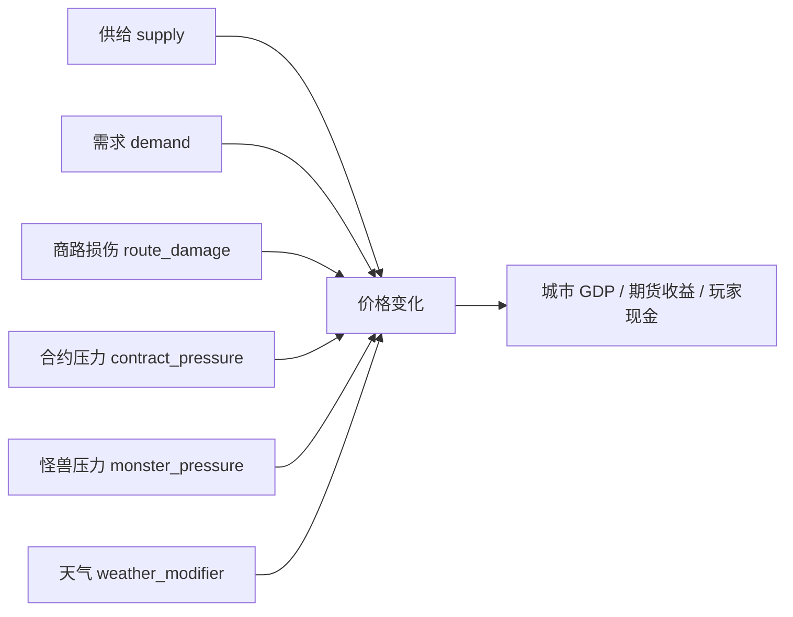

# Global Environment Balance

本文件独立记录天气、市场刷新、经济波动和全局环境变化。它面向开发者、测试和后续 AI/模拟器，不进入玩家主 UI。

核心原则：

- 天气和市场刷新是公开全局信息。
- 新闻不是被动触发；新闻类事件应由玩家打出的卡牌制造。
- 商品价格不能被玩家直接任意改价，只能由供给、需求、商路、合约、怪兽、天气等因果字段改变。
- 天气预报必须提前出现，给玩家留决策空间。

## 代码入口

| 模块 | 位置 | 职责 |
|---|---|---|
| 环境因果模型 | `scripts/balance/environment_balance_model.gd` | 天气状态、预报窗口、市场刷新、经济波动。 |
| 运行期平衡 hub | `scripts/balance/runtime_balance_model.gd` | 汇总环境、商品、移动、战斗和卡牌价格报告。 |
| 平衡目标数据 | `data/balance/runtime_balance_targets.json` | 固化硬性范围和设计锚点。 |
| 开发者灰盒 | `scenes/ui/DeveloperBalancePanel.tscn` | 只在 dev 模式展示摘要，不进玩家主 UI。 |

## 全局刷新节奏

| 项目 | 硬范围 | 设计意图 |
|---|---:|---|
| 市场刷新 | 30–60 秒 | 供需/价格等公开全局状态可以周期刷新。 |
| 天气预报 | 60–180 秒提前 | 玩家能提前看到天气窗口并调整建城、商路、怪兽/军队路线。 |
| 天气持续 | 75–180 秒 | 天气足够长，能形成战术窗口，但不永久锁死地图。 |
| 单次天气区域 | 1–5 个区域 | 星球越大，允许同时预报/影响的区域越多。 |

对应函数：

| 函数 | 输出 |
|---|---|
| `market_refresh_interval_seconds(depth, volatility_level)` | 市场刷新秒数。 |
| `weather_forecast_window_seconds(depth, volatility_level)` | 天气提前预告秒数。 |
| `weather_duration_seconds(weather_state, depth)` | 天气持续秒数。 |
| `weather_zone_count_model(depth, region_count)` | 受影响区域数。 |
| `global_environment_refresh_model(depth, region_count, active_weather_count, volatility_level)` | 全局环境刷新摘要。 |

## 天气状态

当前硬函数支持这些天气状态。后续可以增加，但新增天气必须写清楚影响字段。

| 天气 | 主要影响 | 典型用途 |
|---|---|---|
| `clear` / `calm` | 无明显惩罚 | 默认状态、恢复窗口。 |
| `rain` / `monsoon` | 小幅降低交通，提高部分食物/海洋产出 | 温和供需扰动。 |
| `storm` / `ion_storm` | 明显降低交通，增加断路压力和怪兽压力 | 商路危机、怪兽推进窗口。 |
| `tidal_surge` | 海洋/沿海运输受压，海洋商品可有产出扰动 | 海域地图压力。 |
| `drought` | 食物/生物产出下降，需求上升 | 食物价格和城市需求窗口。 |
| `solar_wind` | 科技/数据交通受扰，能源可能受益 | 科技商品和能源商品分化。 |
| `meteor_shower` | 交通/产出受压，断路风险高 | 全局危机、重压制窗口。 |
| `miasma` | 需求下降，怪兽压力上升 | 怪兽诱导、污染/雾气主题。 |

对应函数：

`weather_state_effect_model(weather_state, terrain, product_category)`

输出字段：

- `production_multiplier`
- `transport_multiplier`
- `demand_multiplier`
- `price_weather_modifier`
- `route_damage_pressure`
- `monster_pressure_modifier`
- `public_forecast_required`
- `causal_tags`

## 商品价格因果链

商品价格变化必须来自以下字段：

硬性约束：

- 稳定商品单次刷新变化不超过约 12%。
- 普通商品单次刷新变化不超过约 22%。
- 危机/高波动商品单次刷新变化不超过约 40%。
- 超过 40% 的变化必须来自明确危机来源；当前硬函数不允许默认超过 40%。

对应函数：

- `product_price_model(...)`
- `product_price_step_cap(volatility, base_price)`
- `economic_volatility_model(...)`

## 经济波动函数

`economic_volatility_model(base_volatility, supply_pressure, demand_pressure, route_damage, monster_pressure, weather_pressure, contract_pressure)`

设计意图：让“价格跳动”可解释，而不是随机乱跳。它会输出：

- `volatility_score`
- `volatility_band`
- `single_refresh_cap_pct`
- `driver_summary`

波动来源：

1. 供需差距。
2. 商路损伤。
3. 怪兽压力。
4. 天气压力。
5. 合约压力。

这五类都是玩家能从公开地图、牌轨、天气预报、合约/商品 UI 推理到的因素。

## UI 呈现原则

主桌不显示长解释，只显示短状态：

- 天气图标/短标签。
- 预报倒计时条，不写密集时间文本。
- 受影响区域高亮。
- 商品价格趋势箭头。
- 简短 driver tooltip，例如“风暴：交通↓ 商路风险↑”。

详细解释进入：

- 规则附录。
- 经济总览。
- 商品图鉴。
- 开发者 balance 灰盒。

## AI 与模拟使用

AI 读取环境时应读字段，不读文案：

- `transport_multiplier`
- `production_multiplier`
- `demand_multiplier`
- `price_weather_modifier`
- `route_damage_pressure`
- `monster_pressure_modifier`
- `volatility_band`
- `single_refresh_cap_pct`

AI 可据此选择：

- 保护商路。
- 趁风暴破坏高价值运输线。
- 在干旱前买食物/生物相关期货。
- 在雾瘴中诱导怪兽。
- 修复受天气影响的交通城市。

## 新增天气检查清单

新增天气状态时必须：

1. 写入 `weather_state_effect_model`。
2. 至少影响一个公开字段。
3. 不直接泄露隐藏玩家信息。
4. 有预报窗口，不做瞬间无预告惩罚。
5. 能被 AI 通过字段读取。
6. 能在规则附录用一句短句解释。
7. 不制造被动新闻；如果需要新闻感，做成玩家打出的新闻/传媒类卡牌。
