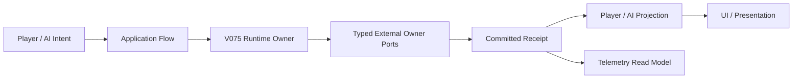

# 《Space Syndicate / 太空辛迪加》V0.7.5 开发者交接日志

> 交接基线：PR #90 Head `1e948a15e17faffe648722fd596fac01a4525426`，Tree `8508df4e900a73c058566f00fc556ec1d11e08ca`。
> 状态标签：**LIVE** 已由当前产品代码或正式规则确认；**TEST_ONLY** 仅为测试夹具/离线验证能力；**PLANNED** 尚未实现；**RETIRED** 已禁止重新引入；**UNVERIFIED** 当前没有足够证据。
> 当前终态：**BLOCKED_AFTER_FORMAL_GATE1_RUNNER_AND_IMPORT_PRECONDITION_FAILURE**。PR #90 尚未合并；新 Head CI 成功。唯一正式 Attempt 已消费并永久冻结：Gate 1 Godot 进程真实启动，但当前 Head Clone 没有 Canonical Import Cache，随后 Raw `diagnostics` singleton 又因序列化为 object 被 Normalizer fail closed；Gate 2—79 未启动。

## 1. 五分钟总览

《太空辛迪加》是一款在动态球面星球上进行设施经营、共享卡牌供应、牌库构筑、怪兽与军队战斗的多人策略游戏。玩家围绕六色资产、十格共享“寿司轨”、个人 DBG 牌库、地区设施和公开/私密信息边界行动；AI 使用与玩家相同的合法候选与权威执行链，不应获得对手隐藏手牌、未来目标或仓库私货。【LIVE；来源：`docs/rules/v075_game_constitution.md`、`docs/rules/v075_combat_authority_manifest.json`、`scripts/v075_runtime/v075_runtime_owner.gd`】

当前产品入口是 `scenes/main.tscn`。它加载 `V075RuntimeComposition` 和 `V075SampleGameScreen`，由 `scripts/v075_runtime/v075_application_bootstrap.gd` 负责装配；旧的 `scripts/main.gd` 已从生产路径删除，不能恢复为巨型 God Object。【LIVE；来源：`scenes/main.tscn`、`tests/v074_legacy_main_retirement_test.gd`】

PR #90 当前仍为 GitHub Draft、可合并，最新 CI Run `31956611702` 为 SUCCESS。唯一产品修复 commit `1e948a15` 只修改 `V075RuntimeOwner._build_bound_actions()`：真实 typed Combat Owner 仍走 preview/validate/commit；只实现最小必需合同的历史/测试 Owner 回退到既有 `prebind_monster_card_action` 与 `build_military_lock`。没有改数值、测试、Canonical Gate Manifest 或规则预期。【LIVE；来源：commit `1e948a15`、Gate 15/16/60 定向 Result】

但 PR #90 还不能合并。旧 Head `6d4d52df` 的正式 Continuation 002 已完成 Gate 2—15（14/14 PASS），Gate 16 `v075_combat_submission_rollback_test.gd` 真实产品 FAIL 后停止；Raw SHA 为 `a72f48f06175286e38c5d82a6d4c08f15ee53e3eec7a1a91b8a63e9db7268b9b`。修复后 Gate 15、16、60 均 PASS，新 Head CI 也 PASS，但这些不是新 Head 的完整 79 Gate Release 证据。【LIVE/UNVERIFIED；来源：冻结 Formal Attempt、定向 Result、GitHub Actions】

下一位开发者的第一件事不是做 V0.7.6，也不是重跑 Formal Attempt 001，而是执行 `PR90_RELEASE_HEAD_BOUND_IMPORT_CACHE_AND_RAW_DIAGNOSTICS_CARDINALITY_REPAIR`。它只修复新的 append-only Tooling Preflight：Import Evidence 必须与当前 Head/Tree/Clone 和物理 Cache 绑定；Raw diagnostics 无论 0/1/N 项都必须保持 JSON array。修复全绿后仍要另行请求新的完整产品 Attempt 授权。【LIVE Tooling；来源：Formal Attempt 001 Raw Result、Execution Start 与 Summary】

## 2. 当前里程碑时间线

### V0.7.3：可观察的动态球面桌面

V0.7.3 奠定了球面地图展示、地区点击/缩放/旋转、响应式桌面和 Playtest Telemetry 的基础。该版本留下的 Presentation Adapter、地图命中测试和固定行动轮转仍被后续继承，但不能把 V0.7.3 的旧地图假设当成 V0.7.5 的最终地理合同。【LIVE/RETIRED 混合；来源：`docs/rules/v073_game_constitution.md`、`docs/rules/v074_amendment_from_v073.md`】

### V0.7.4：动态地图、三设施、仓库、十格轨与六色资产

V0.7.4 把地图权威收口到 `V074MapGenesisCore`，支持 6—30 地区工程范围、陆地/海洋身份、动态邻接和稳定 Region ID；设施注册表不再只认识 Factory/Market，而是 Factory、Market、Warehouse 三类；共享供应轨固定为十个可见位置；玩家资产以六个独立 Pip 表达 Available、Reserved、Empty 与 Projected Refresh。【LIVE；来源：`docs/rules/v074_game_constitution.md`、对应 V074 Gate】

### V0.7.5：完整 Combat Authority 原子切换

V0.7.5 只修改战斗域，继承 V0.7.4 的地图、设施、仓库、轨道、资产、Victory 与 new-game-only 边界。一个 `V075CombatRuntimeOwner` 管理怪兽来源、私密技能状态、军队任务、Combat Receipt Journal 与 exact-once；地图、设施、资产、DBG、Victory 和生产 Save 不归 Combat 所有，只能通过 typed ports 通信。【LIVE；来源：`docs/rules/v075_game_constitution.md`、`docs/rules/v075_combat_authority_manifest.json`】

### PR #90：Gate 60 能力目录与预绑定修复，随后产品落地收口

PR #90 统一了怪兽四模式与军队两任务的 capability catalog，使“完整支持目录”和“当前世界可行动候选”不再混淆，并把 card identity、target、generation/revision 从候选一路保存到 queue、runtime 和 receipt。commit `1e948a15` 进一步在 action build 阶段保留 typed Owner 的严格路径，同时恢复最小合同 Owner 的既有 fallback，修复 submission rollback/exact-once 兼容性而不降低真实能力校验。【LIVE；来源：`docs/architecture/v075_ai_combat_capability_authority_matrix.md`、commit `1e948a15`】

### 本任务实际完成与未完成

已完成：旧工具链冻结与 Result/Cardinality/Binding 证据；ReleaseRunPlanV1 与 first-product-process accounting 修复；旧 Head Gate 2—15 的 14 项 PASS；Gate 16 产品失败定位；一次允许的产品修复；Gate 15/16/60 定向 PASS；新 Head CI SUCCESS；新 Head 四方身份与干净 Acceptance Clone；Gate 1 Source Contract V2；六类相同 Worker Dry Run、reuse 正负例、真实 Result Projection 与双模式 Aggregate；正式 Attempt 001 的 Gate 1 进程启动、Raw Result、Runner stop 与零残留已冻结。【LIVE/TEST_ONLY；来源：Acceptance Evidence、Preflight Seal、Formal Attempt 001】

未完成：当前 Head 有效 Canonical Import、可判定的 Gate 1 Product Authority、Gate 2—79、79/79 Aggregate、Post-Aggregate Review、Exact-SHA MCP、Viewport、3/4/6/8 Headless Matrix、2,000 局 Product Headless、PR Ready、merge commit、Release Tag。【UNVERIFIED/NOT_RUN；来源：Formal Attempt 001 blocker】

## 3. 玩家当前能做什么

玩家可从真实 `main.tscn` 进入 V0.7.5 Runtime Composition；当前样品以新局流程为权威基线，不应把旧存档兼容描述成已经完成。【LIVE/UNVERIFIED；来源：`scenes/main.tscn`、Constitution 的 new-game-only 条款】

一局中，地图由稳定 Seed 与规则请求生成动态地区，地区带陆地/海洋身份、邻接、设施槽和日照信息。玩家在桌面上查看地区、选择公开目标并接收只读投影；UI 不得写地图权威状态。【LIVE；来源：V074 Map Genesis 与 Player Projection】

共享寿司轨同时展示十个卡牌实例。购买会形成空位并保持缓慢滚动语义，不应在购买瞬间补牌、推进 supply cursor 或额外抽 RNG。供应抽取与卡牌 `primary_color` 由统一轨 Authority 决定，怪兽 preferred color 不能覆盖牌实例颜色。【LIVE；来源：V074/V075 Constitution】

购买的普通卡进入个人弃牌池，随后通过正常 DBG 洗回和抽牌进入手牌；卡牌成功或 Fizzle 后依其生命周期进入目标区，UI 不可自行移动权威卡牌。设施卡支持 Build、Upgrade、Repair；设施槽、generation 和 expected revision 在锁定与提交时校验，争抢或目标失效按 typed Fizzle 处理。【LIVE；来源：V07 Semantic Core、V074 Facility Core】

怪兽卡可预绑定四种模式：部署新怪兽、刷新现有同族怪兽、升级更高 Rank、在容量上限时替换不同族怪兽。怪兽在维护边界基于公开快照自主寻找 preferred-color 敌方设施；ground_trample 可按固定点球面距离对敌方 Factory/Market/Warehouse 造成受限践踏，飞行/传送不践踏。【LIVE；来源：V075 Constitution 与 Monster Cores】

怪兽私密技能只对所有者显示，位于 private skill dock，不进入公共牌列、普通五行动槽、手牌、弃牌或 merge。合法请求在无原子事务时立即处理，否则排到下一个安全 Receipt 边界；它不能中断提交或恢复 Counter Stack。【LIVE；来源：V075 Private Skill Core/Privacy tests】

军队卡只有 `assault_region` 与 `assault_monster` 两种一次性任务。地区攻击锁定地区 revision 和精确设施 generation，以一个总伤害预算稳定分配；怪兽攻击锁定 exact source/generation/revision，目标移动可跟随同一来源，销毁/替换/世代变化则 Fizzle，不能自动换目标。任务结束后军队撤离，卡回个人弃牌。【LIVE；来源：V075 Military Constitution】

AI 只可见自身授权私密信息与所有玩家的公开信息；它使用与玩家相同的 typed candidates、validator、queue 和 runtime receipt。AI 没有读取 rival skill、pending target、warehouse stock、未来军队目标的后门。【LIVE；来源：AI Capability Matrix 与 Privacy Gates】

Victory 与 FinalSettlement 仍由其既有 Owner 管理，Combat 只能查询 terminal 状态并在 Victory pending 后拒绝新私密技能。已经接受的请求在单次 FinalSettlement 前完成或 Fizzle；结算后不得继续移动、践踏、攻击或冷却恢复。【LIVE；来源：V075 Constitution】

## 4. 完整规则说明

### 4.1 地图和地区

【LIVE】地理唯一 Writer 是 `V074MapGenesisCore`。请求包括 Seed、地区数、复杂度和陆海 profile，输出 `MapGenesisReceiptV1`。当前验证范围为 6—30 地区；30 是工程支持界，不是永远的宪法上限。Region ID 稳定排序，地图和 AI 必须依赖 receipt 的邻接，不得依赖数组位置、屏幕像素或摄像机。

【LIVE】地区可为 land 或 ocean，但 V0.7.5 战斗不增加陆海通行或伤害修正。ground 指贴合球面移动，不等于“只能走陆地”。怪兽路径的权威距离是整数 `distance_milli_arc`，而不是动画帧、像素或 Godot 默认物理碰撞。

【LIVE】V0.7.4 文档声称使用闭合 geodesic microcell mesh、共享边界和 LOD loop；Presentation 读取 receipt，不合成替代海岸线。地图复杂度不能改变同一权威路径的践踏伤害。

【PLANNED】V0.7.6 的“精确球面拼图/Shared Half-Edge”是更严格的几何方向，本任务没有实施。不要把它写成 V0.7.5 已有的完全精确球面分区。

### 4.2 设施

【LIVE】设施类型闭集至少包括 Factory、Market、Warehouse，六色行业身份通过 registry 解释。设施状态属于 Region Infrastructure Owner；Combat 不可直接写 Facility。战斗伤害必须形成 `FacilityCombatDamageIntentV1`，由设施 Owner 验 generation 后 commit/reject 并返回 receipt。

【LIVE】Build、Upgrade、Repair 都走权威 Intent/Receipt。目标槽、facility ID、generation、expected revision 必须在锁定后保持；若槽被占、设施世代变化或目标非法，行动 Fizzle，不自动寻找另一槽。Fizzle 的资产退款和卡牌去向由原子生命周期决定，UI 不可补写。

【LIVE】Warehouse 对外可投影设施类型、地区、Owner、公开 damage state；private stock、private routes 与未来物流计划不能进入 Combat 或 rival projection。Warehouse damage 可影响公开 capacity/throughput，但库存细节仍私密。

【UNVERIFIED】日照、生产吞吐和所有历史经济边界未在本次新 Head 完整 Gate 中重新跑完；它们由继承 V0.7.4 的规则与既有测试支持，但在本次终态不能声称 Release Acceptance 全绿。

### 4.3 十格共享寿司轨

【LIVE】轨道可见容量为 10，每个位置保存权威 card instance。购买后空位移动，供应不在同一购买动作中即时补满；不应因战斗卡购买而推进 supply cursor、instance sequence 或 supply RNG。

【LIVE】Normal/Commodity 供应比例继承为 6000/4000 basis points；Normal subtype 默认权重包括 facility/monster/military 7000/1500/1500。数值只来自 balance defaults，文档或 UI 不能复制另一套常量。

【LIVE】每个卡实例的 `primary_color` 由统一轨供应 Authority 单独选择；同一 definition 的两个实例可为不同颜色。怪兽 preferred industry color 只用于自治目标，不能决定卡牌颜色或支付资产颜色。

### 4.4 六色资产

【LIVE】玩家资产表面固定显示六个 Pip，不以单一“资产分数”代替。至少需要清楚区分 Available、Reserved、Empty 和 Projected Refresh；对手只能看到公开允许的投影。

【LIVE】公共批次行动与怪兽私密技能使用 reservation。私密技能只能占用 `available_unreserved_assets`，不能偷用已为公共行动保留的资产；被 Authority 接受后若在安全边界 Fizzle，应释放全部技能 reservation、不开始 cooldown，但消耗该怪兽本批一次使用。

【LIVE】Presentation Pip 只能消费资产 receipt/projection，不能直接 debit、refund 或 refresh。

### 4.5 卡牌与 DBG

【LIVE】卡牌购买进入个人 discard，正常 reshuffle 后可 draw 到 hand。Monster 与 Military 都是普通 DBG 卡；军队不是永久单位卡组，怪兽的 source 持久但卡仍按 DBG 生命周期流转。

【LIVE】Card identity 必须包含 authority-issued instance identity 与 generation。Queue 不得把 partial/legacy request 自动升级为当前合法候选；缺失、伪造或 stale binding 必须拒绝。Receipt 保存 mode/mission、card identity、target generation/revision。

【LIVE】Starter 与标准牌的具体目录由 Card Definition Registry 和资源清单管理。不要从 UI 文案推导规则；definition/registry 是来源，UI 只是投影。

【UNVERIFIED】当前生产 Save/Continue 对 V0.7.5 Combat 的完整 roundtrip 没有本次 Release 证据。Constitution 明确 candidate 为 new-game-only、Detached checkpoint 仅用于 rollback/exact-once 测试。

### 4.6 批次和行动结算

【LIVE】玩家提交行动后，Application Flow 在原子边界锁定，采用固定隐藏轮转；不存在顺位竞拍。每位玩家的本地行动次序、目标预绑定、资产 reservation 和 card identity 进入 Authority。

【LIVE】执行链为 Intent → Application Flow → Runtime Owner → Receipt → Projection → UI。产品 Writer 只在 Owner；Receipt 成功后再发布。失败时 rollback 必须恢复 reservation、Combat journal 与相关 checkpoint；同一 receipt 重试必须 exact-once。

【LIVE】目标失效不自动 retarget，不把 Refresh 转成 Deploy，也不把 Assault Region 转成 Assault Monster。Fizzle 是可预期的 typed 结果，不是 UI 临时错误。

【RETIRED】玩家实时 Counter Stack、顺位竞拍、基于动画完成时间的规则推进不得恢复。怪兽私密行动只在安全 Receipt 边界排队，不中断正在提交的事务。

### 4.7 怪兽

【LIVE】首批六个 family 分别覆盖六色 preferred industry；普通玩家 base active capacity 为 1，可由 typed Character port 修正。容量下降不会销毁现有 source，但会阻止新部署直到数量重新合法。

【LIVE】`DEPLOY_NEW` 需要未激活 family 且容量足够；`REFRESH_EXISTING` 必须同 family、card rank 不高于 source rank 且 HP 未满，Rank I—IV 分别恢复最大 HP 的 25/50/75/100%；`UPGRADE_EXISTING` 要求更高 rank，提升 max HP、满血并解锁技能，旧 cooldown 保留、新技能 READY；`REPLACE_EXISTING` 在容量上限时撤离一个精确不同 family 再部署，不算 kill、不给 reward。

【LIVE】自治只读公开快照：动态邻接、敌方公开 Factory/Market/Warehouse。最短 hop 后按 authored facility preference、target priority、公开 damage state、稳定 facility ID tie-break。找不到 preferred-color 目标时逐批扩大范围；全图仍无目标则 hungry fallback 到最近敌方公开设施，目标重新出现后恢复 preferred color 与 base radius。

【LIVE】移动 profile 闭集为 ground_trample、flying_no_trample、teleport_no_trample。Ground 每区聚合固定点 arc segment，先 preferred-color facility、再其他敌方设施、最后 stable ID 分配受限伤害。它不直接伤害怪兽、军队、玩家、货物或地区 HP。

【LIVE】每个 family 有四个私密主动技能，Rank I—IV 逐级解锁，第四个是 ultimate；preferred color、autonomy、movement、trample、arrival attack 与 passive 不是技能卡。每怪兽每批最多使用一个 active skill。

【PLANNED】V0.7.6 的 L1 低成本定向移动、所有技能正资产成本、物理 ETA 和 Combat Observatory 未实现。

### 4.8 军队

【LIVE】唯一合法任务是 `assault_region` 与 `assault_monster`。军队卡是普通匿名公共批次行动，不创建 persistent source、cooldown、private dock、follow-up command 或单独 control cap。

【LIVE】地区攻击锁定 region revision 和精确敌方 facility IDs/generations。一个总 damage budget 逐点稳定分配，不能对每个设施复制全额伤害；非法锁定项跳过，不加入新目标，全部失效则 Fizzle。

【LIVE】怪兽攻击锁定 exact source instance、generation、revision 与公开 region。相同 source 移动后可在新公开地区被攻击一次；销毁、撤离、替换、generation 改变或其他非法状态导致 Fizzle，不换目标。

【RETIRED】guard_region、protect_region、defend_region、intercept_region 与 military-on-military 在 Core、AI、UI、checkpoint、telemetry 都非法。

【PLANNED】军队 Direct Action、球面物理移动与 ETA 干预属于 V0.7.6 方向，不是当前玩家能力。

### 4.9 AI 与隐藏信息

【LIVE】Supported Capability Catalog 是闭集：怪兽四模式、军队两任务；Current Legal Action Candidates 是依赖当前 actor/private snapshot 和公开世界的子集，可以为空或只有一个。测试不得制造四/二候选来伪装目录覆盖。

【LIVE】AI Observation → typed candidate → policy → queue → runtime → receipt 保留同一 binding。相同输入的候选顺序稳定且不新增 RNG draw。AI policy 权重在 PR #90 修复中未改变。

【LIVE】AI 可见自己的 sources、skills、cooldowns、available assets，以及公开 facilities、monsters、legal targets、adjacency；不可见 rival skill definition、pending target、warehouse stock、future military target、完整隐藏 order 或 AI 私密计划。

### 4.10 Victory 与 FinalSettlement

【LIVE】Victory Owner 仍是唯一胜利 Writer，Combat 只读 query。进入 victory_pending 后拒绝新的 private skill；已接受请求必须在唯一 FinalSettlement 前完成或 Fizzle。

【LIVE】FinalSettlement 要求 exact-once。之后 Combat 不得继续 movement、trample、mission 或 cooldown recovery；Presentation 只播放 committed receipt。

【UNVERIFIED】本次新 Head 尚未进行完整 Headless/2,000 局，因此不能在 Release 层宣称 FinalSettlement 2,000/2,000。

### 4.11 Save / Continue

【LIVE】历史经济 Save Owner 与 envelope 能力存在于 V0.6/V0.7 代码和测试中；但 V0.7.5 Combat Constitution 明确当前 candidate 为 new-game-only，不写 production Save slot。

【TEST_ONLY】Detached Combat checkpoint 支持 rollback、exact-once 和调试测试；它不是生产 Save/Continue UI。

【PLANNED/UNVERIFIED】Alpha 0.4-C 的生产 Save/Continue 仍需独立恢复计划与完整所有权审计。交接者不得把测试 checkpoint 当成玩家可依赖的长期存档。

## 5. 三个完整玩法示例

### 示例 A：从寿司轨买牌、弃牌、洗回、抽到并建设设施

【LIVE】玩家在十格轨上选择一个公开卡实例。Authority 验证轨位置与 card instance，按该实例的 `primary_color` 和成本预留资产。购买 commit 后，卡进入玩家个人 discard，原轨位置形成 vacancy；供应 cursor 不在购买动作中被偷偷推进，也不会立即补牌。后续 DBG 在合法 draw 边界发现牌库不足时，把 discard 稳定洗回并消耗唯一规则 RNG 流，抽到该设施牌进入 hand。

玩家在提交窗口选择 Build 并预绑定地区、设施槽和 expected revision。Application Flow 锁定后，Facility Owner 再验证槽仍为空、generation/revision 相符、资产 reservation 可 commit。成功时产生 Facility Receipt，卡进入规定目的区，六色 Pip 从 Reserved 转为真实支付状态，UI 再播放建设动画。如果另一玩家先占槽，当前行动 typed Fizzle，资产依合同释放，UI 显示原因但不能改选另一槽。

### 示例 B：怪兽牌 Deploy / Refresh / Upgrade / Replace

【LIVE】玩家抽到某 family Rank I 卡，在容量 1 且该 family 未激活时选择 DEPLOY_NEW，绑定 family 与目标 region。成功 receipt 建立 source instance/generation，卡回个人 discard。怪兽受伤后再次抽到同 family Rank I，选择 REFRESH_EXISTING，绑定 source generation 与 HP revision，恢复 25% max HP；若 HP revision 在执行前改变，则 stale Fizzle，不能自动升级。

后来玩家抽到同 family Rank II，选择 UPGRADE_EXISTING，source rank 提升、max HP 增长、HP 变为新 max；旧 skill cooldown 保持，第二技能新解锁为 READY。若玩家已达容量又抽到不同 family，可选择 REPLACE_EXISTING，精确绑定要撤离的旧 source。旧 source withdrawal 不产生 kill reward，新 source 获得新 generation；任何 generation 漂移都 Fizzle，不换另一个 source。

### 示例 C：军队攻击地区或怪兽与目标失效

【LIVE】玩家选择 assault_region 时，锁定 region revision 与当时合法的敌方 Factory/Market/Warehouse IDs/generations。假设总伤害预算为 5，则按 stable order 一点一点分配，总和仍为 5，不是每个目标 5。执行前其中一项被销毁，该项跳过，预算不会寻找新设施；如果全部失效，任务 Fizzle。无论成功或 Fizzle，军队撤离，卡进入个人 discard。

选择 assault_monster 时，锁定 source instance、generation、revision 和公开 region。相同 source 在执行前移动但 generation/revision 仍符合规则，可在当前公开 region 被攻击一次；若 source 被替换导致 generation 改变，任务 Fizzle，不能打另一只怪兽。整个过程不允许 Guard/Protect，也没有玩家实时反击栈。

## 6. 架构图



【LIVE】`scenes/main.tscn` 的根脚本是 V075 Application Bootstrap，装配 `V075RuntimeComposition` 和 `V075GameScreen`。Bootstrap 只负责连接，不是规则 God Object。Application Flow 负责事务边界和顺序；V075 Runtime Owner 绑定外部 owners 与 Combat；Combat Owner 只拥有战斗状态；外部地图、设施、资产、DBG、Victory owners 通过 typed ports 写自己的状态。

【LIVE】Receipt 是提交后的事实。Player Projection 依据 viewer 过滤字段；AI Adapter 使用同一 Authority 数据但只能接收自己的私密 allowlist；Telemetry 只读且禁止 rival hidden data；Presentation 可 flash、shake、projectile、damage number、tween，但不写 HP、位置、目标或规则 RNG。

【RETIRED】`scripts/main.gd`、`combat_main.gd`、Monster/Military legacy Controller 实例和 V0.6 dual-write/fallback 不得回到生产 Composition。旧 Controller 只能作为语义/纯算法参考。

## 7. 仓库导航地图

- `scenes/main.tscn`：真实入口与 V075 Composition/UI 装配。【LIVE】
- `scenes/runtime/V075RuntimeComposition.tscn`：Runtime Owner 组合。【LIVE】
- `scenes/ui/v075/V075SampleGameScreen.tscn`：当前玩家表面。【LIVE】
- `scripts/v075_runtime/v075_application_bootstrap.gd`：主入口 Bootstrap。【LIVE】
- `scripts/v075_runtime/v075_application_flow.gd`：原子事务、同步重入与失败清理。【LIVE】
- `scripts/v075_runtime/v075_runtime_owner.gd`：跨域 Runtime 绑定、AI 候选、queue/lock/receipt 桥。【LIVE】
- `scripts/v075/runtime/v075_combat_runtime_owner.gd`：Combat 权威状态与 exact-once。【LIVE】
- `scripts/v075/combat/v075_combat_capability_catalog.gd`：四怪兽模式、两军队任务唯一目录。【LIVE】
- `scripts/v075/ai/v075_ai_combat_action_candidate_v1.gd`：typed candidate。【LIVE】
- `scripts/v075/ai/v075_combat_ai_adapter.gd`：AI Combat 投影适配器。【LIVE】
- `scripts/v075/monster/v075_monster_source_core.gd`：Deploy/Refresh/Upgrade/Replace 纯计划。【LIVE】
- `scripts/v075/monster/v075_monster_autonomy_core.gd`：公开快照自治。【LIVE】
- `scripts/v075/monster/v075_monster_private_skill_core.gd`：私密技能、安全边界、冷却/Fizzle。【LIVE】
- `scripts/v075/monster/v075_monster_trample_core.gd`：固定点践踏。【LIVE】
- `scripts/v075/military/v075_military_mission_core.gd`：两任务 lock 与执行。【LIVE】
- `scripts/v074/map/v074_map_genesis_core.gd`：地图唯一 Owner Core。【LIVE】
- `scripts/v074/facility/v074_facility_runtime_core.gd`：设施事务。【LIVE】
- `scripts/v074/track/v074_shared_sushi_track_core.gd`：十格共享轨。【LIVE】
- `scripts/v074/warehouse/v074_warehouse_runtime_policy.gd`：仓库公开/私密边界。【LIVE】
- `tools/invoke_godot_test.ps1`：隔离、超时、Raw Result 与残留进程检测。【LIVE Tooling】

目录层面：`resources/cards/` 是定义资源；`docs/rules/` 是冻结 Constitution/Amendment/Balance；`tests/` 是行为证据但测试夹具不自动等于玩家规则；`reports/` 是审计输出；`tools/` 是 Gate/MCP/Viewport/Release 驱动。

## 8. 当前验收结果

| 阶段 | 状态 | Head | 证据 | 是否阻塞 |
|---|---|---|---|---|
| GitHub CI | PASS | `1e948a15` | Run `31956611702` | 否 |
| 旧 Head Gate 2—15 | 14/14 PASS | `6d4d52df` | Release Continuation 002 | 否，历史 |
| 旧 Head Gate 16 | PRODUCT FAIL | `6d4d52df` | Raw SHA `a72f48f…268b9b` | 否，已修复 |
| 唯一产品修复 | COMMITTED | `1e948a15` | `v075_runtime_owner.gd` | 否 |
| 修复后 Gate 15/16/60 | 3/3 PASS | commit 前同一产品内容 | Raw SHA 已登记 | 否 |
| Revision 002 Plan Dry Run | 6/6 PASS，无 Godot | Tooling only | Worker SHA `dbb27a69…259d` | 否 |
| 现有 Runner full-plan 穷尽审计 | NO AUTHORIZED ENTRYPOINT | 新 Head | Audit SHA `17500b45…b1a` | 是，需新授权 |
| Gate 1 Source Contract V2 | PASS | 新 Head | Worker `675f5ad4…d8bd` | 否，已修复 |
| V2 Final Preflight Attempt 003 | 18/18 PASS，无 Godot | 新 Head | Report `38c434c8…78ae` | 否 |
| Full Aggregate fixture | PASS，79 Receipt/0 reuse | 新 Head | `FORMAL_IN_PLAN` | 否，Tooling-only |
| 新 Head Acceptance Clone | exact/clean | `1e948a15` | Head/Tree/status parity | 否 |
| 新 Head Canonical Import | NOT_AVAILABLE_IN_FORMAL_CLONE | `1e948a15` | `.godot/global_script_class_cache.cfg` 缺失 | 是，Runner/Preflight |
| Formal Attempt 001 | RUNNER_BLOCKED | `1e948a15` | execution 1；Attempt consumed | 是 |
| Gate 1 Raw Invocation | FAILED_ENVIRONMENT_PRECONDITION | `1e948a15` | Raw `fc7fea93…6736`；exit 1；1,158 parse errors | 是，未形成 Product Authority |
| Gate 2—79 | NOT_STARTED | `1e948a15` | Runner stopped after Gate 1 | 是 |
| Aggregate 79/79 | NOT_RUN | `1e948a15` | 无 | 是 |
| Post-Aggregate Review | NOT_RUN | `1e948a15` | 无 | 是 |
| Exact-SHA MCP | NOT_RUN | `1e948a15` | 无 | 是 |
| Viewport | NOT_RUN | `1e948a15` | 无 | 是 |
| Headless 3/4/6/8 | NOT_RUN | `1e948a15` | 无 | 是 |
| Product Headless 2,000 | NOT_RUN | `1e948a15` | 无 | 是 |
| PR #90 | OPEN DRAFT，mergeable | `1e948a15` | GitHub PR #90 | 是 |

Formal Attempt 001 的 Gate 1 Godot PID `26632` 已真实创建，所以 `execution-start.json` 权威记录 execution/authorized count 均为 1，产品 Attempt 已消费。进程在 0.75 秒后退出 1；Raw Result SHA `fc7fea93e7e097892959b25493f51d7dd12239c3885880476217c60750f36736`，首条错误是无法找到 `MenuLifecycleApplicationFlowController`。该类型及后续首批缺失类型在 exact Head 源码均有真实 class_name 声明，但 Formal Clone 完全没有 `.godot` 目录；Raw Result 也记录 Import 未请求、class cache missing。【LIVE Tooling/environment fact】

在此之后的独立只读审计穷尽了 6 个密封 Worker 候选实例（5 个唯一 SHA）。Revision 001/002 具有正确的动态首 Gate 记账与 Product/Evidence 分离，但都无条件要求 Gate 1 reuse；较早 full-range Worker 不要求 reuse，却硬编码 Gate 1 或 Gate 3，并缺失当前产品结果权威与证据投影合同。结论为 `NO_AUTHORIZED_EXISTING_ENTRYPOINT`；不能通过旧 Worker、内部函数直调、空 Attestation 或旧 Head 证据绕过。【LIVE Tooling fact；Audit SHA `17500b45…b1a`】

原 Gate 1 来源 blocker 已由唯一获授权的 post-repair Tooling Revision 解决；它没有覆盖当前新发现的 Head-bound Import Cache 合同。Formal Manifest 的 `canonical_import_evidence` 指向旧 Head `6d4d52df...`，预检只校验了 Evidence 字节，没有证明当前 Head Clone 的 cache 物理存在。Raw Result 又把唯一 diagnostics 序列化为 object；Normalizer 因 `product_executor_diagnostics_wrong_type` 正确 fail closed。正式 Summary 因此为 `RUNNER_BLOCKED`，product started=1、completed/pass/fail=0，Gate 2—79 未启动。【LIVE Tooling fact】

## 9. 已知问题与技术债务

### 产品问题

旧 Head Gate 16 的 Combat submission rollback/exact-once 产品问题已用唯一修复周期解决，修复后 Gate 15、16、60 和新 Head CI 均 PASS。Formal Gate 1 的 Raw Godot invocation 确实失败，但当前证据将其归因于缺失 current-head class cache，且 Product Executor 未形成产品 FAIL Authority。因此 `PRODUCT_CODE_REGRESSION_ATTESTED=false`；“新 Head 无产品问题”仍是 **UNVERIFIED**，不能写成 PASS。

### Runner / Tooling 债务（当前阻塞）

`first_planned_gate_id`、产品进程创建后立即记账、Gate 1 reuse 条件与 full-plan Aggregate cardinality 已修复且本次 execution-start 证明记账触发有效。当前 Runner/Preflight 仍有两个明确 blocker：Import Evidence 没有绑定当前 Head Clone 的物理 cache；Raw diagnostics singleton array 在 JSON 写出时折叠为 object。只能在新的 append-only Tooling Revision 中修复，不能修改或重跑 Formal Attempt 001。

另外要保留 V3 cardinality、Start Witness Wire 与 Product Executor/Evidence Projector 解耦。不能为修 trigger 倒退到 Raw `.Count`、`@($null)`、关闭 StrictMode 或让 projection failure 抹除产品 PASS。

### UI / 体验问题

真实 Viewport 尚未在新 Head Release 链运行。地图、轨、Asset Pip、Monster private dock 与 Military panel 有大量聚焦测试，但窗口布局、交互手感、动画并发恢复和隐藏信息只在完整 Viewport 后才能标记 Release PASS。【UNVERIFIED】

### Save 债务

V0.7.5 Combat 仍是 new-game-only；Detached checkpoint 是 TEST_ONLY。生产 Save/Continue 与旧 Alpha 0.4-C 的恢复必须另立任务，不能混入 Runner 修复。

### 文档债务

`v075_combat_authority_manifest.json` 的 `runtime_claims.connected_domain_count` 仍保留早期“target authority only”的历史语句，实际 PR #90 已有生产 wiring 证据。该冲突应标为历史字段，未来更新需引用 Exact-SHA MCP，而不能仅改文案。【来源冲突；UNVERIFIED 文档字段】

### 性能风险

未完成新 Head 2,000 局，CPU、内存、deadlock、nonfinite、duplicate settlement 没有 Release 结论。V0.7.6 的 20Hz tick/snapshot/replay 也尚未 POC，不能承诺跨平台确定性。

## 10. V0.7.6 后续方向

本节全部为 **PLANNED_NOT_IMPLEMENTED**。

建议架构是 Server-Authoritative Deterministic Command Simulation，不采用 peer-to-peer full lockstep，也不对整个经济世界做 full rollback。Tick 仅覆盖 monster/military physical movement、combat intervention window、monster skill cooldown、Direct Action ETA 和 combat effect schedule；统一轨、购买、DBG、设施、宏回合、Victory 与 FinalSettlement 保留现有批次/Receipt。

第一阶段 Detached POC 三场景：怪兽 L1 定向移动；军队 Direct Action 的物理 ETA/too_late；两个玩家同 Tick 私密行动的稳定排序与隐私。POC 不接入生产 Composition，不修改 PR #90，不导入外部游戏资产。

数值使用 integer/fixed_point/milli_arc/basis_points/fixed_tick/canonical_int64，权威状态禁用 float 最终语义。Command 稳定排序使用 target_tick、lane priority、authority sequence、player ID、command ID。规则 RNG 继续由唯一 Run RNG Authority 拥有，只增加命名 stream/cursor，不创建第二 RNG Owner。

必须建立 CombatCommandV1、EffectProgramV1、CombatStateHasherV1、CombatReplayLogV1、短 Snapshot Ring。Preview、AI 与 Authority 共用 Validator/Interceptor/Effect Program；Presentation 只消费 Receipt，不写 gameplay，不抽规则 RNG。

几何方向包括精确球面拼图与 Shared Half-Edge；体验方向包括 Combat Observatory、Monster/Military Popout、低成本定向移动、正资产成本。只有 PR #90 真正合入 main 后，且下一位开发者获得生产切换授权，才可创建 V0.7.6 分支。

## 11. 下一开发者的三步计划

### 第一步：冻结 Formal Attempt 001

从 `handoff/pr90-blocked-6d4d52df` 阅读本交接，核验 Formal Attempt 001 的 Execution Start、Raw Result 与 Summary SHA。不得补写 Row/Receipt，不得删除日志，不得在原 Root 继续运行；确认 Godot/Worker/7576/7586 为 0。

### 第二步：修复 Head-bound Import 与 Raw diagnostics array 合同

执行 `PR90_RELEASE_HEAD_BOUND_IMPORT_CACHE_AND_RAW_DIAGNOSTICS_CARDINALITY_REPAIR`。新的 Tooling Preflight 可以为当前 Head 在 disposable exact-sha Clone 执行一次 Canonical Import，但不得启动任何产品 Gate；必须证明 Evidence Head/Tree/Clone/Cache SHA 一致，并证明 diagnostics 0/1/N 项 JSON roundtrip 均保持 array。全绿后密封新 Runner 字节，再请求 `PR90_REPAIRED_HEAD_FULL_GATE1_79_FORMAL_ATTEMPT_002`；不得自动启动。

### 第三步：只有 79/79 后进入 Release Acceptance

依次执行三路 Post-Aggregate Review、Exact-SHA MCP、真实 Viewport、Headless 3/4/6/8、一次 2,000 局。全部 PASS、工作树干净、PR mergeable 后把 Draft 标为 Ready，以 merge commit 合并；禁止 squash/rebase。Tag 按正式 Release Manifest。只有 merge/tag/handoff 完成后才进入 V0.7.6 POC。

## 12. 不得重新引入的设计

- 【RETIRED】`main.gd` 巨型 God Object 或 legacy Main fallback。
- 【RETIRED】顺位竞拍与实时 Counter Stack。
- 【RETIRED】Guard/Protect/Defend/Intercept 军队任务。
- 【RETIRED】固定六地区或 alpha-zeta 地图 fallback。
- 【RETIRED】Factory/Market-only 设施注册表；Warehouse 必须保留。
- 【RETIRED】五格供应轨；生产可见容量是十格。
- 【RETIRED】把六色资产压成一个主分数显示。
- 【RETIRED】V0.6 dual-write、mixed ruleset 或 compatibility fallback。
- 【RETIRED】怪兽/军队/AI 泄露 rival skill、future target、warehouse stock。
- 【RETIRED】目标失效后自动 retarget 或 mode/mission conversion。
- 【RETIRED】Presentation/动画修改 HP、位置、目标、Authority tick 或规则 RNG。
- 【RETIRED】Raw JSON `.Count`、`@($null)` 和 optional property 猜测。
- 【RETIRED】把 TEST_ONLY checkpoint、PLANNED V0.7.6 或旧规则描述为 LIVE。

## 13. 启动与验证命令

以下命令是操作示例；先替换本地路径，并确认不会指向冻结 Evidence。

```powershell
git clone https://github.com/zhuyeyang979-glitch/space-syndicate.git space-syndicate
git -C space-syndicate fetch origin --prune
git -C space-syndicate checkout --detach 1e948a15e17faffe648722fd596fac01a4525426
git -C space-syndicate rev-parse HEAD
git -C space-syndicate rev-parse 'HEAD^{tree}'
git -C space-syndicate status --short
```

最小 Godot 定向测试应使用仓库外 LogRoot/UserDataRoot，禁止 `-RefreshImport`：

```powershell
pwsh -File tools/invoke_godot_test.ps1 `
  -TestScript res://tests/v075_combat_checkpoint_transaction_rollback_test.gd `
  -GodotPath C:\path\to\Godot_v4.7-stable_win64.exe `
  -LogRoot E:\evidence\gate15 `
  -IsolatedUserDataRoot E:\evidence\gate15-userdata
```

MCP 与 Viewport 仅在 79/79 后执行仓库已有 runbook：`tools/invoke_v075_mcp_validation_runbook.ps1`、`tools/invoke_v075_responsive_viewport_capture.ps1`。Headless 与 2,000 局必须遵循 Release Manifest，一次执行、首失败停止。

查看当前阻塞 Evidence：先读新 Head `full-suite-manifest-gate1-reuse-blocker.json` 和 `existing-runner-full-plan-exhaustion-audit.json`，再只读旧 Head Continuation 002 的 `product-execution-complete.json`、Gate 16 Raw Result 与 Summary。不要修改任何旧 Formal Root，也不要为新 Head制造不存在的 Gate 1 Attestation。

## 14. 术语表

- **DBG**：Deck-Building Game 牌库循环；购买、discard、reshuffle、draw、hand 的个人卡牌生命周期。
- **Owner**：某类权威状态的唯一 Writer；其他模块只能通过 port/intents/receipts 交互。
- **Intent**：尚未提交的请求，包含 identity、generation、expected revision、reservation 等前置条件。
- **Receipt**：成功或 typed Fizzle 后的不可变权威事实，是 Projection/Presentation 的输入。
- **Projection**：按 viewer 权限构造的只读视图；不同玩家可见字段不同。
- **Fizzle**：目标或前置条件失效后的规则化无效果结算，不自动换目标。
- **Prebound**：提交/锁定前已选择且带 generation/revision 的 exact target/mode/mission。
- **Generation**：实例重建或替换时变化的身份世代，用于拒绝 stale binding。
- **Runtime Composition**：`main.tscn` 装配的 Owner/Port/UI 图，不是单一 God Object。
- **FinalSettlement**：唯一终局结算 Receipt；必须 exact-once，之后战斗停止。
- **Direct Action**：V0.7.6 计划中的非普通公共牌列军队行动；当前未实现。
- **Combat Observatory**：V0.7.6 计划中的多战斗只读观察/表现层；当前未实现。
- **Product Result Authority**：满足 Head/Tree、exit、timeout、marker、诊断和残留进程条件的 Raw Result。后续 Runner 失败不能把产品 PASS 改成 FAIL。

### 开发者实操附录 A：怎样阅读规则来源而不把历史版本混在一起

【LIVE】接手这个仓库时，先把“现在玩家遵守什么规则”和“仓库里曾经讨论过什么方向”分开。V0.7.5 不是从零重写游戏；它在战斗域覆盖 V0.7.4，而 V0.7.4 又在地图、设施、Warehouse、轨道容量、资产显示和 Bootstrap 等指定域覆盖更早版本。没有被新 Constitution 明确修改的条款继续继承，已被明确 retired 的条款则不能因为旧文件仍可搜索到就恢复。最可靠的阅读次序是：先看 `docs/rules/v075_game_constitution.json` 与同名 Markdown，再看 `v075_amendment_from_v074`，然后沿 `v074_rule_precedence.md`、`v07_rule_precedence.md` 向下查被继承的具体规则。JSON 是闭合机器合同，Markdown 用于解释；代码、测试和 Evidence 用来证明实现与合同是否一致。

【LIVE】规则判定应遵循“身份、结构、数值、实现、证据”五层分工。Constitution 决定合法枚举、Owner、端口和生命周期；Balance Defaults 决定可以调节的数值；Registry 或资源定义决定具体卡牌、设施、怪兽与军队目录；Core/Owner 决定运行时唯一写入路径；测试与 Release Evidence 证明特定 Head 上是否通过。不要在 UI 字符串、模型颜色、场景节点名称或测试夹具常量里反向推导规则。比如怪兽 family 的 preferred color 只服务自治目标，而同一张怪兽牌实例的 `primary_color` 仍由统一供应轨 Authority 独立产生；二者在画面上都可能显示颜色，却不是同一权威字段。

【LIVE】状态标签必须跟随每一条重要结论。`LIVE` 表示当前代码或冻结规则已经具备该能力，不代表本次 Release Acceptance 全绿；`TEST_ONLY` 表示能力只用于夹具、离线检查或 Detached checkpoint，不能承诺给玩家；`PLANNED` 表示路线图；`RETIRED` 表示禁止回流；`UNVERIFIED` 表示本次证据不足。尤其要注意，“CI PASS”“某个定向 Gate PASS”“产品完整可发布”是三个不同层次。本次新 Head 的 CI 与 Gate 15/16/60 定向验证是 PASS，但正式 Attempt 001 在 Gate 1 的 Runner/Import 前置条件上停止，Gate 2—79 与后续 Release 链是 NOT_RUN，所以产品仍然 BLOCKED。

【LIVE】遇到来源冲突时，不要通过编辑一段文档制造表面一致。先记录冲突双方、各自语境、版本和是否有 Exact-SHA 运行证据，再交给后续任务决定。例如 Combat Authority Manifest 中早期 `connected_domain_count=0` 的目标清单语境，与 PR #90 已出现的生产 wiring 代码和定向测试存在时间差。本交接把它列为文档陈旧项，而不是擅自将 Manifest 改成新事实。只有新 Head 完整 Gate 与 Exact-SHA MCP 形成证据后，才适合更新这类声明。

【RETIRED】以下阅读习惯会重新制造规则漂移：看到旧 V0.6 名称就增加无边界 compatibility fallback；把测试 reference 当生产 Owner；从 localized display name 推导 card type；从数组位置推导地区或玩家身份；为了让一个旧 double 通过而扩大必需绑定接口；把 README 的规划段落写成当前玩法。PR #90 最新修复只恢复已经存在的最小 Owner fallback，并在 typed 方法存在时保留严格预览/校验/提交路径；它没有把 optional capability 重新提升为全局必需合同，也没有降低真实 Owner 的校验。

### 开发者实操附录 B：从新局到 FinalSettlement 的完整一局心智模型

【LIVE】新局从真实 `scenes/main.tscn` 启动。Application Bootstrap 创建 Runtime Composition，连接地图、设施、统一轨、资产、DBG、Combat、Victory、投影和 UI。Bootstrap 不生成地图规则，也不持有玩家经济；它只做装配、转发 typed intent/receipt、刷新展示、导航和故障报告。玩家席位与角色由 Session/Role 权威建立；每个席位拥有自己的私密手牌、Commodity inventory、六色资产、预留和本地行动顺序，同时共享公开地图、公开设施、公开怪兽状态和统一轨中对该 viewer 授权的局部窗口。

【LIVE】地图 Owner 依据 Seed、地区数量、复杂度和陆海 profile 生成 `MapGenesisReceiptV1`。当前工程验证范围为六至三十地区，地区 ID 使用稳定顺序，不恢复固定 alpha-zeta 六地区。每个地区恰为 land 或 ocean，邻接来自同一权威网格；V0.7.5 的 ground 只表示贴球面运动，不增加陆地通行限制。Sun direction 也由地图事实产生，Presentation 只能显示亮暗，不能用画面亮度回写生产效率。

【LIVE】每名玩家的 Starter DBG 是十二张稳定设施牌：六种颜色各有一张 Rank I Factory 与一张 Rank I Market。Authority 洗牌后发五张，余下七张进入 draw pile；不会为了“看起来更好玩”强塞一对 Factory/Market。普通手牌上限恒为五，任何角色、组织、卡牌或效果都不能添加第六张。Warehouse 没有 Starter 卡，但会作为标准普通牌进入统一轨；这也是为什么设施完整注册表必须始终包含 Factory、Market、Warehouse，而不能把 Starter 子集误当完整目录。

【LIVE】统一寿司轨是一个全局有序循环，不是每个玩家各自复制一套牌。每个 viewer 只看到自己获授权的局部 segment；V0.7.4 的玩家表面提供十个物理位置，开局为十个真实且有独立 identity 的实例。Normal 与 Commodity 共用同一轨、同一移动节奏和同一颜色供应，但获取事务不同。普通牌点击后尝试支付现金并进入个人 discard；Commodity 点击后尝试免费 claim 并进入独立五格 inventory。别的玩家 segment、未来队列和供应 RNG 都保持私密。

【LIVE】购买或 claim 会移走精确实例，在原位置留下公开、不可交互的 vacancy。这个动作不即时补牌、不消耗未来供应 RNG、不推进 supply cursor、不生成替代 instance，也不把后方牌整体挤上来。只有自然轨道推进会搬运幸存牌和 vacancy，在队首抽取供应，并在 vacancy 离开共享尾部后恢复容量。画面上的缓慢滚动是 Presentation；它可以插值位置，却不能成为 Authority clock。

【LIVE】玩家在 submission window 中从普通手牌、Commodity、怪兽/军队 action 或其他合法 bound action 选择零到五个活动行动。每个行动必须先绑定完整目标、选择本地顺序并预留六色资产；队列 lock 是 all-or-nothing，整个本地计划无法负担就不能部分偷偷提交。`any` 只是允许从六个池中组合支付的约束，不是第七种资源。未来 refresh 不能支付当前 batch；同一资产也不能同时被公共行动与怪兽私密技能预留。

【LIVE】所有席位 lock 后，Authority 冻结隐藏 lead 顺序，并按“本地行动索引优先、隐藏席位顺序次之”构建全局匿名队列。第一个本地行动依次穿过所有有行动的玩家，再处理第二个本地行动；空队列跳过。公开演出可以显示卡、规则允许的目标、当前效果和结果，但不能显示 actor 的姓名、颜色、头像、席位、跳过次数或来源手牌动画。没有竞拍顺位，也没有执行中的 Counter Window；保护、减伤或保险只能来自已经提交的权威状态。

【LIVE】每项行动沿 Intent → Application Flow → Runtime Owner/Core → 外部 typed port → Receipt 完成。成功会消费 reservation 并按卡牌生命周期移动实例；规则允许退款的 Fizzle 会释放对应 reservation。Fizzle 不等于异常，它表示目标 generation/revision、槽位、source 或其他前置条件在执行时失效；Authority 不自动换目标、不改变 mode/mission，也不让 UI 重新选择。运行时异常则是实现故障，必须与 typed Fizzle 分开记录。

【LIVE】整个 batch 解析后，先完成资产消费和退款，再用 lock 时冻结的每色 Commodity GDP snapshot 对六个池各补一次；未用资产保留，超过每色 cap 六的部分丢弃，fixed-point remainder 继续保留。随后进入手牌维护：已用普通牌进 discard、抽到五张、必要时用可保存可重放的个人 RNG 洗回 discard、展示可选 merge；每接受一次 merge 再抽回五张，直到玩家结束或维护超时。普通牌绝不自动 merge。

【LIVE】宏回合和 Victory 不会在中途突然截断事务。任何终局触发先进入 pending，至少要等当前 submission lock、完整 batch、资产刷新、手牌维护和本宏回合所有 roster 席位的 lead period 都结束，再在边界重新验证。验证失败就清除 pending 并进入反向宏回合；验证成功才产生唯一 `FinalSettlement`。V0.7.5 还要求已接受的私密技能在结算前成功或 Fizzle，FinalSettlement 后不得再有移动、践踏、任务或 cooldown 恢复。

【UNVERIFIED】以上是冻结 Constitution 与当前生产结构表达的规则模型，不等于本次 Head 已完成全局 Release 实跑。尤其是多人 Viewport、3/4/6/8 Headless、两千局、最终结算计数和长期性能仍为 NOT_RUN。接手者在产品门完成前应使用“当前实现合同”而不是“已发布质量”来描述这段流程。

### 开发者实操附录 C：地图、设施、供应和六色资产的边界细节

【LIVE】地图 Receipt 不只是画一张球。它同时固定 Region ID、邻接、陆海身份、设施槽、日照和不同 LOD 的闭合边界。UI 命中测试、AI 最短路、怪兽自治和设施目标都必须消费这些身份，不能各自根据屏幕多边形再做一套地理。复杂度 `SIMPLE`、`STANDARD`、`COMPLEX` 控制微网格细节和有机形状，不等价于地区数量；同样的地区数可以具有不同复杂度，而更多顶点不能改变规则距离或践踏伤害。

【LIVE】每个地区的设施槽来自完整 registry 的笛卡尔积：三种 facility type 乘六种 industry color，共十八个潜在槽。Starter 只有 Factory 与 Market 并不削减 Warehouse 槽。Build 需要锁定空槽与 expected revision；Upgrade/Repair 需要锁定自己的精确 facility identity、generation 和 revision。如果另一行动先占槽、替换实例或改变世代，后续行动 Fizzle；不能改建到附近空槽。这样才能让多人争抢、回放和 exact-once 得出相同结果。

【LIVE】Sunlight 只影响设施规则声明的 work-rate channel。当前最低覆盖 Factory production、Market demand/consumption、Warehouse ingress 与 egress，sunlit 比率为 2.0、dark 为 1.0。它不改变卡牌供应、轨道颜色、购买价格、建设合法性、设施 HP/等级/容量、Warehouse stock、怪兽攻击、军队伤害或资产 cap。任何把 render brightness、摄像机朝向或 UI shader 当规则输入的实现都越权。

【LIVE】Warehouse 的公开与私密字段必须分层。公开层可包含 owner、地区、rank、damage、capacity 和 throughput；私密层包含 stock 细节、routes 与未来物流计划。Combat 只能提交 `FacilityCombatDamageIntentV1`，由 Region Infrastructure Owner 验证 generation 并写设施；Combat Receipt 可以包含公开 damage 结果，却不能为了 AI 评分或动画把 stock 携入。这个边界同时约束 Player Projection、AI Observation、Telemetry 和调试日志。

【LIVE】六色资产是六个独立、每色上限六的池，而不是一个可随意兑换的总分。Player Card Dock 用六组各六个位置的 repeated-symbol pips 表达：明亮代表 available，锁定代表 reserved，暗位代表 empty，ghost overlay 代表 projected refresh。Tooltip 与无障碍文本可以显示精确 current/reserved/cap/remainder，但图形不能额外增加第七个“即将恢复”位置，也不能透露对手精确余额。

【LIVE】资产预留的意义是让预览、提交和结算共享同一支付事实。行动在 lock 前可以调整；lock 后 card、target、本地顺序和 reservation 全部不可变。成功动作消费自己的预留，授权退款的 Fizzle 释放自己的预留；Presentation 不允许因为动画取消就退款。怪兽私密技能只看 `available_unreserved_assets`，已给公共 batch 的 reserved 余额不可借用。刷新基于 lock 时冻结的 GDP snapshot，结算中刚产生的经济变化不能追溯支付本 batch。

【LIVE】Normal 与 Commodity 虽同轨但进入不同生命周期。Normal 成功购买进入 discard，之后由个人 DBG 的 draw/reshuffle 进入 hand；Commodity 免费 claim 后进入独立五格 inventory，绝不进入 draw pile、hand 或 discard。Commodity inventory 满时只拒绝当前 claim，不自动丢弃、不覆盖旧物品、不触发 merge，卡继续沿轨移动。Normal hand 满也不会阻止 Commodity claim，Commodity 满也不会阻止 Normal purchase。

【LIVE】Normal merge 是同 owner、同 primary color、同 card type、同 `merge_family_id`、同 level 且都在未锁手牌中的可选动作，阶梯为 L1+L1→L2、L2+L2→L3、L3+L3→L4。Commodity merge 使用同 commodity ID、颜色、owner 与 unlocked 状态，阶梯为 L1+L1→L2、L2+L1→L3，L3 是当前上限。两种 merge 都是手动、产生新 instance identity；自动 merge、Commodity L4 和跨 inventory/hand 混合 merge 都是 RETIRED。

【LIVE】供应权威应把 card kind、primary color、instance identity 与 cursor 变化记录为独立事实。长期 Normal/Commodity 比例保持 6000/4000 basis points；颜色 cycle 从六色均匀基线开始，玩家对下一 cycle 选择不同的 UP/DOWN，在边界同时 reveal。GDP 不影响 card kind 或颜色分布，怪兽 preferred color 也不干预供应。任何聚焦修复若改变 RNG draw count、cursor、instance sequence 或 vacancy 行为，都不是“仅 UI 调整”。

### 开发者实操附录 D：怪兽、军队和战斗事务的端到端检查法

【LIVE】怪兽首先是普通 DBG 卡，然后才通过一次卡牌行动改变持久 source。`DEPLOY_NEW` 要求 family 尚未激活且容量允许；`REFRESH_EXISTING` 要求同 family、牌 rank 不高于 source rank 且 HP 未满；`UPGRADE_EXISTING` 要求更高 rank；`REPLACE_EXISTING` 只在容量上限时撤离一个精确不同 family source 再部署。四种 mode 的合法候选可以是空集或单元素，capability catalog 却始终是四种完整闭集。AI 或测试不能通过伪造四个当前候选来“证明”目录完整。

【LIVE】Refresh 的 Rank I—IV 恢复最大 HP 的 25%、50%、75%、100%。Upgrade 提升 rank/max HP、补满新 max HP、保留既有 cooldown，并让新解锁技能从 READY 开始。Replace 的撤离不算 kill、不给 reward。所有 mode 都保存 card identity、source instance、generation、expected revision 与目标；执行时失效就按原 mode Fizzle，不能把 Refresh 自动改成 Deploy，也不能把 Replace 改成 Upgrade。

【LIVE】怪兽自治只读一个冻结的公开维护快照。先在动态邻接上找 preferred-color 的敌方 Factory/Market/Warehouse，以最短 hop、authored facility preference、target priority、公开 damage state、稳定 facility ID 解决并列。范围内没有目标就本 batch 等待并在下批扩大一 hop；全图都没有 matching color 时进入 hungry，选择最近敌方公开设施；matching color 重现后恢复 base radius 与颜色优先。AI 私密计划、Warehouse stock、玩家资产与未来行动都不参与路径选择。

【LIVE】移动 profile 只有 `ground_trample`、`flying_no_trample`、`teleport_no_trample`。路径先由 Authority 形成 ordered region path 与整数 `distance_milli_arc` segment，同一地区多段先聚合再计算一次践踏。践踏只伤敌方 Factory/Market/Warehouse，优先匹配色，再其他敌方设施，再 stable ID；它不直接伤怪兽、军队、玩家、货物或 region HP。Destination trample 与 arrival attack 使用不同 receipt identity，避免重放时重复结算。

【LIVE】每个 active family 有四个 private active skills，Rank I 到 IV 逐级解锁，第四个才是 ultimate。preferred color、autonomy、movement、trample、arrival attack 和 passive trait 都不是 skill card。技能只在 owner 的 private dock，既不占普通手牌/Commodity inventory，也不加入公共匿名队列；但每个 source 每 batch 最多使用一次 active skill。

【LIVE】私密技能请求在没有原子事务时可立即处理；若事务进行中，只能进入 owner 私密 sequence，在第一个安全 Receipt 边界执行。顺序由 Authority receive sequence、stable player ID、request ID 确定，但这一顺序不向 rival 暴露。请求在 Authority 接受前非法则不花资产、不消费本批使用；接受后若 source/target 在安全边界失效，则释放 reservation、不开始 cooldown、无效果，但本批使用已消费。不能用即时技能打断正在提交的行动，也不能恢复 Counter Stack。

【LIVE】军队卡同样是普通 DBG 卡，却不创建持久 military source。`assault_region` 锁定地区 revision 与当时所有合法敌方设施的精确 IDs/generations，一个总 damage budget 逐点稳定分配，绝不复制到每个设施；失效锁定项被跳过，不新增目标。`assault_monster` 锁定 source instance/generation/revision；同一 source 合法移动后仍可在新公开地区被攻击一次，销毁、撤离、替换或 generation 改变则 Fizzle。两种任务完成或 Fizzle 后都撤离并把牌送入个人 discard。

【RETIRED】`guard_region`、`protect_region`、`defend_region`、`intercept_region` 在 Core、AI、UI、checkpoint 和 telemetry 中都非法。V0.7.6 的 Direct Action、持续军队实体、球面物理 ETA 和 combat-freeze 干预同样不属于 V0.7.5。接手者若要修 PR #90，只能保持当前两任务闭集，不能顺手加入未来 mission。

【LIVE】战斗事务审查应逐层验证：候选是否来自同一个 capability catalog；preview 与 queue 是否保持 identity/binding；Application Flow 是否在同步重入与外部 port 失败时回滚；Combat Owner 是否只写 Combat journal/source/skill/mission；Facility port 是否由设施 Owner 真正 commit；Receipt 是否 exact-once；Player/AI projection 是否过滤私密字段；Presentation 是否只消费已提交 receipt。任何一层直接修改别层状态，都可能让单测通过而全链失去 Authority 一致性。

### 开发者实操附录 E：隐私、AI、Projection 与 Presentation 审计清单

【LIVE】公开事实、viewer-private 事实和 authority-secret 事实必须在数据进入消费方之前完成分类。公开事实包括规则允许显示的地图邻接、设施身份/公开损伤、怪兽 identity/rank/HP/armor/preferred color/region、已提交的公共效果和结果。玩家自己的 private projection 可以增加自己的 hand、Commodity inventory、资产/预留、怪兽 skill definition/cost/cooldown/pending target 与本地 queue。Authority-secret 则包括其他玩家手牌、库存、精确资产、reservation、未来轨道顺序、隐藏 lead、RNG state、AI 私密计划和未提交行动。

【LIVE】AI 不是“有全部世界对象但承诺不用”的客户端。它只能通过 typed observation ports 获得 actor 自己的私密状态与公共世界快照，再使用与玩家相同的 typed candidate、validator、queue 与 runtime receipt。合法性、目标 generation/revision、reservation 与 mode/mission 不在 policy 里重写。Policy 只在同一合法候选集合中做选择或评分；如果候选为空，它必须能选择 no-op，而不是读取 rival 信息凑出动作。

【LIVE】Player Projection 也不能为了 UI 方便暴露完整 Authority object。UI 需要 card face 时只能取得 viewer 拥有或规则公开的字段；需要目标高亮时消费 Authority 提供的合法候选与拒绝原因；需要资产预览时读取自己 projected balance。Hover、tooltip、keyboard focus、动画或 telemetry 都不应触发规则 RNG、选择目标或推进 Authority time。

【LIVE】匿名公共结算要求不仅隐藏一个 `player_id` 字段，还要防止侧信道。队列和日志不得包含 actor name、seat、avatar、专属音效、origin-hand animation 或 skipped-seat 计数；不同玩家的网络/动画时长也不应成为身份标记。Reduced Motion 版本必须显示相同的公共信息，只减少视觉运动，不能删掉规则结果或额外泄露 actor。

【LIVE】Presentation 收到的是 frozen plan 与 committed receipt。它可以打开 Popout、播放 projectile、flash、shake、damage number、HP tween、状态 icon 和撤离动画；它不能写 HP、位置、cooldown、target、asset、card zone 或 Authority tick。动画被跳过、窗口关闭、截图失败或帧率下降都不得改变规则结果。多个并发效果恢复颜色/缩放时，应以 Presentation 自己记录的原显示状态为基准，不能把另一个效果仍在使用的状态覆盖掉。

【LIVE】Telemetry 是只读观察者，不是旁路 API。它可以记录 public receipt、性能时间和允许的错误分类；不能记录 rival skill definition/target/cooldown、complete private instant sequence、Warehouse stock、AI plan 或 raw save payload。调试日志也必须遵守同一规则，尤其不要因为 `--verbose` 或异常序列化就把整个 object dump 到共享 Evidence。

【UNVERIFIED】PR #90 包含大量隐私、AI 与 Presentation 聚焦测试，但本次新 Head 没有完成正式 Gate 1—79、真实 Viewport 和两千局，所以不能声称所有侧信道已在 Release 层证明为零。下一次完整 Attempt 若在相关 Gate 发现真实产品失败，应冻结该 Raw Result，停止后续产品链；不能用 Runner 修复把真实隐私失败重分类。唯一产品修复周期已用完，不能自动继续修复。

### 开发者实操附录 F：如何判断产品 PASS、Runner FAIL 与冻结证据

【LIVE Tooling】一次正式 Gate 至少包含两条相邻但独立的链。产品执行链启动 Godot，在 exact Head/Tree、测试路径和参数上产生 stdout/stderr 与 Raw Result；证据投影链再把结果规范化为 Gate Row、Receipt、Progress、Summary 和 Aggregate。前者回答“产品进程观察到了什么”，后者回答“该观察能否成为版本化 Product Authority”。本次 Gate 1 有 Raw failure，但因 current-head Import Cache 缺失且 Raw diagnostics 类型不合法，没有形成 Product PASS 或 FAIL Authority；不能把它补写成任一结论。

【LIVE Tooling】一个 Raw Result 要成为 Product Result Authority，至少要能证明 gate/test identity 与 Head/Tree 匹配、进程确实启动、exit code、timeout、required marker、脚本/资源/runtime/task/UID/unclassified 诊断、残留进程，并且原始字节有稳定 SHA。旧 Head Gate 1 与 Gate 2—15 的 PASS 仍是历史权威，旧 Head Gate 16 则满足真实 PRODUCT FAIL 合同。任何这些结果都不能迁移成新 Head 的产品结论。

【LIVE Tooling】产品结果出现之后，progress、heartbeat、observer、row、receipt、summary 或 aggregate 失败属于 `RUNNER_FAILURE_AFTER_PRODUCT_RESULT`。它阻止整个 Attempt 宣称完成，却不把已经满足权威条件的产品 PASS 反写成 FAIL。本次不同：Raw Result 在 Product Authority 规范化前已因 diagnostics wrong type 被拒绝，而且执行环境缺少 current-head class cache，因此 Product Authority 尚未形成。Attempt 已消费，产品失败 attested 为 false。

【LIVE Tooling】冻结意味着停止继续“修补现场”。Formal Attempt 001 当前有 29 个文件；`execution-start.json`、Raw Result、`product-execution-complete.json` 与 Summary 均已存在，但 Gate Row/Receipt 不存在。不得补写缺失投影、删除 incident 或在同一路径重跑。补写会让未来读者无法区分“当时实际发生”与“事后推测应该发生”，还会破坏 append-only 证据链。

【LIVE Tooling】历史 Run 001 disposition 仍应表述为 `GATE1_PRODUCT_PASS_THEN_RUNNER_ACCOUNTING_FIRST_GATE_TRIGGER_HARDCODED_TO_GATE3`；历史 Continuation 002 应表述为 `GATE_2_TO_15_PASS_THEN_GATE16_PRODUCT_FAIL`；新 Head旧 blocker 为 `FULL_SUITE_MANIFEST_REQUIRES_UNAVAILABLE_SAME_HEAD_GATE1_REUSE_ATTESTATION_BEFORE_PRODUCT_START`。当前 Formal Attempt 001 disposition 是 `GATE1_RAW_ENVIRONMENT_FAILURE_THEN_PRODUCT_EXECUTOR_DIAGNOSTICS_WRONG_TYPE_RUNNER_BLOCKED`。四者不能合并成一个含糊的“Gate failed”。

【LIVE Tooling】Gate 1 Source Contract V2 修复本身在 Tooling Preflight 完成时没有启动 Godot或消耗产品 Attempt；`first_planned_gate_id`、reuse 计划条件与 full-plan Aggregate cardinality 均已证明。随后独立 Formal Attempt 001 已启动 Godot并消耗配额，新发现的 Import/diagnostics blocker 不推翻前述 V2 结论，但要求新的限定 Tooling Repair。

【LIVE Tooling】只有新的 Tooling Repair 先证明 current-head Import Cache 与 diagnostics array 合同全绿，再由新授权明确给出 run ID、gate range、execution count、Head/Tree、Import Evidence、自动重试政策和失败停止规则，才可以创建新的 Formal Root。Attempt 001 已消费；同一 Root 和同一 Attempt ID 永远不得再用。

### 开发者实操附录 G：接手 PR #90 的文件级路线与审查问题

【LIVE】接手者第一轮只读导航建议按依赖方向进行。先读 `docs/handoff/START_HERE_NEXT_DEVELOPER.md` 和本主文档，确认 BLOCKED 终态；再读 V0.7.5 Constitution、Combat Authority Manifest 与 Balance Defaults，建立规则边界；随后看 `v075_application_bootstrap.gd`、`v075_application_flow.gd`、`v075_runtime_owner.gd` 和 `v075_combat_runtime_owner.gd`，理解从装配到 Combat Owner 的调用链；最后按具体失败查看 capability catalog、AI adapter、monster/military cores 与对应 tests。不要从一个测试文件直接猜整个架构。

【LIVE】PR #90 产品 diff 的核心审查问题是：完整能力目录是否与当前合法候选分离；optional capability 是否只在功能调用时校验而不污染基础绑定；card/source/target identity 与 generation/revision 是否贯穿 preview、queue、runtime、receipt；AI 是否与玩家共享同一 Authority pipeline；rollback 是否恢复 reservation 与 journal；external owner failure 是否不会留下半提交状态。commit `1e948a15` 在 typed 方法存在时保留严格路径，只在最小合同 Owner 上调用既有 fallback；后续 Review 仍要确认这些边界。

【LIVE】Application Flow 审查时要特别看同步重入。一个 typed port 调用可能在同一调用栈内回调或失败，事务状态必须在所有出口成对清理；不能依赖下一帧、动画完成或 UI 关闭释放 lock。Checkpoint 只能为 transaction rollback/exact-once 服务，不能变成 production Save。若失败发生在外部 Owner commit 前，应恢复内部 reservation/journal；若外部 commit 已返回 receipt，重试必须根据 receipt identity 去重，而不能重复伤害。

【LIVE】AI 审查不要只看 policy 输出。先证明 observation allowlist 不含 rival private fields，再证明 candidate catalog 完整而 current candidates 只反映当前世界，然后证明预绑定字段进入 queue/lock，最后证明 runtime 不接受 partial legacy request。空候选是正常状态；一个候选也正常。测试若使用 historical double，只要求它实现基本合同；调用某个 optional preview/lock 能力时，Runtime 才应通过 capability guard fail closed。

【LIVE】地图与设施审查应确认 Combat 没有成为第二 Writer。怪兽移动 receipt 可以改变 Combat source 的 region identity，却不能重生成 Map adjacency；设施损伤计划可以计算 damage intent，却不能直接写 facility HP；Warehouse damage 可以产生公开 throughput/capacity 变化，却不能读取 private stock。若一个便利函数返回完整对象，调用者也必须只投影 allowlisted 字段，避免“只读”对象在日志或 AI 中泄露。

【LIVE】测试改动原则很严格：当前 BLOCKER 属于仓库外 adapted Runner，用户没有授权修改产品测试、Canonical Gate Manifest、Gate 顺序或期望。Runner 修复应在独立工具包或明确允许的 docs/tooling scope 中完成，并通过静态 diff 证明 `scripts/`、`scenes/`、`resources/`、`tests/` 和 Canonical Manifest 零变化。若修复必须触碰这些区域，停止并请求范围扩展，不要把它包装成“测试基础设施小改”。

【LIVE】Git 与 Evidence 身份也要分开。当前产品权威 Head 是 `1e948a15e17faffe648722fd596fac01a4525426`，Tree 是 `8508df4e900a73c058566f00fc556ec1d11e08ca`。Docs-only Handoff 分支仍源自较早产品 base，只增加 `docs/handoff/` 与 `reports/handoffs/`；它不是新的产品候选，也不改变 PR #90 产品 Tree。未来 Attempt 必须重新实时核验 PR #90 Head/Tree，不能把文档提交 SHA 当作游戏 SHA。

### 开发者实操附录 H：下一次任务的完成定义与停止条件

【LIVE Tooling】`PR90_RELEASE_FULL_HEAD_GATE1_REUSE_OPTIONAL_MANIFEST_CONTRACT_REPAIR` 已完成。它只创建一个独立 Tooling Revision，没有修改 PR #90 代码、测试、Canonical Manifest、Gate 顺序、数值或冻结 Evidence；静态审查、reuse 正负 Self-Test、六类同 Worker Dry Run、双模式 Aggregate 和真实 Result Projection 均全绿。

【LIVE Tooling】Preflight Seal 证明了 Gate 1 来源合同和命令闭包，却没有证明 current-head Formal Clone 的 `.godot` Cache 物理存在，也没有覆盖 Raw singleton diagnostics 的 JSON array 基数。下一任务必须精确为 `PR90_RELEASE_HEAD_BOUND_IMPORT_CACHE_AND_RAW_DIAGNOSTICS_CARDINALITY_REPAIR`；它只授权 Tooling Preflight，不授权任何产品 Gate。

【PLANNED】如果新 Attempt 获准并完成 Gate 1—79 全部 PASS，Aggregate 才能写 79/79。随后三路 Post-Aggregate Review 都要达到 P0=0、P1=0，才进入 Exact-SHA MCP；MCP 必须在相同产品 Head/Tree 上验证 project reload、changed scripts/scenes/resources、真实 main composition、Combat 关键路径和零新增 runtime/task 错误。MCP 失败不是继续跑 Viewport 的理由。

【PLANNED】Viewport 要从真实 `main.tscn`、固定 profile/seed、1 Human + 3 AI 开局，不注入核心状态，核对目标样品并完成唯一 FinalSettlement；之后再按顺序执行 3/4/6/8 Headless Matrix 和一次两千局 Product Headless。每阶段只运行一次，首失败停止。两千局必须报告 completed、deadlock、runtime error、invalid action、nonfinite、hidden-info violation、duplicate effect、duplicate settlement 与 final settlement count，不能只报“进程退出零”。

【PLANNED】只有 CI SUCCESS、79/79、Review GO、Exact-SHA MCP PASS、Viewport PASS、Headless Matrix PASS、2,000 局 PASS、source/clone clean、PR mergeable 全部同时成立，才能把 PR #90 标为 Ready 并使用 merge commit 合入。禁止 squash 或 rebase merge。合入后再按 Release Manifest 打标签、同步 main、完成 Handoff；在此之前 V0.7.6 `IMPLEMENTATION=false`、POC 不启动、分支不创建。

【PLANNED】本次已按 Runner/Import blocker 停止；没有第二个产品修复周期。Tooling Repair 全绿后 NEXT_AUTHORIZATION 才是 `PR90_REPAIRED_HEAD_FULL_GATE1_79_FORMAL_ATTEMPT_002`。若未来正式 Gate 在有效环境中形成真实产品 FAIL Authority，则只能冻结并报告 `PR90_PRODUCT_GATE_<ID>_<DOMAIN>_BLOCKED_NO_REPAIR_CYCLE`。任何情况下都不自动创建下一个 Attempt。

【PLANNED_NOT_IMPLEMENTED】只有 PR #90 真正合入 main 后，V0.7.6 才从 Detached POC 开始。POC 限定怪兽 L1 定向移动、军队物理 ETA/too_late、同 Tick 两个私密行动稳定排序与隐私，采用服务器权威、固定点 Command Simulation、有限迟到窗口、Receipt 和独立 Presentation Timeline。它不重写整个经济游戏，不建立第二 RNG Owner，不复制 GPL 代码，不把新 MCP 试验变成产品门。POC 通过后仍需另行授权 production adapter。

【LIVE/PLANNED】接手者可以用一句话判断是否该继续：如果当前工作不能证明旧冻结 Evidence 不变、产品 Head 不变、Gate Plan 不变，而且没有新的正式授权，就停在 Tooling Preflight；如果任何产品进程已经产生不可变 Result，就先分类并冻结，再谈后续。这个停止规则比“尽量把流水线跑完”更重要，因为它保护真实 PASS、阻止配额被隐式重置，也让下一个开发者能够重建完整因果链。

### 开发者实操附录 I：玩家操作的边界案例与预期结果

【LIVE】玩家点击轨道中的普通牌时，客户端首先展示选择反馈，但 Authority 才决定该实例是否仍属于本 viewer 的 segment、是否还在可获取状态以及现金是否足够。两个客户端几乎同时看见相邻移动状态时，也不能由画面位置裁决归属。成功只移走被购买的 instance 并写入该玩家 discard；失败保持实例继续移动。因为供应补充与 acquisition 分离，失败或成功都不应额外抽一次供应 RNG，这一点适合作为排查“同 Seed 后续牌序漂移”的第一检查项。

【LIVE】玩家点击 Commodity 时是 free claim，不支付现金或六色资产，但 inventory 五格上限仍是权威前置条件。满格时 UI 可以提前显示“无空位”，Authority 仍需独立验证；若两次请求竞争最后一格，只允许排序在前且仍合法的请求 commit。被拒绝的 Commodity 不进 discard，也不替换旧物品。玩家之后可以手动合并符合条件的 Commodity 释放一格，但拒绝流程不能替玩家自动执行 merge。

【LIVE】普通卡打出后不会立即补手。提交阶段手牌、目标和本地顺序锁定，解析阶段按全局匿名队列依次处理，完整 batch 结束后才进入 draw-to-five 与 merge maintenance。若 UI 在每张卡动画结束后立刻抽牌，会同时破坏隐藏顺序、后续行动身份和 RNG cursor；这类现象即使画面“更顺畅”也是产品错误。维护阶段玩家可以保留合法重复牌，不选择 merge 不是异常。

【LIVE】设施争抢最常见的边界是两个行动锁定同一空槽。两者都可能在各自预览快照中合法，但全局队列先执行者改变 slot revision 后，后执行者必须 Fizzle 并按规则退款；不能移动到另一个同色槽，也不能为了减少挫败把建设转成 Upgrade。Repair/Upgrade 对被摧毁、替换或 generation 改变的设施采用相同 stale-binding 原则。UI 应解释原目标失效，而不是只显示通用脚本错误。

【LIVE】怪兽 Refresh 的边界是“同 family、牌 rank 不高于 source rank、source 未满血”。如果玩家预览时受伤、执行前已被其他效果补满，则当前绑定失效并 Fizzle；不能把牌自动保留在手里等下批，也不能升级。Upgrade 的边界相反：牌 rank 必须更高；成功后旧 cooldown 状态保留，新技能 READY。Replace 必须绑定被撤离的精确不同 family source；若 source 在执行前已经销毁或 generation 改变，不能任选另一个 active monster 代替。

【LIVE】怪兽私密技能的 UI 可在一个显示帧内给出选中、资产预留、目标 ghost 或等待 Authority 的反馈，但不能提前显示最终 RNG、伤害或对手不可见目标。若技能请求在公共 Receipt commit 期间到达，它排队到安全边界；玩家看到“等待”不是卡死。若 accepted request 后 source 消失，Fizzle 会退款且不启动 cooldown，但消耗本批 source 使用；这一细节必须由 Authority Receipt 驱动图标，不能由 UI 根据“没有伤害动画”自行猜测。

【LIVE】军队 `assault_region` 的总伤害预算不会按设施数倍增。例如锁定三个设施、预算五，Authority 按稳定次序逐点分配，总提交伤害仍为五。一个锁定设施失效时跳过它，不补入新建的设施；如果全部失效则 Fizzle。`assault_monster` 可以跟随同一 source 的合法移动，但不能跟随“同 family 新实例”；source generation 是区分移动与替换的关键。

【LIVE】玩家在解析期间不能追加普通行动或反制。一个已经预提交的 shield/passive 可以自动生效，但不能弹出新的 Counter 选择。怪兽 private instant 也只在安全 Receipt 边界运行，并不插入正在 commit 的事务内部。若未来设计想增加实时反应窗口，必须通过新 Constitution 修改时序、隐私和回放合同；不能复用旧 Counter Stack 名称偷偷恢复。

【LIVE】Victory pending 时，当前宏回合仍要走完权威边界。某玩家中途达到条件不意味着立即终止后续已锁行动；同样，如果边界重验失败，游戏继续而不是保留一个半完成 Settlement。FinalSettlement 只能出现一次，之后任何 monster move、trample、military mission 或 skill cooldown tick 都是 duplicate/post-terminal 错误。两千局验收之所以要求 settlement count 精确等于 completed match count，就是为了捕捉这类低概率生命周期问题。

【UNVERIFIED】真实 Viewport 仍需检查上述规则如何传达给玩家：vacancy 是否明显但不误导为可点击；六色 reserved/refresh 是否可区分；Fizzle 是否说明原绑定失效；私密 skill dock 是否不进入公共牌列；匿名队列是否没有 actor 侧信道；Reduced Motion 是否仍完整显示结果。本次文档只能给出应验证的合同，不能替代尚未执行的视觉证据。

### 开发者实操附录 J：Evidence 可复现性、云端交接与长期维护

【LIVE Tooling】Evidence 的第一条规则是保存“原始字节”和“解释结果”两种层次。Raw Result、stdout、stderr、Start Witness 和进程快照属于观察事实；Normalized Result、Gate Row、Receipt、Summary 与 Aggregate 属于版本化投影。投影可以在新 Synthetic Root 中重建并验证 fingerprint parity，但不能覆盖旧 Attempt 原文件。若投影器后来修复，应该生成带来源 SHA 的 append-only attestation，而不是把历史目录修成仿佛从未失败。

【LIVE Tooling】每份跨运行复用证明都要回答来源 run ID、物理 result path、原始 SHA、gate/test identity、Head/Tree、exit/timeout/marker、诊断计数、残留进程、规范化 SHA、观察时间和 canonical payload SHA。复用证明不是旧 Formal Receipt，也不能声称旧 Attempt 完成了未完成的 Progress/Summary。这个 distinction 让产品计算结果可保留，同时让 Runner 历史仍然诚实。

【LIVE Tooling】Canonical Import 是每个产品 Head 的昂贵且有身份含义的步骤。历史旧 Head 有 215/215 ignored sidecar parity，但 Formal Attempt 001 的当前 Head Clone 没有 `.godot` 目录；旧 Head Evidence 不能证明新 Head Cache。下一 Tooling Repair 可为当前 Head 执行一次 Canonical Import，并必须把 Head/Tree/Clone/Godot/Renderer/Cache SHA 绑定进新 Evidence。Runner 重启或 Observer 失败不能再次授权 Import。

【LIVE Tooling】进程与端口归零不是形式检查。Godot、Worker、Observer 或 Runtime Bridge 残留可能继续写日志、占用用户数据目录、改变下一 Gate 的端口或让“新启动”实际附着旧进程。每次冻结和每个正式阶段结束都应记录相关 PID、命令行、工作目录、受保护端口与停止结果；如果无法安全识别 owner，先停止而不是按名字批量杀死无关用户程序。本次冻结已确认 Godot、Worker 和受保护端口均为零。

【LIVE Tooling】Docs-only Handoff 的云端发布也要有机器完整性。Manifest 记录产品身份、CI、Gate/Review/MCP/Viewport/Headless/2,000 状态、首阻塞、Evidence 路径、文档清单和 NEXT_TASK；Integrity 对七份文档与 Manifest 逐项记录相对路径、长度和 SHA-256，再从云端分支读取相同字节核对。Integrity 文件自身不做递归自哈希，必须明确 `self_excluded_due_non_recursive_hash=true`，避免看似完整但无法固定点的设计。

【LIVE Tooling】Handoff branch 从 PR #90 产品 Head 创建，但提交后必然有新的 docs commit SHA。报告中应同时保存 `product_head_sha` 与 `handoff_commit_sha`，不把后者写入产品 Gate identity。Docs PR 的 base 应是 PR #90 head branch，使合并产品 PR 后文档可以沿同一历史落地；如果 GitHub 不接受该 base，至少保证远端分支可访问，并在 PR #90 评论提供 branch、START_HERE、主日志、Manifest 和下一 Prompt 路径。

【LIVE】云端文档的读者可能完全不知道此前多次 Continuation。人类摘要因此应先说游戏是什么、能做什么、为什么当前 BLOCKED，再列机器字段；不能用几十行布尔值代替因果。另一方面，机器 Manifest 不能只引用中文叙述，要保留 exact SHA、run ID、状态枚举和证据路径。两种视图互相补充：人类理解决策，工具验证身份。

【LIVE】当前交接的长期维护原则是“不让文档超前于产品”。未来 Runner 修好、完整 Gate 通过后，可以在新的 Handoff commit 更新验收表，但应保留本次 BLOCKED 文档和 Git 历史；未来 V0.7.6 POC 启动后，也只能把通过的 Detached 场景从 PLANNED 改为 TEST_ONLY，直到 production adapter、完整 Gate 与 Release Acceptance 证明后才标 LIVE。路线图中的 20Hz、Command Log、State Hash、Snapshot/Replay 目前都没有这种证据。

【LIVE】若接手者只能记住三个检查点：第一，任何产品写入都必须有且只有一个 Owner；第二，任何玩家/AI 决策都必须携带精确 identity、generation、revision 与 reservation，通过同一 validator/runtime；第三，任何 PASS 都必须绑定 exact Head/Tree 与不可变 Result，Runner 后续失败另行分类。地图、卡牌、Combat、隐私、回放和 Release Runner 的复杂问题，都可以沿这三个检查点定位。

【LIVE Tooling】本交接发布完成后，用户仍需显式启动下一 Tooling Repair。Docs PR 不是 Attempt 授权、不是 PR #90 Ready 信号，也不是 V0.7.6 开工信号。下一开发者应复制 `NEXT_DEVELOPER_FIRST_TASK_PROMPT.md`；该 Prompt 明确 `AUTHORIZED_PRODUCT_ATTEMPT_COUNT=0`。

### 开发者实操附录 K：Release 链各阶段究竟证明什么

【LIVE Tooling】GitHub CI 证明仓库配置的自动检查在远端环境成功，不证明本机 Acceptance Clone、真实 Viewport 或两千局已经运行。定向 Gate 证明某个修复域在指定脚本集合中恢复，例如 Gate 15 的 36/36；它不能替代全套一至七十九。Canonical Import 证明 exact Head 的资源可导入并且 sidecar 分类符合预期，也不能证明战斗语义。把这些证据逐层保留，能避免任何单项 PASS 被夸大成 Release PASS。

【LIVE Tooling】无 Godot Dry Run 证明 Runner 的参数绑定、命令闭包、manifest 投影、result cardinality、start witness wire 和证据构建路径可以在不消耗产品 Attempt 的情况下贯通。它的价值是尽早发现工具错误，但它没有执行 GDScript 产品测试。正式 Gate 只有在第一个产品 Godot 进程启动后才消耗 Attempt；这条边界防止语法、schema 或 observer 自测失败浪费产品配额，也不允许把 Dry Run 79/79写成产品 79/79。

【PLANNED】Post-Aggregate Review 不是重复跑 Gate，而是从 diff 和 Owner 边界审查低概率结构风险：事务重入和失败清理、怪兽/军队/设施 damage、AI/asset/DBG exact-once、隐私/UI/Telemetry/地图/轨道/范围。P0/P1 为零才进入 MCP。Exact-SHA MCP 则在真实项目装配中检查 changed scripts/scenes/resources 与 main composition，捕捉纯测试可能遗漏的装配、资源和运行时错误。

【PLANNED】Viewport 负责真实窗口、输入、布局、玩家可见信息、动画和 FinalSettlement 样品；Headless Matrix 负责三、四、六、八人不同规模下的 deadlock、invalid action、隐私和重复效果；两千局负责稀有时序、长期稳定性、非有限数值与 settlement exact-once。三个阶段观察面不同，不能用“Headless 能跑”替代 UI，也不能用一局 Viewport 替代长期模拟。

【PLANNED】PR Ready 与 merge 是所有上游证据的结果，不是开始 Release 验证的按钮。合并前还要确认 source worktree clean、Acceptance Clone tracked/index delta 为零、PR 仍 mergeable、CI 仍对应产品 Head。Merge method 固定为 merge commit，以保留产品分支历史；标签来自正式 Release Manifest。任何上游状态 NOT_RUN、NO_GO 或 FAIL 都应让 `PR90_READY=false`。

【LIVE】本次状态可以用最短的可审计表达概括：旧 Head Gate 2—15 PASS、Gate 16 PRODUCT FAIL；唯一产品修复已提交为新 Head `1e948a15`，Gate 15/16/60 与 CI PASS；Gate 1 Source Contract V2 Preflight 18/18 PASS；Formal Attempt 001 已消费，Gate 1 Raw invocation 因 current-head class cache 缺失退出 1，随后 diagnostics singleton object 使 Product Executor fail closed，Gate 2—79 未启动；PR #90 仍 OPEN DRAFT、未合并；V0.7.6 未实施。

【LIVE】如果云端 CI、GitHub PR 页面与本地 Evidence 在时间上出现差异，先比较 commit SHA、tree SHA、run ID 和 observed time，再判断是否真的漂移。不要只看文件修改日期、分支显示名或“最新”字样。产品身份必须同时由实时 PR Head、直接远端 PR ref、直接远端 branch ref 与 Acceptance Clone Head/Tree 支持；共享 mirror 只能作缓存线索，不能单独决定权威身份。真实漂移应在启动新进程前停止，而不是尝试把旧 Evidence 迁移到新 Head。

【LIVE】面向玩家的语言同样要保持这种证据纪律。可以说当前代码包含动态球面地图、十格共享轨、六色资产、三类设施、怪兽四模式、军队两任务、AI 隐私与 FinalSettlement 合同；不能说 PR #90 已发布、两千局稳定或 V0.7.6 物理战斗已经可玩。清楚区分“规则已经定义”“实现已有定向证据”“完整 Release 已验收”并不会削弱项目，反而让下一位开发者知道应该验证哪一层、遇到失败该冻结什么、哪些成果仍可安全复用。

【LIVE】任何后续变更都应先写出它属于产品、工具、测试、文档还是 Evidence 投影，再决定可修改目录与验证强度。范围说不清时宁可先停在只读审计；一旦范围清楚，就用最小 diff、精确身份和可重复证据完成。这样既保护玩家规则，也保护已经付出成本获得的产品结果。

## 规则冲突与待确认决定

1. `v075_combat_authority_manifest.json` 的 `runtime_claims.connected_domain_count=0` 是早期 Lane A 目标清单语境；PR #90 代码与测试已存在生产 wiring。接手者应以新 Head Exact-SHA MCP 重新形成 runtime evidence，再更新文档；当前标为 **UNVERIFIED 文档陈旧项**。
2. V0.7.4 Constitution 描述 geodesic microcell shared boundaries；V0.7.6 又计划“精确球面拼图/Shared Half-Edge”。前者是当前实现合同，后者是更严格未来方向。不要自动把两者调和为“V0.7.6 已完成”。
3. 历史经济 Save 测试存在，但 V0.7.5 Combat 明确 new-game-only。玩家可用 Save/Continue 的产品范围必须另行验收；当前不作扩大解释。

## 交接结论

PR #90 的产品修复已在新 Head 通过 CI 与 Gate 15/16/60 定向验证；Gate 1 Source Contract V2 的无 Godot全链预检也已完成。正式 Attempt 001 随后证明了两个预检盲点：Manifest 接受了旧 Head Import Evidence，却没有证明当前 Clone 的 class cache 存在；Raw singleton diagnostics 没有保持数组。Attempt 已消费并冻结，产品 PASS/FAIL Authority 均未形成。下一步只能先完成 `PR90_RELEASE_HEAD_BOUND_IMPORT_CACHE_AND_RAW_DIAGNOSTICS_CARDINALITY_REPAIR`；在新的 79/79、Review、MCP、Viewport、Headless、2,000 局全部完成前，PR #90 不得合并，V0.7.6 不得生产切换。
