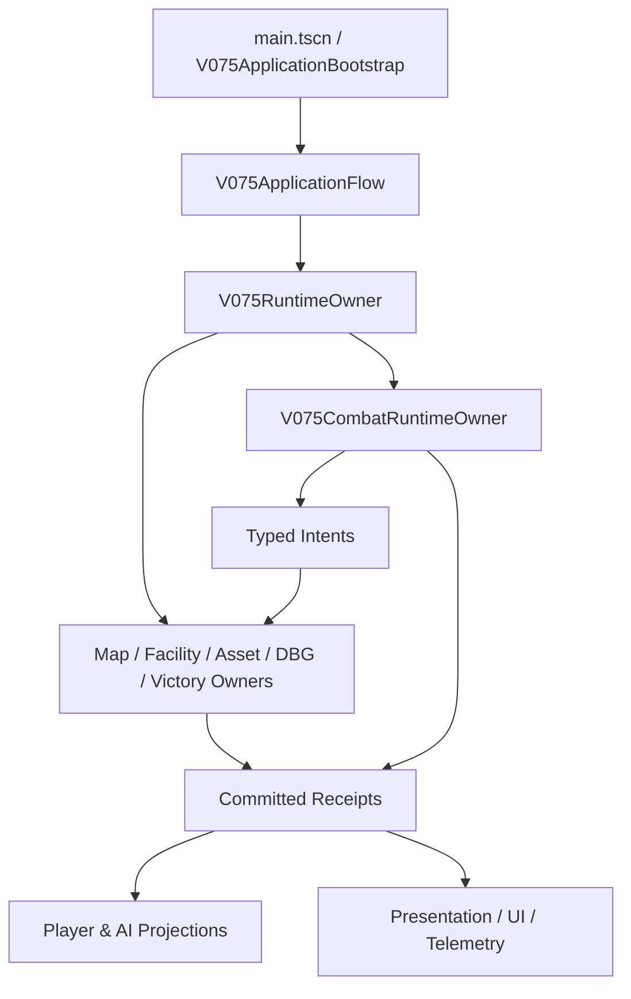

# V0.7.5 架构与 Owner 地图

| 状态/决策 | 唯一 Writer | 禁止事项 | 状态 |
|---|---|---|---|
| 地图 topology/geometry | V074 Map Owner/Core | UI/Combat 改邻接或抽 Map RNG | LIVE |
| 设施 | Region Infrastructure/Facility Owner | Combat 直接写 Facility | LIVE |
| 玩家资产 | Player Asset Owner | UI/Combat 直接改 balance | LIVE |
| DBG piles/card zones | DBG Owner | Combat 直接写 deck/hand/discard | LIVE |
| 怪兽来源/技能/军队任务 | V075CombatRuntimeOwner | 第二 Combat Owner | LIVE |
| Victory/FinalSettlement | Victory Owner | Combat 写胜利 | LIVE |
| Presentation | Presentation Owner | 修改 gameplay 或抽 rule RNG | LIVE |
| Telemetry | Read-only sink | 泄露 rival hidden fields | LIVE |

关键文件见主交接第 7 节。`scripts/main.gd`、legacy Monster/Military Controller 生产实例、V0.6 dual-write/fallback 均为 RETIRED。

当前 Runner 阻塞不属于产品 Owner 图：它发生在 Godot Raw Result 生成之后、Gate Receipt 之前。Raw 产品 PASS 必须通过 append-only attestation 保留，不能靠回写旧 Attempt 修复。
