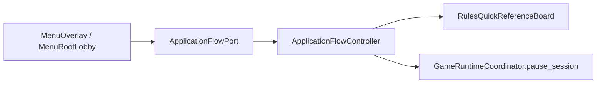

# Main application-flow handler inventory

Status: `MAIN_APPLICATION_FLOW_HANDLER_EXTRACTION_GREEN`

## White-list action inventory

| Action | Before | Current owner | State | Mutation risk |
| --- | --- | --- | --- | --- |
| `rules` | `Main._on_menu_quick_nav_action_requested` → `_open_rules_menu` → rules board | `ApplicationFlowController.open_rules` | migrated | none; static read-only reference content |
| `standings` | Main snapshot adapter + menu/scoreboard composition | Main adapter + existing public snapshot service | pending | read-only public query; keep visibility boundary |
| `economy` | Main dashboard source adapter + menu/economy surface | Main adapter + `EconomyDashboardPublicSnapshotService` | pending | read-only public query; no cash mutation |
| `intel` | Main dossier source/action bridge | Main adapter + `IntelDossierPublicSnapshotService` | pending | action bridge can enter gameplay inference; separate cutover |
| `compendium` | Main catalog navigation/action routing | Codex controllers/services plus Main route adapter | pending | read-only pages with separate navigation state |
| `setup` | Main new-game/setup actions | Main + setup scene | pending | session-start transaction; do not move into a UI-only handler |

## Classification

### A. Pure application flow

The migrated rules slice opens a menu shell, displays the existing rules board,
and pauses the session through the existing Coordinator API. It does not own
world state or decide any gameplay rule.

### B. Read-only presentation queries

Standings, economy, intel and compendium currently use existing visibility-safe
snapshot services, but Main still assembles some source facts. They require
separate query-port cutovers rather than copying those adapters into the flow
handler.

### C. Simulation/world mutation

Setup, intel guesses, save/load and player actions remain outside this handler.
They must continue through the existing session, command and mutation owners.

### D. Historical glue

The rules-specific Main methods and two unused rules preloads were deleted in
the same change. No compatibility wrapper or fallback remains.

## Production path

Other white-list actions still use the transitional port-to-Main route and are
explicitly marked pending above. This is not a second runtime authority.
