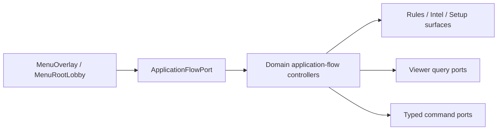

# Main application-flow handler inventory

Status: `MAIN_APPLICATION_FLOW_HANDLER_EXTRACTION_GREEN`

## White-list action inventory

| Action | Before | Current owner | State | Mutation risk |
| --- | --- | --- | --- | --- |
| `rules` | `Main._on_menu_quick_nav_action_requested` → `_open_rules_menu` → rules board | `ApplicationFlowController.open_rules` | migrated | none; static read-only reference content |
| `standings` | Main snapshot adapter + menu/scoreboard composition | `StandingsApplicationFlowController` + `StandingsPublicQueryPort` | migrated | viewer-authorized read-only query |
| `economy` | Main dashboard source adapter + menu/economy surface | `EconomyApplicationFlowController` + `EconomyDashboardViewerQueryPort` | migrated | public facts plus authorized viewer's own private economy; cached-only |
| `intel` | Main dossier source/action bridge | `ApplicationFlowPort` + `IntelApplicationFlowController` + `IntelDossierViewerQueryPort` + `IntelPrivateCommandPort` | migrated | authorized query is read-only; narrow typed commands delegate to existing owners |
| `compendium` | Main catalog navigation/action routing | `CompendiumApplicationFlowController` + `CompendiumNavigationPort` + `CompendiumReadOnlyQueryPort` | migrated | typed, read-only, exact-once pages; no Main route or gameplay mutation |
| `setup` | Main new-game/setup actions | `SetupApplicationFlowController` + typed draft/query/transaction services | migrated | draft-only edits; session start is atomic and rollback-capable |

## Classification

### A. Pure application flow

The migrated rules slice opens a menu shell, displays the existing rules board,
and pauses the session through the existing Coordinator API. It does not own
world state or decide any gameplay rule.

### B. Read-only presentation queries

Standings, economy, compendium and Intel now use scene-owned query/application-
flow ports. Intel's query joins only the audited Region Codex public source,
public card history, role public definitions, and the authorized viewer's own
WorldSession/card-annotation projections. The detached result is read-only.

### C. Simulation/world mutation

Save/load and general player actions remain outside this handler. Setup draft
edits use a dedicated command port, while session creation crosses the
`SessionStartTransactionCoordinator`; Intel
mutations cross `IntelPrivateCommandPort` and remain owned by
`WorldSessionState` or `CardHistoryPrivateAnnotationService`; the application
flow port stores no navigation or gameplay state.

### D. Historical glue

The rules-specific Main methods and two unused rules preloads were deleted in
the same change. No compatibility wrapper or fallback remains.

## Production path

Setup and Intel have no transitional port-to-Main route and create no second
runtime authority.
