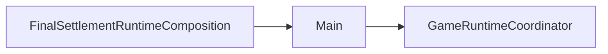
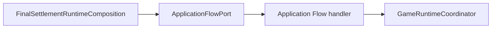

# Main dependency direction migration report

Status: `MAIN_DEPENDENCY_DIRECTION_MIGRATION_GREEN`

## Completed edge migration

Before:

After:

The port is a typed, allow-listed intent boundary. It does not become a new
runtime authority and does not duplicate Coordinator state.

## Files

- `scripts/runtime/application_flow_port.gd`
- `scenes/runtime/ApplicationFlowPort.tscn`
- `scenes/main.tscn`
- `scripts/runtime/final_settlement_runtime_composition.gd`
- `tests/main_dependency_direction_migration_test.gd`
- `docs/migration/main_dependency_inventory.md`

## Preserved callers

The application root still owns startup and the current menu implementation.
That is deliberate: menu page composition, new-game setup, and save entry are
larger boundaries with existing parity obligations. They are listed as the
next cutovers rather than hidden behind an untyped wrapper.

## Main remaining responsibilities

- scene bootstrap and dependency binding;
- application-level menu/page routing;
- input-to-action forwarding;
- temporary compatibility adapters whose domain owners are already explicit.

Main still does not own simulation stepping, command mutation, RNG, autonomous
behavior, monster action mutation, or presentation snapshot construction.

## Acceptance evidence

`main_dependency_direction_migration_test.gd` proves the production scene
loads one ApplicationFlowPort, the final-settlement scene no longer targets
Main directly, allow-listed actions are accepted, invalid actions fail closed,
and Main remains free of `_process` and flow-port discovery.

The migration intentionally does not alter gameplay order, clock formulas,
save schema, or runtime authority ownership.
