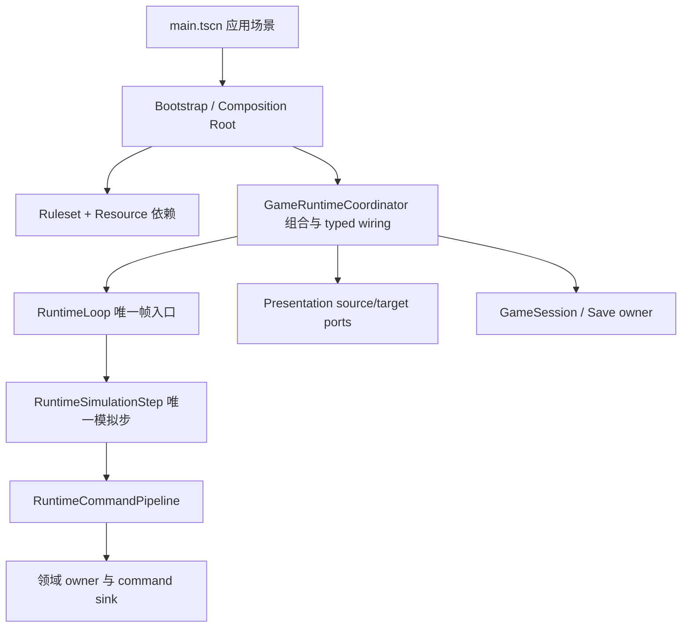
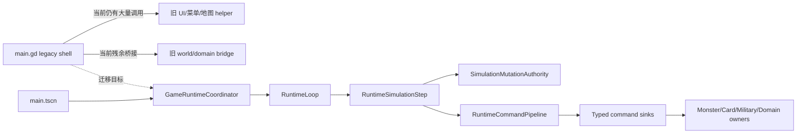

# Main Composition Root 职责地图（v0.6）

状态：`MAIN_COMPOSITION_ROOT_REDUCTION_GREEN`

本阶段只做职责审计、依赖图和迁移计划，不移动生产代码，不创建新的
Manager，不改变玩法顺序。`scripts/main.gd` 仍是历史遗留的巨大脚本；本
文档定义它最终应保留的最小边界。

## 当前规模与结论

| 文件 | 物理行 | 方法 | 顶层状态/常量概况 | 结论 |
|---|---:|---:|---:|---|
| `scripts/main.gd` | 13,116（原 13,159） | 815（原 819） | 66 顶层变量、110 常量、15 preload | 已删除 4 个无调用历史 helper，仍混合 bootstrap、UI、玩法、存档和旧兼容职责 |
| `scripts/runtime/game_runtime_coordinator.gd` | 6,051 | 565 | 14 顶层字段 | 已是正式组合根，但方法数量过大，必须保持“组合/接线”边界，不能演化成第二个 Main |
| `scripts/runtime/runtime_loop.gd` | 57 | 7 | 4 顶层字段 | 唯一权威帧入口，职责清晰 |
| `scripts/runtime/runtime_simulation_step.gd` | 180 | 16 | 7 顶层字段 | 唯一模拟步与 mutation window |

当前架构门禁仍通过：Main budget、Main composition、RuntimeLoop、typed
world ports 和 autonomous command gates 均已有独立证据。这个结论不等于
`main.gd` 已经删除。

## 最终 Composition Root 边界

最终 Main/Bootstrap 允许做的事情只有：

1. 作为 `main.tscn` 的应用入口。
2. 实例化或接收场景中已经声明的节点。
3. 提供规则 Resource、窗口配置和启动参数。
4. 执行一次明确的依赖绑定/启动顺序。
5. 将输入和页面 action 转交给 typed presentation/action port。
6. 处理应用级退出请求。

最终 Main 禁止：

- 修改 players、districts、商品、设施、怪兽、军队或胜利状态；
- 创建或消费随机源；
- 决定怪兽/AI/天气/经济行为；
- 直接执行 RuntimeCommandPipeline 命令；
- 推进 RuntimeLoop、RuntimeSimulationStep 或 world clock；
- 保存或恢复任何领域 owner 的内部状态；
- 计算 GDP、价格、路线、战斗、卡牌效果或胜利公式；
- 通过 `call/get/set`、`current_scene` 或 `/root/Main` 提供兼容回退。

## 当前职责完整审计

### A. 保留在 Main/Bootstrap（小而稳定）

| 当前区域/函数簇 | 现状 | 最终归属 | 备注 |
|---|---|---|---|
| `_ready`, `_build_runtime_game_screen`, `_bind_sceneized_runtime_composition` | 场景启动和接线 | Bootstrap/场景组合 | 只保留顺序控制和缺失依赖的 fail-closed 报告 |
| `_build_table_audio`, `_bind_runtime_audio_nodes`, `_start_table_bgm` | 应用音频入口 | `TableAudioHost` + Bootstrap | Main 只触发，不拥有音频状态 |
| `_quit_game`, 应用级设置入口 | 应用生命周期 | Bootstrap/Settings owner | 不得触碰模拟状态 |
| 顶层场景节点和 exported NodePath | 组合声明 | `.tscn` | 应继续从脚本移入场景资源 |

### B. 必须迁移到现役 scene-owned owner

| 当前职责/函数簇 | 证据范围 | 目标 owner | 迁移原则 |
|---|---|---|---|
| `_process` 遗留、暂停/时钟/阶段推进 | runtime loop 相关函数 | `RuntimeLoop`、`RuntimePhaseCoordinator`、`WorldEffectiveClockRuntimeController` | 不新增第二时钟，不改变顺序 |
| `_weighted_pick_index`, 怪兽目标/特殊行动、线性移动辅助 | 约 10,400–10,800 行及旧 helper | `MonsterRuntimeController` + autonomous command sinks | 决策与 mutation 分离，随机只走 `RunRngService` |
| `_play_v06_runtime_card_for_player`, 卡牌队列、效果、反制、情报提交 | 约 7,200–7,400、9,900–10,000、11,200–11,900 行 | card submission、queue、transition sink、effect router、intel、commitment owners | 真人/AI 共享 typed command，不恢复 Main wrapper |
| `_product_market_*`, `_city_gdp_*`, `_commodity_*`, `_route_*` | 约 1,040–1,300、3,260–4,100、5,600–5,900 行 | ProductMarket、CommodityFlow、RouteNetwork、GDP derivative owners | 现金/资产 delta 必须由现役 owner 原子结算 |
| `_ai_runtime_*`, `_apply_ai_runtime_intent`, rival 行为 | 约 1,300–1,370、8,360–8,520 行 | `AiRuntimeController` + AI command adapters | Main 不读取/解释 AI 私有计划 |
| `_monster_runtime_*`, `_military_runtime_*`, wager/战斗桥接 | 约 850–1,250、4,000–4,600、9,800–10,000 行 | Monster/Military/ForcedDecision owners | 公开 receipt 与私有状态分离 |
| `_generate_roguelike_districts`, Voronoi、地形、商品生成 | 约 6,590–7,050 行 | NewGame/Topology/RegionSupply owner | RNG 和地图事实不回到 Main |
| `_new_game`, `_start_new_run_from_menu`, 角色/起始怪兽选择 | 约 5,940–6,330、7,360–7,660、10,050–10,300 行 | NewGameSetup、Role、Starter、SessionStart transaction | 只保留页面 action 转发 |
| `_load_run`, `_apply_run_domain_state_compatibility_adapter` | 约 6,270–6,510 行 | GameSession/GameSave owner | 不扩展历史存档兼容层；迁移完成后删除旧 adapter |
| `_victory_*`、终局排名/倒计时 | 约 4,340–4,460 行 | VictoryControlRuntimeController + public snapshot | Main 不比较 before/after 或写公开日志 |
| `_toggle_pause`, `_activate_runtime_*`、目标选择与临时决策 | 约 1,700–2,000、9,800–10,050 行 | ForcedDecision、ActionRouting、Overlay targets | presentation 不拥有 gameplay mutation |

### C. 迁移到 presentation/query owner

| 当前职责/函数簇 | 目标 owner |
|---|---|
| `_build_layout`, `_build_full_map_overlay`, `_build_card_resolution_overlay`, `_refresh_*` | GameScreen、PlanetBoard、OverlayLayer、typed refresh port |
| `_open_*_menu`, `_show_menu`, `_menu_*` | MenuRootLobby、Rules/Compendium/Codex 页面场景 |
| `_runtime_player_board_*`, `_runtime_*_snapshot`, `_card_presentation_*` | GameTableViewModel、PlayerBoard/ CardPresentation viewmodels |
| `_open_bestiary_*`, `_open_card_codex_*`, `_open_product_codex_*`, `_open_region_codex_*` | CodexNavigation + 对应 public snapshot service |
| `_selected_district_*`, `_district_supply_*`, `_focus_runtime_map_*` | DistrictSupply surface、PlanetMapView、TableSelectionState |
| `_present_*`, `_add_action_callout`, `_refresh_map_controls` | VisualCueRuntimeOwner、public log、presentation targets |

### D. 应删除的历史债务

| 债务 | 删除条件 |
|---|---|
| `_get/_set` 对旧 Main 字段的兼容访问 | 所有生产消费者改为 typed owner 后物理删除 |
| `*_runtime_call(method_name, arguments)` 泛型 Main bridge | 对应 typed port 完整接线后删除，不能换名保留 |
| `_apply_run_domain_state_compatibility_adapter` 中已退役字段 | save owner 明确版本边界后删除，不恢复旧规则 |
| `RuntimeFallbackHost` 下的旧 fallback 分支 | 正式场景依赖完整后删除；不作为新功能保险丝 |
| 旧 UI build/refresh helper 与动态 signal | 页面场景和 typed target 覆盖后删除 |
| 固定商品/城市/怪兽旧常量与生成器 | topology/catalog owner 接管后从 Main 删除 |

## Coordinator 层审查

`GameRuntimeCoordinator` 当前是正式组合根，但约 6,051 行/565 方法，存在
“隐藏 Main”风险。它必须遵守以下硬边界：

- 可以保存 typed NodePath、依赖引用和绑定结果；
- 可以按固定顺序执行 `configure`/`bind_*`；
- 可以暴露窄型 delegation API；
- 不得持有 players、districts、完整商品库存、完整 AI 计划或第二份时钟；
- 不得计算玩法公式；
- 不得成为所有 action 的万能路由器；
- 不得使用 service locator、current scene、`/root/Main` 或动态方法字符串；
- 每次新增方法必须证明它是组合/接线，而不是领域行为。

`RuntimeLoop`、`RuntimeSimulationStep`、`SimulationMutationAuthority` 和各
领域 controller 已经是独立 owner。拆 Main 时不能把这些 owner 的代码复制
到 Coordinator。

## 依赖图与风险

主要风险：

1. UI helper 仍然直接读取 Main 字段，导致“只迁 UI 不迁状态”的隐式回退。
2. Coordinator 的 565 个方法可能继续吸收玩法逻辑，形成第二个 God Object。
3. `_get/_set` 和泛型 `*_runtime_call` 可能让旧路径看似可用但实际绕过 typed owner。
4. 存档/新局初始化如果一次性迁移过大，容易重复写入 players/districts。
5. 测试和旧 fixture 的 Main 引用很多；应逐域迁移，不恢复已退役入口。
6. `RuntimeWorldPorts.lifecycle`、退役 fixture 和旧 smoke 夹具是明确排除项，不能混入本阶段。

## 推荐拆分顺序

1. **Composition audit（本阶段）**：冻结职责清单、依赖图和负向门禁。
2. **Application bootstrap 减薄**：将音频、设置、菜单入口和场景绑定完全场景化。
3. **New-game/session-start cutover**：把地图生成、角色/起始怪兽和 session start transaction 移入 owner。
4. **Save/restore owner cutover**：移除 Main domain adapter，保持现有 save schema。
5. **Presentation/action routing cutover**：将菜单、地图、牌桌和临时窗口 action 转为 typed ports。
6. **Typed world ports 完整迁移**：按领域删除旧 bridge，不扩展 Coordinator。
7. **Main caller retirement**：逐类删除 Main dynamic access、旧 UI helper 和历史 glue。
8. **Bootstrap final cutover**：把 `main.tscn` 保留为组合资源，`main.gd` 退化为不超过约 120 行的应用启动薄壳，最终物理删除旧脚本。

每一步都必须满足 Main budget 单调下降、无双路径、无新增随机/时钟/状态 owner，且通过对应 focused gate 后才能进入下一步。

## 当前阶段验收

- Composition Root audit：20/20。
- Godot 4.7 audit Bench：6/6。
- Main Runtime Composition：通过。
- Main Architecture Gate：80 checks 通过。
- Foundation：30/30；Consumption：33/33。
- Authority：12/12。
- Autonomous behavior：11/11；Monster action：13/13。
- RuntimeLoop：28/28；Runtime phase：50/50。
