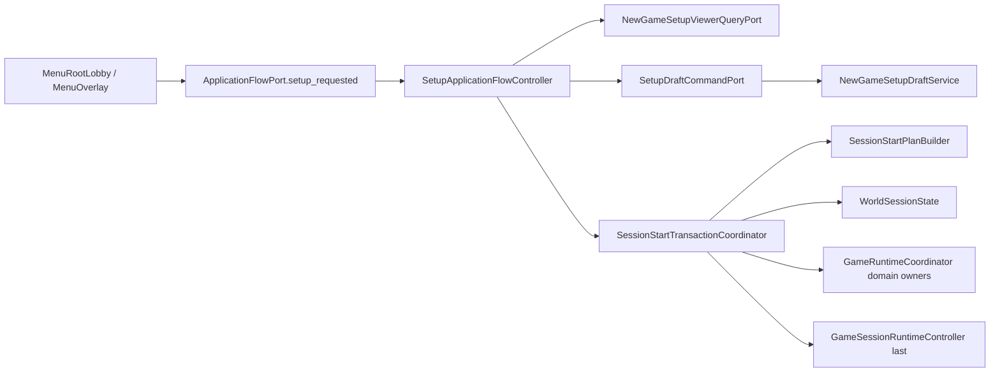

# Main setup application-flow inventory

Status: `MAIN_SETUP_APPLICATION_FLOW_EXTRACTION_IMPLEMENTED`

## Production path

## Removed Main ownership

- Setup configuration fields and random-role placeholders.
- `NewGameSetupPage` preload, page snapshot assembly, and string action parser.
- Setup open/start/back/return routing.
- `_new_game` world generation and owner-reset glue.
- New-session timer priming and setup settings persistence.
- Main-owned market-card preview/open-seat state; this is now
  `TableCardSupplyPresentationState` and resets only after commit.

## Current owners

| Responsibility | Owner |
| --- | --- |
| Uncommitted setup choices | `NewGameSetupDraftService` |
| Draft mutation validation and exact-once journal | `SetupDraftCommandPort` |
| Detached page snapshot | `NewGameSetupViewerQueryPort` |
| Deterministic pure plan | `SessionStartPlanBuilder` + `SessionStartWorldPlanBuilder` |
| Preflight/checkpoint/apply/rollback coordination | `SessionStartTransactionCoordinator` |
| Live players, districts and world geometry | `WorldSessionState` |
| Domain initialization and rollback | Existing children of `GameRuntimeCoordinator` |
| Session lifecycle commit | `GameSessionRuntimeController` |
| Live RNG | Existing `RunRngService` |

`GameSessionRuntimeController` commits after world and runtime owners. RNG is
planned from a detached checkpoint and committed only after all business owners
apply. UI, public log, weather scheduling and presentation refresh are
commit-only effects.

The pure planning layer is split into a 263-line roster/market plan composer and
a 279-line world-geometry subplan builder; neither owns live state.

## Retained boundaries

- Main still composes presentation and legacy gameplay action surfaces.
- Save Registry remains 19 sections; setup draft and plans are not saved.
- Full-run resume remains explicitly incomplete.
- General gameplay action routing remains the next independent boundary.
