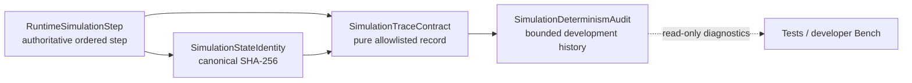

# Simulation determinism consumption layer handoff

STATUS=SIMULATION_DETERMINISM_CONSUMPTION_LAYER_GREEN

## Outcome

The deterministic foundation now has a bounded, pure-data development consumer. A simulation run can be compared step by step without recording Nodes, UI state, engine timing, mutable world objects, or private diagnostic payloads.

## Contracts added

- `SimulationTraceContract` builds and validates stable trace records.
- `SimulationDeterminismAudit` retains a maximum of 32 traces and 32 violations.
- `SimulationStateIdentity.stable_serialize()` exposes canonical serialization for pure-data contract verification.
- `RuntimeSimulationStep` exposes narrow development methods for recording a completed step, reading the latest identity/trace, and reporting deterministic violations.
- `RuntimeSimulationStep.tscn` owns one passive `SimulationDeterminismAudit` child. It remains free of `_process`, save ownership, presentation ownership, and world mutation authority.

## Trace fields

| Area | Retained fields |
| --- | --- |
| Step | index, completed, stable stop reason |
| Commands | schema, type, ID, producer revision, order, payload/envelope fingerprint |
| Results | command ID, accepted, stable reason, result fingerprint |
| Phases | ordered phase names |
| State | SHA-256 before and after |
| Mutations | domain, kind, target key, outcome, summary fingerprint |

All non-allowlisted command/result/mutation values are dropped. Runtime objects and engine/UI/presentation fields cause validation failure.

## Determinism evidence

- Same initial state plus the same ordered commands reproduced the final fingerprint, every intermediate fingerprint, phase trace, mutation trace, and stored trace.
- `add -> multiply` and `multiply -> add` produced different final fingerprints.
- Rejected commands retained an explicit accepted=false result and stable rejection reason.
- Identical resolution-failure paths reproduced the same trace and never entered the commit phase.
- The production scene composes exactly one passive audit consumer under the existing simulation-step owner.

## Randomness evidence

- `RunRngService` remains the shared authoritative gameplay RNG owner.
- Region supply retains its per-bag deterministic state, but its weighted draw now goes through `RunRngService.deterministic_weighted_shuffle()`; it no longer constructs an RNG in the region-supply owner.
- A newly introduced direct production RNG constructor fails the source allowlist.
- An uncontrolled world-mutating randomness declaration fails `SimulationRandomnessBoundary`.

## Validation

| Gate | Result |
| --- | --- |
| consumption layer focused test | PASS 33/33 |
| Godot headless consumption Bench | PASS 8/8 |
| Godot 4.7 MCP consumption Bench | PASS 8/8; no new runtime error; established source warnings only |
| foundation | PASS 30/30 |
| runtime phase decomposition | PASS 50/50 |
| RuntimeLoop | PASS 28/28 |
| command pipeline | PASS 31/31 |
| card frame driver | PASS 104 checks |
| transition sink | PASS 70/70 |
| transition gameplay fault injection | PASS 61/61 |
| typed world ports | PASS 80/80 |
| presentation query ports | PASS 65/65 |
| presentation source/target | PASS 20/20 |
| Main architecture | PASS 80 checks |
| main runtime composition | PASS |
| UI text smoke / visual snapshot | PASS / PASS |
| smoke `--check-only` | PASS |
| region supply randomization | PASS 47/47 |
| region supply RNG save roundtrip | PASS 40/40 |
| region supply purchase | PASS 51/51 |

An editor-wide scan still reports the dirty-worktree's pre-existing `GameRuntimeCoordinator._wire_runtime_world_ports` access to a missing `RuntimeWorldPorts.lifecycle` member. The focused production composition, runtime-loop, typed-port, presentation, architecture, and check-only gates are green; this consumption layer neither introduces nor works around that unrelated composition debt.

The broader `card_flow_region_supply_production_wiring_v06_test.gd` remains red because its production fixture cannot obtain authoritative player market facts (`market_facts_unavailable` / `expected_revisions_invalid`). The randomization, save-roundtrip and purchase-owner gates are green, and the failure occurs after the unchanged deterministic draw; it is recorded as existing integration-fixture debt rather than hidden or bypassed.

## Remaining gaps and safe future consumers

### Remaining gaps

1. There is no typed full-world internal projection aggregator; identity is still computed from an explicit owner-supplied projection.
2. Only the migrated `card_resolution_transition` command family has broad command-pipeline coverage; direct intents must be migrated before a whole-match command stream can be claimed.
3. Production still intentionally runs one variable-delta simulation step per active engine frame; no cross-platform floating-point bit identity is promised.
4. Trace recording is explicit development instrumentation, not an automatic permanent match journal.
5. Region supply retains its documented derived deterministic bag state through a RunRngService API; new derived streams remain prohibited without explicit state, save roundtrip, and audit amendment.

### Future functionality that can safely build here

- deterministic regression comparisons;
- CI divergence reports;
- owner-level state-projection coverage checks;
- command-family migration verification;
- later replay/network/save design documents that consume fingerprints as evidence.

Replay, rollback, network synchronization, and save migration must remain separate future boundaries. None may treat the trace as authoritative world state or bypass existing owners.

## Repository state

- Commit created: no.
- Push performed: no.
- Existing dirty working tree preserved: yes.
- Reset, checkout, restore, clean, stash, or unrelated cleanup: none.
