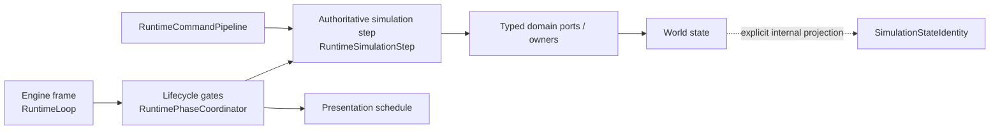

# Simulation determinism foundation handoff

STATUS=SIMULATION_DETERMINISM_FOUNDATION_GREEN

## Outcome

The runtime now has an explicit scene-owned simulation-step boundary. This is a determinism foundation, not a replay system: no command recording UI, network protocol, multiplayer layer, fixed-step scheduler, or save redesign was introduced.

## Frame versus simulation step

- `RuntimeLoop` remains the only engine `_process` owner and was not modified by this task.
- `RuntimePhaseCoordinator` still owns lifecycle branching and presentation placement.
- `RuntimeSimulationStep` owns exactly one active-world entry point: command, simulation, resolution, post-flow lifecycle gate, state commit, and post-victory lifecycle gate.
- Current production behavior is deliberately preserved at one simulation step per active frame.
- The boundary does not structurally require that ratio: synthetic tests host the same four explicit simulation steps under different engine-frame/UI metadata and obtain the same result.
- A future fixed-step accumulator may be placed above this API, but it is not part of this change.

## Scene and script surfaces

- `res://scenes/runtime/RuntimeSimulationStep.tscn`
- `res://scripts/runtime/runtime_simulation_step.gd`
- `res://scenes/runtime/SimulationStateIdentity.tscn`
- `res://scripts/runtime/simulation_state_identity.gd`
- `res://scenes/runtime/SimulationRandomnessBoundary.tscn`
- `res://scripts/runtime/simulation_randomness_boundary.gd`
- Production composition: `res://scenes/runtime/RuntimePhaseCoordinator.tscn/RuntimeSimulationStep`

## Deterministic identity

`SimulationStateIdentity.identify()` accepts an explicit internal simulation projection plus an optional ordered command trace. It:

1. rejects Object, Node and Callable values;
2. sorts dictionary keys using a type-preserving key encoding;
3. preserves semantic array order;
4. canonicalizes `StringName`, vectors, rectangles and colors;
5. hashes the canonical payload with SHA-256;
6. returns only identity metadata, not the private source state.

It is not wired to public presentation and does not aggregate the entire mutable world. That narrower scope prevents a new snapshot owner and prevents private state from leaking through UI.

## Randomness boundary

- Shared authoritative gameplay draws remain owned by `RunRngService`, whose state is seeded/restorable.
- AI, monsters, weather and product-market paths continue to receive that service through their existing bridges.
- Region supply keeps its deterministic per-bag RNG state and save-roundtrip contract, while draw construction is centralized in `RunRngService`.
- New-run randomization is classified as external initial-state selection; after the initial state is fixed, simulation draws are reproducible.
- `SimulationRandomnessBoundary` owns no RNG. It audits declarations and fails uncontrolled world mutation, non-reproducible simulation randomness, or visual randomness that claims mutation capability.

## Command coverage

- Covered production command type: `card_resolution_transition`.
- Envelope identity, producer revision, contiguous order, payload binding and canonical fingerprint remain unchanged.
- Synthetic tests execute the real `RuntimeCommandPipeline` against two independent deterministic sinks.
- The same ordered sequence reproduces the same state; `add → multiply` and `multiply → add` intentionally produce different states and fingerprints.
- Other direct intent families remain command-boundary debt and were not falsely folded into a generic bus.

## Validation

| Gate | Result |
| --- | --- |
| `simulation_determinism_foundation_test.gd` | PASS 29/29 |
| `SimulationDeterminismFoundationBench.tscn` headless | PASS 6/6 |
| Godot MCP production-phase Bench | PASS 6/6; new runtime errors 0; only established source warnings |
| command pipeline | PASS 31/31 |
| card frame driver | PASS 104 checks |
| transition sink exact-once | PASS 70/70 |
| transition gameplay fault injection | PASS 61/61 |
| runtime phase decomposition | PASS 50/50 |
| RuntimeLoop | PASS 28/28 |
| typed world ports | PASS 80/80 |
| presentation scheduler trace | PASS 8/8 |
| presentation source/target | PASS 20/20 |
| presentation query ports | PASS 65/65 |
| victory public privacy | PASS 47/47 |
| Main architecture | PASS 80 checks |
| main runtime composition | PASS |
| UI text / visual snapshot | PASS / PASS |
| smoke `--check-only` | PASS |
| main budget | PASS; 13,159 physical, 11,414 nonblank, 819 methods; no new Main consumer |

The legacy `layout_scene_smoke_test.gd` still fails historical assertions for removed campaign snapshots, retired Main entry points and obsolete owner counts. The isolated full smoke progressed through scene/menu/setup/AI/table checks to the existing field-monster legacy block and was stopped after a bounded observation window; no determinism, phase-order, command, exact-once, presentation or privacy gate regressed. No deleted compatibility API was restored.

## Metrics

- Simulation-step entry points: 1 (`RuntimeSimulationStep.advance_active`).
- Production simulation-step instances: 1.
- Engine-frame owners: 1 (`RuntimeLoop`).
- State identity method: type-preserving canonical pure data + ordered arrays + SHA-256.
- Production command types covered: 1/1 migrated type.
- Duplicate command mutation in covered path: 0.
- RuntimeLoop changed by this task: no.
- Gameplay formula changes: none.
- UI/presentation authority added to simulation: none.

## Known debt / next boundary

1. Define a typed, internal full-world simulation projection by composing existing owner snapshots; do not reuse a public presentation snapshot.
2. Migrate remaining world-changing direct intents through explicit command types before claiming broad command-sequence coverage.
3. Decide separately whether product requirements justify a fixed-step accumulator. This foundation intentionally preserves variable-delta production behavior.
4. Migrate or retire the historical full-smoke and layout fixtures instead of reintroducing Main callbacks.

## Repository state

- Commit created: no.
- Push performed: no.
- Existing dirty working tree preserved: yes.
- Reset / checkout / revert / clean / squash: none.
