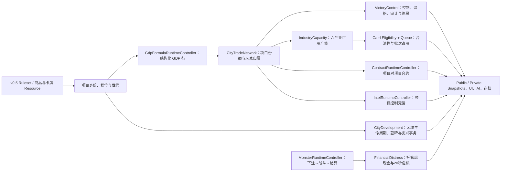

# 《太空辛迪加》v0.5 规则实现开发计划

> 状态：SS05-00、SS05-01 与 SS05-01A 已完成；v0.5 数据和玩家文字基础 ready、生产运行时仍为 v0.4；下一步为 SS05-02。
> 编写日期：2026-07-14。
> 玩家规则权威：`docs/tabletop_rulebook_v05.md`。
> 运行时迁移合同：`docs/rules_v05_runtime_migration.md`。
> 迁移基础合同：`docs/rules_v05_migration_foundation_contract.md`。
> 玩家文字合同：`docs/player_facing_text_and_rules_presentation_contract.md`。
> 当前生产运行版：v0.4。

## 1. 结论

v0.5 不应通过“在 v0.4 上改几个数字”实现。现金胜利、城市 owner、整城 GDP 分摊、区域式合约、城市／出牌者竞猜、百分比怪兽赌局和即时破产互相依赖；若逐个增加兼容分支，会形成两套同时生效的规则真相。

采用以下迁移方式：

1. 先建立可从空目录恢复的 v0.4 tag，再冻结 v0.5 数据结构和存档握手。
2. 先替换“项目身份 + 结构化 GDP 行”这一共同底座。
3. 胜利、六产业产能、项目合约和项目情报只消费同一份玩家归属 GDP。
4. 每个领域以原子切换完成：新 owner、调用方、测试和旧写路径删除必须在同一切换批次完成。
5. v0.5 在非发布集成分支推进；首个语义切换后不再承诺该分支维持完整 v0.4。v0.4 由不可变 tag 和发布分支恢复，不由运行时 fallback 恢复。
6. 全部门禁通过后只执行发布入口提升；不得把旧算法集中积压到最后一次大删除。
7. 玩家文字采用稳定机器 ID、可见性过滤和本地化三层分离；领域 owner 必须先净化事实，再由 presentation 层生成文字消息，locale resolver 不得拥有规则或隐私判断。

本计划中的“直接删除”不是要求现在就在脏工作树里删文件，而是指：对应替代项接管时，旧语义不得继续以 feature flag、缺省值或兼容 fallback 留在生产链中。

## 2. 三类工作定义

| 类别 | 含义 | 执行要求 |
| --- | --- | --- |
| 直接删除 | v0.5 明确不再允许的旧规则、旧状态、旧 action、旧存档字段或旧文案 | 替代 owner 接管的同一批次删除；不得保留生产回退 |
| 替换 | 保留现有单一 owner 或界面职责，但更换其数据结构、算法和协议 | 先用只读影子对账验证，再原子切换 mutation owner |
| 推进 | v0.4 没有，但 v0.5 必须新增或做完整的能力 | 新 Resource、Service、Controller、UI、AI、教程和测试一起交付 |
| 历史归档 | 有审计价值但不能继续进入生产或 CI conformance 的 v0.4 证据 | 保留 Git 历史和基线，移出生产 registry；禁止自动回退 |

## 3. 硬前置：任何删除前先做安全基线

当前工作树存在大量 tracked 修改和 untracked 运行时资源。任何删除、移动、根场景切换或存档升级之前必须先完成：

- 运行 `tools/repository_safety_baseline.ps1`，把状态、哈希、`main.gd` 指标和玩家存档元数据写到仓库外的 QA 目录。
- 对当前意图明确的工作形成可恢复 Git 快照，标记 `v0.4-runtime-baseline`。
- tag 必须在独立 clean clone 中完成 Godot 4.7 import、composition 与 layout 验证；仅有 dirty-worktree manifest 不算可恢复基线。
- 从该 tag 建立 `rules/v05-runtime-integration` 非发布分支。后续不增加运行时版本选择器、自动 fallback 或双 mutation owner。
- 记录 focused benches、完整 smoke、玩家存档哈希和生产默认保存路径。
- 指定一名集成人统一修改 `scripts/main.gd`、`scenes/main.tscn`、`scenes/runtime/GameRuntimeCoordinator.tscn` 和总测试注册表。
- 自动 QA 只使用 `user://space_syndicate_design_qa/test_runs/`，不得加载、迁移或重写玩家真实存档。

未完成这一前置门，不执行本文件任何“删除”项。

## 4. 目标数据流与所有权

约束：路线仍由 `CityTradeNetworkRuntimeController` 唯一拥有；卡牌合法性仍由 `CardPlayEligibilityRuntimeService` 唯一裁决；批次占用仍由 `CardResolutionQueueRuntimeService` 唯一保存；怪兽和赌局仍由 `MonsterRuntimeController` 唯一拥有。不得新建第二套路线、卡牌执行或怪兽引擎。

## 5. 直接删除清单

以下行号只表示 2026-07-14 审计证据；实施时以符号和字段搜索为准。

### D-01｜删除 v0.4 生产默认值和自动回退

删除内容：

- `scripts/runtime/ruleset_runtime_bridge.gd` 的 v04 `DEFAULT_PROFILE_PATH` 和缺省自动加载。
- `scenes/runtime/RulesetRuntimeBridge.tscn` 对 `space_syndicate_ruleset_v04.tres` 的生产引用。
- `scripts/rules/space_syndicate_ruleset_profile.gd` 中只接受 `v0.4` 的校验，以及不属于 v0.5 的 `private_plan_enabled`、旧终局和旧组牌参数。
- `GameRuntimeCoordinator`、`GameSessionRuntimeController`、Monster、Military、Weather、Contract、Market、CityTrade、Card Queue 等控制器中的 `_ruleset_id == "v0.4"` 生产启动条件。

删除时机：最终生产切换提交。缺少合法 v0.5 profile 时必须启动失败，不能退回 v0.4。

### D-02｜删除现金目标胜利和旧终局排名

删除内容：

- `scripts/main.gd` 的 `victory_countdown_active/timer/trigger_player/trigger_score`。
- `_victory_countdown_status_text()`、`_victory_countdown_trigger_candidate()`、`_start_victory_countdown()`、`_update_victory_countdown()`。
- `CITY_FINAL_VALUE` 在胜利、城市清算和终局分数中的用途。
- `_roguelike_cash_goal()`、`_player_visible_settlement_estimate()`、`_player_final_score()` 中“现金 + 城市变现 + 情报现金”的胜利算法。
- `runtime_balance_model.gd`、`runtime_balance_parameters_resource.gd` 和数据文件里的现金胜利目标曲线。
- 保存、恢复、重置、排行榜、终局板、教程和 AI 中的 `cash_goal` 与旧 `victory_countdown_*` 字段。
- `main.gd` 作为终局 mutation owner 的 `game_over`、`_finish_game()`、`_final_score_rankings()`、`_player_final_score()`，以及自行按现金重排的 final-settlement source/snapshot 字段。通用“牌局已结束”状态改由 `GameSessionRuntimeController` 保存，不能在 Main 再留第二个可写终局状态。

替代协议：`VictoryControlRuntimeController` 只产出一次性、版本化 `outcome_receipt`（原因、胜者集合、共同胜利、比较链和审计证据）；`GameRuntimeCoordinator` 幂等应用后调用 `GameSessionRuntimeController.finish_session(outcome_receipt)`，`FinalSettlementPublicSnapshotService` 只展示该 receipt，不再自行排名。

保留边界：现金仍可作为正常审计终点的末级比较项，并在“星球真正毁灭”分支作为主比较项；这两个用途都只能由新 Victory owner 明确调用。

### D-03｜删除现金归零立即淘汰

删除内容：

- `scripts/main.gd::_check_bankruptcy_eliminations()` 及 `bankruptcy_check_in_progress`。
- 所有 cash mutation 后直接设置 `eliminated=true` 的调用路径。
- `StandingsPublicSnapshotService` 中“现金归零立即出局”的状态文案和推导。

保留边界：通用 `eliminated` 最终状态保留；删除的是“cash <= 0 当帧淘汰”。

### D-04｜删除旧怪兽下注协议

删除内容：

- `MONSTER_WAGER_MAX_STAKE_PERCENT`、`MONSTER_WAGER_PERCENT_STEP`、`MONSTER_WAGER_VISIBLE_RAISE_STEPS`。
- `_monster_wager_clamped_percent()`、`_monster_wager_percent_options()`、`_monster_wager_bet_percent()`、`_place_monster_wager_percent()`。
- `_monster_wager_forced_side()`、`_force_monster_wager_missing_bets()` 和缺席玩家被强制下注的路径。
- “全员决定即提前结算”、单次 `pending_attack` 后结算、胜方投注者均分奖池。
- `main.gd` 的 `monster_wager:*:*:percent` action 和百分比档位按钮。
- AI 的 `stake_percent` 候选、单次百分比下注和强制下注策略。

保留边界：底注率仍为 5%–10%；删除的是后续百分比加注、强制参与、一次攻击结算和均分派奖。

### D-05｜删除旧 30 秒卡牌组和旧竞价链

删除内容：

- `shared_card_group_window.gd` 的 30 秒、25+5 秒、标准 3 张／最高 4 张规则。
- `CARD_BID_INCREMENT_OPTIONS = [10,20,50,100,200,500,1000]`。
- `_apply_card_group_bid_chain()` 及“未胜出竞价支付给前一组”的分账。
- 任意正整数竞价和旧竞价链文案。

替换后唯一规则：8 秒 = 6 秒组织 + 2 秒锁牌；教程每席 1 张、标准每席 2 张；出价只允许 0/50/100，全部进入下一场怪兽公共池。

### D-06｜删除城市 owner、GDP 保底和整城分摊

删除内容：

- `gdp_formula_runtime_controller.gd` 与 GDP profile 的 `minimum_city_gdp` 和 `max(minimum_city_gdp, net)`。
- `city_product_project_state.gd::assign_city_gdp()` 按项目等级瓜分整城 GDP。
- 项目最高贡献并列时以最早贡献或座次强行选 controller 的逻辑。
- `city_product_project_bridge.gd::migrate_legacy_city()` 从 `city.owner` 猜造项目，以及同步回旧 owner 字段的生产用途。
- `city_trade_network_runtime_controller.gd` 无项目时把玩家视为 100% owner、owner 收取整城现金流、同 owner 城市不竞争等 fallback。
- `CITY_PRODUCT_LEVEL_MAX = 5` 的项目／商品项目等级用途；v0.5 项目最高 IV。`ECONOMY_LEVEL_MAX` 和 `REGION_ECONOMY_LEVEL_MAX` 当前约束区域生产、运输、消费维度，不属于本删除项，不能借项目迁移误删。

保留边界：怪兽 owner、军队 owner 等实体归属不受本项影响；自动商路和实时现金流换算继续保留。

### D-07｜删除“猜城市 owner／猜卡牌 owner”玩法

删除内容：

- `INTEL_CORRECT_GUESS_CASH`、`INTEL_WRONG_GUESS_COST`、`CARD_OWNER_GUESS_STAKE` 的旧用途。
- `_guess_card_resolution_owner*()`、`_card_owner_guess_*()`、城市 owner 私标与终局情报现金分。
- 猜中后公开卡牌实际出牌者的行为。
- Intel Dossier、Card Presentation、角色被动、AI、存档和 action registry 中的 `city_owner_guess`、`card_owner_guess`、`intel_card_trace`。
- 卡族 008《业主透镜》、009《出牌追帧》、039《线索悬赏》的旧 owner 竞猜语义；这些资源必须重写或退役，不能原样进入 v0.5。

保留边界：公共快照 sanitizer 中对 `hidden_owner`、`private_plan`、AI 私有字段的泄漏拦截测试继续保留。

### D-08｜删除区域到区域、多商品的旧合约模型

删除内容：

- `ContractRuntimeController` 的 `selected_source_district/selected_target_district`、district-based `offer_context/plan_offer` 和旧存档键。
- 按区域自动推断商品、一个合约携带多个商品、自动撮合多个商品的基础模型。
- 合约接受后直接向城市增删 products/demands 或修改区域生产／运输／消费值的路径。
- 普通超时按“拒签”结算惩罚、扣款或路线损伤。
- `ContractRuntimeWorldBridge` 的区域端点 mutator。
- 卡族 044–049 的旧端点字段；逐张改为 exact product + project endpoint，无法表达新语义者退役。

保留边界：明确写在高级卡牌上的“主动拒绝后果”可以保留；普通超时必须是中性结果。

### D-09｜删除 End Turn 和私人计划槽

删除内容：

- `TopBar.tscn` 的 `EndTurnButton`，`top_bar.gd`、`game_screen.gd` 和 `main.gd` 的 End Turn signal/action。
- `private_plan_enabled` 及 v0.4 conformance 对私人计划槽的强制要求。
- 教程、自动化或输入路由中点击 End Turn 的步骤。

v0.5 是实时主循环；保留暂停、强制决定和卡牌锁定，但不保留回合结束按钮。

### D-10｜删除标准模式无来源的市场随机噪声

删除内容：

- `ProductMarketRuntimeController` 标准刷新时无事件来源地调用共享 RNG，并按 volatility 随机漂移价格的路径。

标准模式中价格只能由供给、需求、路线、合约、天气、怪兽压力、仓储或明确卡牌事件变化。若未来实验模式需要随机噪声，必须使用独立 profile 显式开启。

### D-11｜删除生产加载链的旧存档双读

删除内容：

- `CardResolutionQueueRuntimeService::to_legacy_save_snapshot()` 与 `apply_legacy_save_snapshot()` 的生产调用。
- 从 `city.owner` 猜造项目并回写旧字段的兼容链。
- 主保存流程并行写入新旧两套 queue、victory、contract、wager 或 intel 字段的路径。
- v0.5 缺字段时静默读取 v0.4 district/owner/percentage schema 的 fallback。

存档政策：不把进行中的 v0.4 对局续打成 v0.5。v1 只可被识别、备份并提示开始 v0.5 新局；可导入开局配置，但旧活动合约、赌局、倒计时和项目状态不得静默迁移。

### D-12｜删除活跃内容与测试中的旧规则断言

切换相应领域时同步替换：

- `README.md`、`AGENTS.md`、`docs/tabletop_rulebook.md`、`docs/rules_summary.md` 的活跃 v0.4 说明。
- `data/scenarios/final_countdown.json`、教程、战役和首桌数据中的现金终局目标。
- `StandingsPublicSnapshotService`、`FinalSettlementPublicSnapshotService`、`FinalSettlementBoard.tscn` 和临时决定 fixture 的旧标签。
- `smoke_test.gd` 中现金目标、立即破产、owner 竞猜、强制百分比下注、均分奖池和区域合约断言。
- `runtime_balance_report_test.gd` 的现金目标梯度，`main_runtime_composition_test.gd` 的 75 秒终局，`layout_scene_smoke_test.gd` 的旧赌局／倒计时，`shared_card_group_runtime_test.gd` 的旧竞价，`gdp_formula_runtime_controller_test.gd` 的 GDP 最低 40。

新测试必须在删除旧断言的同一批次落地，不能通过降低覆盖率完成迁移。

### D-13｜历史证据归档与不变门迁移

以下与 v0.5 冲突的规则断言、资源和结果快照保留为 `historical v0.4 / non-runtime / non-conformance`：

- `resources/rules/space_syndicate_ruleset_v04.tres`。
- `resources/economy/space_syndicate_gdp_formula_v04.tres`。
- v0.4 卡牌 catalog/family 原始快照。
- `ruleset_v04_conformance_bench.gd`、registry、scene，以及各领域 characterization bench 中现金胜利、city owner、最低 GDP、区域合约、百分比下注等冲突语义的 v0.4 基线结果。
- `docs/ruleset_v04_runtime_cutover.md`、旧规则文档和 `docs/development_log.md` 历史记录。

这些冲突资产不得被生产 Resource registry、默认 profile、启动场景或 v0.5 CI conformance 引用，也不得作为启动失败时的回退。单一 owner、隐私 sanitizer、资金／GDP 守恒、幂等 transaction、存档隔离、导航和场景组合等不随规则改变的门禁不得退出 CI；应去掉 v0.4 常量依赖并迁移为 v0.5 invariant tests。

## 6. 替换清单

| ID | 旧实现 | 替换后的唯一实现 | 主要落点 | 切换门 |
| --- | --- | --- | --- | --- |
| R-01 | v0.4 Profile + v1 存档握手 | v0.5 Profile、顶层 `ruleset_id`、分区状态版本 | ruleset profile/bridge、save coordinator | v0.4 存档可识别但不会误写；生产最终只加载 v0.5 |
| R-02 | 城市总 GDP + 项目等级摊分 | `GdpFormulaRuntimeController` 直接输出结构化 GDP 行，再按真实项目份额归属 | GDP controller、CityTrade、project state | 项目、玩家、区域三层守恒；区域可为 0 |
| R-03 | city owner、`district:product:direction` ID 与强制 tie-break | 五槽项目、稳定 slot ID、项目世代、10,000bp、精确平局 `controller=-1` | project state/bridge、CityDevelopment | 双同商品槽不冲突；保存加载稳定；毁灭后不继承旧 ID |
| R-04 | 现金目标 + 75 秒倒计时 | `VictoryControlRuntimeController`：10 秒资格、120 秒审计、30 秒冷却、Top N、最后存活者和灾难终局 | 新 controller/scene、coordinator | 29.99/30、并列、深度 I–VI、名单隐私全部通过 |
| R-05 | 区域 GDP 份额单条件出牌 | 六产业产能 + 具名商品 + 原影响力 + 现金／目标的组合合法性 | card definition、Eligibility、world bridge | 14/15/39/40/79/80/139/140 边界正确 |
| R-06 | 30 秒窗口、3/4 张、旧竞价链 | 8 秒 6+2、教程 1／标准 2、0/50/100 入公共池 | Queue、shared window、BidBoard | 占用在提交锁定，整组只释放一次 |
| R-07 | 区域到区域合约 | `ContractRuntimeController` 内重写为 exact `source_project_id/target_project_id/product_id` | contract controller/bridge、card data | >=15%、8 秒、中性超时、每项目一主约 |
| R-08 | 城市／出牌者竞猜 | `IntelRuntimeController`：每玩家每项目一次、押100、猜对净赚100、私密跟踪60秒 | 新 controller、Intel Dossier snapshot | 公共端不泄漏；过期保留 last-known |
| R-09 | 单次攻击百分比赌局 | 原 `MonsterRuntimeController` 内 `betting -> battle -> settled` 整场状态机 | Monster controller、wager panel、AI | 8 秒只冻结 betting；1/10/100 次加注与资金守恒 |
| R-10 | 永久毁灭且普通 repair 拒绝 | `CityDevelopmentRuntimeController` 内的区域生命周期事务：destroyed、tombstone、revival、damaged/buildable | CityDevelopment 发 receipt；CityTrade/Contract 消费墓碑 | 复兴恢复建设资格但 GDP／旧项目仍为0 |
| R-11 | cash<=0 当帧出局 | `FinancialDistressRuntimeController`：20 秒、收入救回、一次半价售牌；跨领域淘汰由 `EndStateSettlement` 编排 | 新 controller、inventory/economy bridge、end-state settlement | 托管未结算前不误触发；超时只发出幂等淘汰请求 |
| R-12 | 随机市场、帧尖峰金融、分散军令／天气参数 | 标准无噪声；金融用10秒移动平均；军令 Guard/Strike/Intercept；天气90/90同区不叠 | Market、finance、Military、Weather | 同状态同动作确定性；参数只来自 profile |
| R-13 | 现金进度、owner 文案和百分比按钮 | 区域控制、审计、六产业、项目端点、危机、复兴、绝对加注 snapshots/UI | standings、economy、intel、wager、table snapshots | UI 不自行重算规则，隐私快照通过 |
| R-14 | AI 观察 cash goal/city owner/stake percent | AI 观察归属 GDP、产能、争夺、审计、项目、危机和赌局 phase | AI controller/policy resources | AI 只读取获准事实，action 与新协议一致 |
| R-15 | 各处直接使用整数现金或 float 百分比取整 | 统一整数分 `CurrencyAmount`、可用／托管／总账和确定性舍入／余数协议 | economy、inventory、wager、finance、save、UI formatter | 0.01 精度、无浮点漂移、任何结算资金守恒 |

## 7. 需要推进的新内容

### A-01｜v0.5 Resource 层

- 新建 `space_syndicate_ruleset_v05.tres`，包含胜利深度表、10/120/30 秒、卡牌组 6+2、赌局 8 秒与 30/45/60 秒战斗上限、合约 8 秒、情报 100/60、危机 20 秒、天气 90/90、军队 60/10 等参数。
- 新建唯一商品产业目录；每个商品恰好属于生命、能源、工业、科技、商贸、航运之一。
- 新建 `card_runtime_catalog_v05.tres` 和版本化 v0.5 卡牌定义；不要直接改写准备归档的 v0.4 catalog/family 证据。卡牌最多两个主要条件，支持无色、单色、双色、二选一和具名商品；作者校验拒绝三色、未知商品和不可能条件。
- 为“区域复兴 I–IV”建立工业 + 生命双色卡族；它与普通《应急修复》必须是不同 action kind。
- 新增统一 `CurrencyAmount` 固定点协议，以整数“分”保存可用现金、托管、底注、加注和派奖；百分比金额统一四舍五入到最近 0.01，正中时远离零，并夹在 0 与可用快照之间。所有余数按稳定 transaction/player ID 分配，禁止用 float 或各系统自行取整。
- 所有新 wire/save/receipt 字段使用 `_cents` 后缀并携带 `currency_scale=100`；旧无后缀金额只能在版本化存档迁移边界读取，混合单位必须失败关闭。

### A-02｜结构化 GDP 与诊断账本

- 项目身份固定为 `region_id + slot_kind + slot_index + generation`（或等价 opaque ID）；`product_id` 是槽中内容，不是身份。两个生产槽或两个需求槽可同时经营同一商品而不发生 ID 冲突。
- GDP 行至少含 `receipt_id/region_id/project_id/project_generation/product_id/industry_id/direction/source_kind/gross/penalty/net`。其中 `industry_id` 只是由唯一商品目录验证后写入的冗余审计快照；`IndustryCapacityRuntimeService` 必须按 `product_id` 查询目录，并拒绝不一致快照，不能把 GDP 行变成第二个产业分类真相。
- 玩家归属行含稳定舍入顺序和 neutral remainder，不把余数暗送给 controller。
- 提供只读审计快照：区域总 GDP、项目 GDP、玩家归属 GDP、行业汇总和来源解释。
- 在影子阶段同时计算 v0.4 总量只用于差异报告，不向 UI、AI、现金流或胜利提供第二个结果。

### A-03｜胜利审计体验

- 新增审计进度、Top N 区域、资格保持、审计名单、剩余 120 秒和失败冷却 UI。
- 名单玩家公开现金总账、项目份额/GDP、合约、仓储和金融头寸；现金总账等于可用现金加托管现金；不公开手牌、私密情报、隐藏怪兽对应关系和 AI 计划。
- 加入名单后本次审计不重新隐藏；保存加载恢复相同名单与剩余时间。
- 审计失败进入 30 秒冷却时，未被其他公开规则持续揭示的实时资产重新隐藏；日志和已经看见的历史不删除。该转换必须由 snapshot scope 测试验证，不能只把 UI 面板关掉。
- 最终结算展示胜因和比较链，不再展示城市清算值；只剩一名未淘汰玩家时由同一 controller 立即结算。

### A-04｜六产业产能与卡牌占用

- 新增纯派生 `IndustryCapacityRuntimeService`，只根据玩家项目归属 GDP 计算六类可用等级。
- `CardPlayEligibilityRuntimeService` 仍是合法性唯一裁决者。
- `CardResolutionQueueRuntimeService` 唯一持有本批次累计预留、提交锁定、结算释放、退款和存档 transaction ID。
- UI 同时显示“总产能／本组已占用／仍可使用”，避免玩家把产能误解为会永久消耗的资源。

### A-05｜整场怪兽赌局

- 开盘固定 `battle_id`、参战者、底注现金快照、底注率和公共池。
- 标准底注率默认由 `clamp(5 + participant_count - 2 + highest_rank_bonus, 5, 10)` 计算，其中 I–IV 级最高参战怪兽的 bonus 为 0/1/2/3，不再使用含糊的 rank index，也不再随机抽 5–10。
- 底注按固定点“分”精确到 0.01，不凑成 50 或 10 的倍数；第一次加入锁边并托管底注。同一 8 秒窗口内可用唯一 transaction ID 无限次加注，普通加注为 50 的正整数倍，全押是唯一尾数例外。
- 下注倒计时使用不受星球暂停影响的 unscaled UI 实时时钟；不能因自己冻结世界而停止倒数。
- 战斗阶段世界恢复，卡牌、技能、升级可干预；满血升级不清累计实际伤害，迟到怪兽不加入。
- KO／最后站立优先，否则到时比较累计实际伤害；胜方按最终下注比例分池，平局退玩家资金并滚存公共池，无人押中则整池滚存。

### A-06｜项目合约与项目情报

- 合约 registry 保存 active/delivery_blocked/tombstoned 状态和真实项目世代；暂损只阻断交付，`expires_at` 继续前进，项目毁灭永久 tombstone。
- 合约端点类型使用白名单：生产↔需求、生产↔同商品通商、需求↔同商品通商；生产↔生产、需求↔需求和通商↔通商均拒绝，即使商品相同。
- 合约收益写入结构化 GDP 行，不直接改整城数值。
- 情报保存 locked guess、支付 receipt、私密结果、60 秒 live share window 和 last-known snapshot。
- Intel Dossier 只组合当前查看者获准数据，不保存或推断真相。

### A-07｜毁灭、复兴、危机与跨系统终止顺序

- `CityDevelopmentRuntimeController` 统一发出区域生命周期 receipt：GDP 归零、项目墓碑、合约墓碑、路线／金融引用失效和公共事件；不得另建第二套城市引擎。
- 复兴 I–IV 只恢复对应 25/40/60/80% 耐久和卡面项目位／路线端点；不恢复旧项目、份额、合约或 GDP。
- 财务危机期间禁止购牌、优先竞价、新怪兽赌局和新的主动卡牌提交，收入与已锁定结算继续；每次危机最多半价出售一张手牌。
- 规则书没有明确合并升级牌的紧急出售成本基准。SS05-01 可预留版本化 acquisition-basis schema，但在产品决定累计实付、最近副本、基础家族或其它明确规则前，SS05-10 不得实现估值，也不得按当前 catalog 价格静默推断。
- 危机超时淘汰必须是一个幂等事务：已锁卡牌继续，军队离场，怪兽转为无主游荡，金融仓位强平，项目份额转为中立且停止向该席位付款；全部 receipt 应用后再检查“是否只剩一名未淘汰玩家”。
- 星球毁灭顺序固定为：处理已经锁定进入结算队列的复兴 -> 确认毁灭 -> 返还未结算玩家托管 -> 中止普通审计 -> 按现金总账比较，同额共同胜利。

### A-08｜AI、教程、内容与可观测性

- AI action 增加 card reserve/submit、project contract、project intel、wager pass/join/raise_absolute、distress sell、region rebuild。
- AI reward 改为区域控制、Top N GDP、审计和共同胜利；现金目标只存在于星球毁灭分支。
- 首局只启用约 10 个卡族，关闭高级金融，卡牌组每席 1 张；标准内容包再扩到 24–36 个卡族和适量商品。
- 第一局严格按“召唤 -> 首项目 -> GDP -> 购牌 -> 打牌 -> 公开牌轨 -> 产业产能 -> 区域控制”教授，删除 End Turn、现金目标和 owner 竞猜步骤；怪兽赌局放在后续独立练习，不塞入第一局核心八步。
- 开发面板提供 GDP 守恒、产业占用、审计名单、托管资金、项目墓碑和 privacy audit，但不把开发数据暴露给正常玩家界面。

### A-09｜保留并继续推进的现有基础

- 保留 `CityTradeNetworkRuntimeController` 的自动寻路、路线损伤和刷新；v0.5 不增加玩家手动画“逻辑管道”的系统。
- 保留 `CardInventoryRuntimeService` 的手牌上限 5、卡牌最高 IV，以及 `DistrictPurchaseRuntimeController/Settlement` 的 12 秒购买事务；补齐所在区 80%、相邻区 100% 和不可叠加的门禁。
- 保留 Queue、Execution、Forced Decision Scheduler 和临时决定 overlay 的职责边界，只替换时间、容量占用和 action payload。
- 保留怪兽 roster、动作表、累计实际伤害输入、公共优先出价池和战斗表现层；赌局状态机在原 Monster owner 内重写。
- 保留 Weather、Military、Market、Finance controller、公共／私密 snapshot service 和 `GameRuntimeCoordinator` 组合框架；按 v0.5 schema 收束，不把规则计算移到 UI。
- 保留现有导航、返回优先级、卡牌轨、地图和资料库场景；只替换旧规则字段与文案。卡牌美术、音频和第三方素材清理属于独立发布计划，不混入规则切换。

### A-10｜玩家文字、稳定 ID 与可见性

- `docs/player_facing_text_and_rules_presentation_contract.md` 是 v0.5 玩家文字、卡牌呈现、本地化和辅助文字的权威合同。
- 文字受众与信息可见性是两条独立轴。`MACHINE_IDENTIFIER`、`DEVELOPER_DIAGNOSTIC` 和 `TRANSLATOR_METADATA` 不得进入正式玩家 UI；`PLAYER_VISIBLE` 与 `PLAYER_ASSISTIVE` 必须本地化；`PLAYER_GENERATED` 必须转义、限长并按权限过滤。
- 领域 owner 或 public/private snapshot owner 必须先把事实过滤为 `public`、`viewer_private`、`revealed_at_endgame`、`spectator_sanitized` 或 `developer_only`，再交给 presentation 层。不得先拼装含私密信息的完整句子，再在 UI 里删字段。
- 推荐链路固定为 `rule/effect receipt -> visibility sanitizer -> PlayerTextSpec(message_key + typed args + audience + scope) -> locale resolver -> visible/assistive text`。本地化服务只解析 key、参数、locale 和格式，不计算合法性、规则、owner 或可见性。
- 新 v0.5 `card_id`、`effect_id`、`reason_code`、action 和 save key 使用无语言含义的稳定 ASCII 标识；旧中文 ID 只能在明确的迁移边界作为 legacy alias，不能继续兼任玩家名称。
- 发布 UI 禁止回退显示 raw `card_id`、`action_id`、`reason_code`、`args.error`、节点路径、堆栈或未替换 placeholder。缺少 key 时显示已本地化的安全通用提示，并把原始诊断只写入开发日志。
- GDP 玩家单位在 SS05-03 结构化 GDP hard cutover 时统一为 `GDP/min`。SS05-01A 只建立单位 ID 和格式化合同，不得提前把当前 v0.4 `GDP/s` 表面改成一半迁移状态。
- 当前 239 条 v0.4 等级卡牌先建立逐条迁移清单和 effect/text parity 状态；只有对应 v0.5 effect、requirement 和 terms 已成为权威后，才在 SS05-12A 改写玩家文字，避免把旧规则文案本地化后再次返工。

## 8. 分阶段实施顺序

### 阶段 0｜安全基线与 v0.5 合同冻结

工作：执行仓库安全基线、形成 `v0.4-runtime-baseline`、记录测试与玩家存档哈希；冻结 v0.5 字段名、action ID 和 owner 合同。

退出门：当前状态可从 tag 的空目录 clone 完整恢复；QA 不改变玩家存档；影响 SS05-01 schema 的未解决决定为 0。紧急售牌合并成本基准作为 SS05-10 blocking decision 单独登记。

### 阶段 1｜v0.5 Profile、目录和存档握手

工作：在 `rules/v05-runtime-integration` 建立 v0.5 Ruleset、商品产业目录、卡牌 schema、CurrencyAmount wire schema、clock-domain registry、存档 `ruleset_id` 和各 controller 状态版本。该工单不提供运行时 v0.4/v0.5 selector。

退出门：全部商品唯一归类；非法卡牌条件被作者校验拒绝；v1/v0.5 可正确区分且不误写。

实际完成证据（2026-07-14）：

- `space_syndicate_ruleset_v05.tres` 已保存 v0.5 稳定参数；`RulesetRuntimeBridge` 仍只加载 v0.4。
- 六产业目录显式登记当前 46 个真实商品，每个 `product_id` 恰好归类一次，不使用名称、颜色或文案推断。
- 独立 v0.5 卡牌 schema 已支持无色、单产业、双产业、二选一和具名商品条件；尚未审定费用的真实牌保持 `blocked`，不会进入 release-ready 或 public pool。
- `CurrencyAmountWireV05` 已冻结整数分、`*_cents`、混合单位失败关闭、守恒、exact-once 与 midpoint away-from-zero。
- Clock Domain Registry 已登记 14 个计时器；UI 不拥有或递减任何计时。
- 被动 `RulesetSaveHandshakeService` 已能识别 legacy v1、验证 v0.5 save v2 并阻止跨规则集覆盖；生产 `GameSaveRuntimeCoordinator` 仍保持 v1。
- `RulesetV05FoundationBench` 为单一综合门，56/56 通过；composition 与 layout smoke 同时检查没有 selector、fallback 或第二个 active owner。

### 阶段 1A｜玩家文字基础、稳定 ID 和隐私消息协议

工作：实现 v0.5 `PlayerTextSpec` 纯数据协议、稳定 ASCII ID/legacy alias registry、默认 `zh_Hans` 文字目录、typed placeholder schema、translator metadata、单位目录、可见性 sanitizer 合同和伪本地化 fixture。盘点 239 条 v0.4 等级卡牌并记录 migration status，但不在本阶段重写尚未完成规则迁移的卡牌语义。

建议实现：

- `scripts/presentation/player_text_spec_v05.gd`：验证 audience、scope、surface、typed args 和纯数据边界。
- `scripts/presentation/player_text_visibility_contract_v05.gd`：只验证领域已经净化的 envelope，不自行推断 owner、viewer 或规则可见性。
- `scripts/presentation/player_text_locale_resolver_v05.gd`：调用 Godot TranslationServer 解析 key、context、复数和单位；缺失 key 使用安全 fallback，并把诊断送往开发日志。
- `scripts/presentation/player_text_catalog_validator_v05.gd` 与 `resources/localization/player_text_schema_v05.tres`：保存参数类型、字符预算、surface、owner、translator note 和 assistive key，不重复保存规则事实。
- `localization/v05/player_text_zh_Hans.po`：默认简体中文单一翻译源；后续语言沿用相同 key，不把翻译句子存入 save、receipt 或 replay。
- `resources/migrations/card_text_v04_to_v05_registry.tres`：登记 239 条卡牌的 legacy ID、稳定 ID、effect owner、text status、blocking reason 和 parity evidence。
- `scenes/tools/PlayerTextV05FoundationBench.tscn` 与配套脚本：唯一综合 Foundation gate，不新增孤立 Preview。

所有权：领域和 snapshot owner 继续决定谁能看什么；presentation owner 只把已净化事实映射为 `message_key + args`；共享 locale resolver 只负责翻译、复数、单位和格式。三者不得合并为拥有规则与隐私的全能文字服务。

退出门：`PlayerTextV05FoundationBench` 至少 48/48，覆盖六类 audience、五类 visibility scope、先过滤后本地化、typed placeholder、缺失 key 安全回退、raw ID/error/path 泄漏拒绝、默认简体中文、50% 膨胀伪本地化、`GDP/min` 单位 key、239 条迁移清单完整性和纯数据；`PLAYER_ASSISTIVE` 与可见文字有一致语义；v0.5 卡牌 schema 已能保存独立 name/rules/assistive keys；当前 v0.4 bridge、catalog、存档、UI、`main.gd` SHA 和玩家存档哈希保持不变。

实际完成证据（2026-07-14）：

- `PlayerTextSpecV05`、可见性授权、locale resolver、玩家生成文字净化器、typed message schema 和四单位目录已经建立；visibility 在翻译前失败关闭，resolver 不拥有规则或隐私判断。
- 默认 `zh_Hans` PO 已注册；缺失 key 在发行路径只显示安全通用提示，原始 key 与诊断码不会进入 visible/assistive text；伪本地化保持 `{placeholder}` 原样并提供 50% 膨胀。
- 239 条现有等级卡牌 `rules_text` 已逐条登记 SHA-256、来源、rank、owner 和 blocking reason。当前 `release_ready=0`、`blocked=239`；只有 v0.5 候选目录中已经明确的 5 项保存 proposed stable ID，未审定语义没有被猜测。
- v0.5 rank schema 已能独立保存 `name_key`、`rules_key`、`short_effect_key` 和 `assistive_name_key`；blocked 项不会进入 release-ready/public pool。
- `PlayerTextV05FoundationBench` 为唯一综合门，48/48 通过；Ruleset Foundation 56/56、Authoring 36/36、Catalog 80/80、Save 24/24、Menu 24/24、Navigation 32/32 observed／19/32 aligned、composition、focus-order 与 layout smoke 全部通过，Godot MCP `get_errors=0`。
- 生产 Ruleset Bridge、Card Catalog、save v1、现有 v0.4 UI 与 `main.gd` 没有接入新文字基础；`GDP/min` 只作为 v0.5 单位合同存在，实际 UI 切换仍留给 SS05-03。

### 阶段 2｜项目身份、五槽与世代

工作：生产 2、需求 2、通商 1；项目最高 IV；精确平局无人控制；项目 ID 固定为区域 + 槽类型 + 槽序号 + 世代并支持 tombstone；停止以 `city.owner` 作为权威。

退出门：每区最多五个活跃项目；两个同商品同方向槽的 ID 不冲突；份额恒为 10,000bp；保存加载稳定；新项目不能继承旧墓碑关系。

### 阶段 3｜结构化 GDP 主干

工作：GDP controller 输出结构化行；删除最低 GDP 与整城等级摊分；现金流、控制权、产能、合约和情报统一读取新行；玩家 presentation 统一通过单位目录显示 `GDP/min`，不在 UI 中自行按秒／分钟换算。

退出门：`sum(project net) == region GDP`；`sum(player attributable) + neutral == region GDP`；相同输入、舍入和行 ID 完全确定；毁灭区域为 0；v0.5 玩家表面不存在 `GDP/s` 与 `GDP/min` 混用。

### 阶段 4｜四条规则线并行

结构化 GDP schema 冻结后可并行：

- 4A 胜利与审计：`VictoryControlRuntimeController`、排行榜、终局、隐私与存档。
- 4B 六产业与卡牌组：产能推导、Eligibility、Queue 占用和 8 秒组牌。
- 4C 项目合约与情报：exact project endpoints、项目竞猜和私密跟踪。
- 4D 怪兽整场赌局：可提前开发核心状态机，但托管／危机／星球毁灭集成必须等待阶段 5。

退出门：四条线各自 conformance 通过，且没有任何展示层复制规则公式。

### 阶段 5｜复兴、财务危机和跨系统终止

工作：接入区域生命周期、20 秒危机、一次紧急售牌、赌局托管和完整淘汰事务；新增原子 `EndStateSettlement` 集成工单，固定“已锁复兴 -> 毁灭确认 -> 退款 -> 审计中止 -> outcome receipt -> session finish”的顺序；收束天气和军队参数。

退出门：同帧复兴／毁灭／赌局／危机顺序确定可复现；托管不误触发危机；复兴不恢复旧经济对象。

### 阶段 6｜UI、AI、教程和内容包

工作：冻结 public/private snapshots 后按 SS05-12A/B/C 依次完成卡牌文字、UI/辅助文字、AI/教程/角色内容和本地化质量门；重写受影响卡族并裁剪首局内容。不得以翻译模板替代规则事实，也不得让 UI 或 locale resolver 决定可见性。

退出门：不打开开发面板即可完成一局；AI 无越权事实；玩家界面不存在 v0.4 规则文本、raw ID、raw error、英文占位或开发者理由；239 条卡牌达到 effect/text parity；简体中文、伪本地化、长文本、RTL、200% 缩放、键鼠／手柄导航、辅助名称和隐私门通过。

### 阶段 7｜发布入口提升与历史归档

工作：运行固定种子长局；确认 D-01 至 D-12 已在各领域 hard cutover 中删除；把已经完成切换的集成分支提升为 v0.5 发布入口；归档 D-13；更新 README、AGENTS、活跃规则、教程和开发日志。

退出门：全部 focused benches、v0.5 conformance、完整 smoke、保存、隐私、视觉、clean-clone/export 和长局门通过；生产源代码禁词审计无旧入口；标记 `v0.5-rc1`。

### 阶段 8｜平衡与试玩迭代

工作：不少于 50 个固定种子、3–8 席的加速长局；再做真人首局与熟练局。观察首次审计时间、审计失败率、产业颜色拥堵、合约接受率、赌局参与率、危机救回率和复兴使用率。

退出门：没有决策死锁、重复结算、幽灵项目／合约、资金不守恒或隐私泄漏；数值调整只改 v0.5 Resource，不改算法分支。

## 9. 可并行与必须串行的边界

可并行：

- Ruleset Resource、商品目录、卡牌 schema 和测试 fixture。
- GDP schema 冻结后的胜利、产业卡牌、合约／情报三条线。
- 怪兽赌局核心状态机与 GDP 主干。
- Snapshot 冻结后的 UI、AI 和教程。

必须串行：

- 项目身份 -> GDP 行 -> 胜利／产能／合约／情报。
- Card Eligibility -> Queue 占用事务 -> Execution 释放。
- 怪兽托管 -> 财务危机 -> 星球毁灭退款。
- 项目墓碑 -> 合约／情报 tombstone -> 区域复兴。
- 审计私密规则 -> public/private snapshot -> UI。
- 根场景、Coordinator、`main.gd`、`table_snapshot.gd` 和总 smoke 的合并。
- Ruleset Bridge 与默认存档版本的最终切换。

## 10. 工单顺序

| 工单 | 内容 | 依赖 | 结果类型 |
| --- | --- | --- | --- |
| SS05-00 | 安全基线、快照、v0.4 测试记录 | 无 | 硬门 |
| SS05-01 | v0.5 Profile、产业目录、卡牌 schema、CurrencyAmount 与存档握手（完成，runtime inactive） | 00 | 推进 |
| SS05-01A | 玩家文字基础：稳定 ASCII ID、可见性消息协议、默认目录、typed args、单位和伪本地化 fixture（完成，runtime inactive） | 01 | 推进；runtime inactive |
| SS05-02 | 五项目位、稳定 slot ID、项目 IV、世代、平局无人控制 | 01/01A | 替换 + 删除 D-06 部分 |
| SS05-03 | 结构化 GDP 行、归属、守恒与零 GDP | 02 | 替换 + 删除 D-06 剩余 |
| SS05-04 | VictoryControl、审计名单、终局与隐私 | 03 | 推进 + 删除 D-02 |
| SS05-05 | 六产业产能、卡牌条件和批次占用 | 03 | 推进 + 删除 D-05 |
| SS05-06 | 项目合约与 exact product | 03 | 替换 + 删除 D-08 |
| SS05-07 | 项目控制竞猜与私密 60 秒跟踪 | 03 | 替换 + 删除 D-07 |
| SS05-08 | 整场怪兽赌局、托管和绝对加注；只消费 Queue 产出的 `public_wager_pool_receipt` | 01/05 | 替换 + 删除 D-04 |
| SS05-09 | 区域生命周期、复兴和项目墓碑联动 | 03/05/06/07 | 推进 |
| SS05-10 | 20 秒危机、实体牌成本基准、售牌和淘汰事务 | 01/03/05/08/09 | 推进 + 删除 D-03 |
| SS05-11A | 标准市场确定性与随机噪声删除 | 03 | 替换 + 删除 D-10 |
| SS05-11B | 天气 90/90、同区不重叠与存档 | 03 | 替换 |
| SS05-11C | Military Guard/Strike/Intercept 参数与协议收束 | 03 | 替换 |
| SS05-11D | Finance 10 秒移动平均与公开价格输入 | 03/11A | 替换 |
| SS05-12A | 239 条卡牌、规则速读和术语的 v0.5 authored text 迁移；逐条 effect/text parity | 04–10/11A–11D | 替换 + 删除 D-09 文案 |
| SS05-12B | UI snapshots、菜单、按钮、错误、tooltip、日志和辅助文字 hard cutover | 04–10/11A–11D/12A | 替换 + 删除 raw fallback |
| SS05-12C | AI、教程、角色和场景内容迁移；伪本地化、无障碍与隐私发布门 | 12A/12B | 替换 + 删除 D-12 |
| SS05-13 | 原子 EndStateSettlement：Queue／复兴／退款／淘汰／Victory／Session | 04–10/11A–11D | 跨系统集成 |
| SS05-14 | v0.5 存档、生产桥切换和旧双读删除 | 12C/13 | 删除 D-01/D-11，归档 D-13 |
| SS05-15 | 固定种子长局、真人试玩、平衡 Resource | 14 | 推进 |

## 11. 测试与验收矩阵

### GDP、项目与胜利

- 份额 29.99% 不控制；30.00% 且唯一最高才控制；30% 并列双方都不控制。
- 14/15、39/40、79/80、139/140 产业边界。
- 深度 I–VI 的 3/90、4/130、5/180、6/230、7/290、8/360。
- 9.99 秒不触发、10 秒触发；120 秒中途不取消；失败后 30 秒冷却。
- 审计名单内同刻新领先者先公开再参与排名；完全同分共同胜利。
- 菜单、只读暂停、强制决定与怪兽下注冻结不得消耗 10/120/30 秒的 `world_effective` 时间；保存加载恢复固定名单与准确剩余时间。
- 入榜玩家暂时掉出资格仍保持公开，但终点只有重新满足资格者可排名；同 tick 新领先者先加入名单再计算最终名次。
- 区域毁灭、无项目或总 GDP 为 0 时所有控制份额为 0。

### 卡牌组

- 8 秒严格为 6+2；教程 1 张、标准 2 张；全席 ready 可提前锁定。
- 同组两张牌累计占用；双色、二选一、具名商品和最多两个条件正确。
- 提交后 GDP 变化不追溯取消；结算只释放一次；保存加载不重复预留、释放或退款。
- 出价只接受 0/50/100，全部进入怪兽公共池。

### 怪兽赌局

- 开盘现金快照只取一次，底注率始终为 5%–10%，底注只扣一次。
- 同一玩家连续 1、10、100 次加注正确累计且没有次数上限。
- 底注使用整数分的固定点现金；0.01 精度、边界取整、最高不超过快照现金和派奖余数分配可重复且守恒。
- 0、负数、普通非 50 倍数、超现金、重复 transaction ID、换边、迟到和关窗后下注原子拒绝；全押尾数例外。
- 只有 betting 8 秒冻结；battle 可用卡牌／技能／升级；满血升级不清累计伤害。
- KO、超时、平局、无人押中、比例派奖和公共池滚存全部资金守恒。

### 合约、情报、复兴与危机

- 合约端点为真实项目世代和同一商品；发起者端点份额至少 15%；每项目最多一个主约。
- 同 controller 两端自动接受；最高份额并列无回应权；普通 8 秒超时中性结束。
- 情报每玩家每项目一次；押 100；猜对返本金并净赚 100；结果和 60 秒跟踪只对本人可见。
- 摧毁当帧 GDP 归零；复兴不恢复旧项目、份额、合约、情报 live binding 或 GDP。
- cash <= 0 进入 20 秒危机；收入可救回；每次危机最多半价售一牌；超时才淘汰。

### 存档、隐私与集成

- 每个新 controller 都有版本化 `to_save_data/apply_save_data`、round-trip 和幂等 transaction 测试。
- v0.4 存档不会被 v0.5 静默续打或覆盖；v0.5 不会被 v0.4 降级写回。
- 公共快照不含手牌内容、私人情报、隐藏怪兽对应关系、AI 评分或未授权现金。
- `GameRuntimeCoordinator` 是唯一组合入口，`main.gd` 只 tick、转发 action 和应用 receipt。
- clean clone 可导入全部 `.tscn/.gd/.tres/.uid`；Godot 4.7 无解析错误；完整 smoke 和 headed screenshots 通过。
- 新金额字段统一为 `*_cents` 且 `currency_scale=100`；混合单位、重复 transaction ID 和资金不守恒全部失败关闭。
- 3、4、8 席以及 2–7 个 AI 的 setup、行动循环、公共牌轨、隐私、保存和布局通过；8 席不会产生越权快照或不可用操作区。
- 每个 hard cutover 报告 `main.gd` 前后 SHA、行数、函数、变量、常量、禁止符号和 adapter LOC 上限，不允许以一行 wrapper 保留旧 owner。

### 玩家文字、本地化与辅助呈现

- audience 与 visibility scope 分别校验；任何私密事实必须在文字拼装和本地化之前过滤，旁观者只接收 `spectator_sanitized` 参数。
- 所有 `PLAYER_VISIBLE` 和 `PLAYER_ASSISTIVE` 项都有默认简体中文 key、surface、context、字符预算、owner、typed placeholders 和 translator metadata。
- 发行表面扫描不得出现 raw `card_id`、`action_id`、`reason_code`、`args.error`、节点路径、堆栈、`null`、未替换 placeholder、开发者设计理由或无上下文英文占位。
- 禁用原因和错误必须说明发生了什么、为什么发生、下一步能做什么；不可逆操作确认框明确写出后果；按钮使用“动词 + 对象”。
- 239 条等级卡牌逐条比较 effect、requirements、terms、短效果、完整规则、tooltip 和辅助名称；未达到 parity 的条目不得进入 v0.5 release-ready/public pool。
- v0.5 GDP 流量只显示 `GDP/min`；单位换算由统一 formatter 完成，UI 不做规则运算。
- 伪本地化至少覆盖 50% 膨胀、重音字符和 placeholder 保留；同时验证长英文、CJK 字体回退、RTL、200% UI 缩放、窄屏、键鼠／手柄焦点和非颜色状态表达。
- key 缺失在测试中失败；发行运行时只显示安全本地化 fallback，原始 key 与错误仅进入开发日志。

### 保留规则回归

- 常规卡影响力门槛 0/15/25/35，全局／敌对效果 10/20/30/40；免门槛只由明确卡面授予。
- 系统状态漂移先要求改选同类目标；确实无目标时原子退牌、返还本组占用／未结算费用并冷却 3 秒。正常反制仍消耗原牌。
- 同价 0/50/100 按每组轮换优先标记排序，不退回固定座次。
- 购买窗口恰好 12 秒，开窗锁资格与价格；所在区 80%、相邻区 100%，多怪兽不叠成 64%；库存失效只要求重选牌位。
- 普通手牌上限 5、卡牌最高 IV；IV 再获得返该次价格 50%。紧急售牌仍为规则中的 50%，但合并升级实体的成本基准在产品决定前保持 SS05-10 blocker，测试不得擅自固化一种算法。
- Forced Decision 优先级和时钟语义保持单一 owner；怪兽下注的 unscaled 8 秒不会被自身暂停冻结，合约窗口只由其可见决定状态推进。

## 12. 回滚策略

- v0.5 在独立集成分支完成；玩家构建不提供 v0.4/v0.5 双引擎开关。
- 每个领域形成一个原子提交：新 owner、消费者、测试和旧路径删除共同完成。
- 门禁失败时回退整个领域提交，不重新启用局部旧 fallback。
- 首次写 v0.5 存档前只读备份 v1；发布回滚使用 `v0.4-runtime-baseline` 和原 v1 备份。
- v0.5 存档保留供修复版继续读取；旧构建不得尝试覆盖。
- 只读影子对账允许同时计算差异报告，但不能改变现金、胜利、UI、AI、存档或玩家可见状态，因此不构成第二套活动引擎。

## 13. 完成定义

只有同时满足以下条件，才能把 v0.5 标记为“已实现”：

- 玩家行为与 `docs/tabletop_rulebook_v05.md` 一致。
- 生产桥只加载 v0.5，缺失时失败关闭，不自动回退。
- GDP、控制权、产业、合约和情报共享同一结构化归属数据。
- 直接删除项 D-01 至 D-12 在生产入口不可触发；D-13 已脱离生产和 CI。
- 新存档、AI、教程、角色、卡牌、UI、公共／私密快照全部使用 v0.5 字段。
- 玩家可见与辅助文字全部来自版本化目录；机器标识、开发诊断和译者元数据不会泄漏到发行 UI；隐私过滤发生在文本解析之前。
- 全部 conformance、守恒、隐私、保存、视觉、clean-clone 和固定种子长局通过。
- `docs/development_log.md` 记录切换提交、验证结果、仍保留的历史档案和已知限制。

## 14. 下一步执行建议

SS05-01A 已完成且保持 runtime inactive。下一开发批次进入 SS05-02：建立生产 2／需求 2／通商 1 的五项目位、稳定 slot ID、项目最高 IV、generation/tombstone，以及精确平局无人控制。新项目 ID、presentation key 和辅助文字 key 从第一天就遵守 SS05-01A，不再产生需要二次迁移的语言化标识。

该批次仍不得先写胜利 UI、六产业聚合、结构化 GDP 公式或批量改写 239 条卡牌语义；这些消费者必须等待项目身份成为唯一真相层后再接入。SS05-02 应继续采用同一提交内新 owner、调用方、存档协议、测试和旧写路径删除的 hard-cutover 纪律，并让领域 snapshot 先标记 visibility scope，再生成 PlayerTextSpec。
