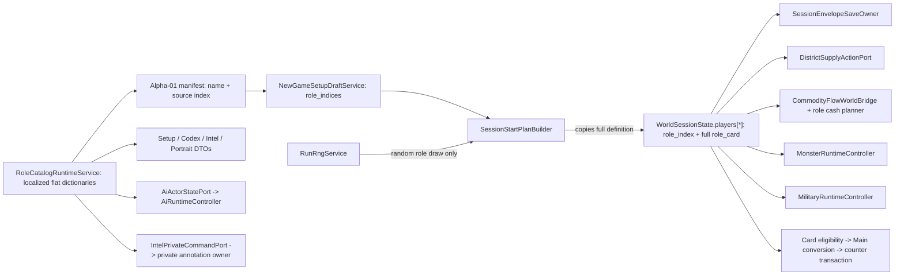

# Role and Passive Semantic Audit (Wave 1, Subagent F)

## Audit identity

- Baseline: `29dac1dd47b04afa60c1d867a0bbe5c5c4d94d0c`
- Branch: `codex/semantic-program-wave1-role-29dac1d`
- Audit date: `2026-07-26`
- Frozen semantic contract: `docs/cards/card_semantic_phase1_frozen_contract.md`
- Scope: role catalog, role/static identity, setup selection, live/save identity, public DTOs, AI role reads, passive trigger/application paths, privacy, RNG, persistence, and replay compatibility.
- Production changes: none. Test assertions changed: none.
- Owned artifacts: this report and `reports/semantic_program/role_passive_semantic_audit.json` only.
- Method: source-level tracing from the sole role catalog into active content selection, setup, session construction, world/save state, public projections, AI, diagnostics, and every mechanical passive field. Tests and migration records were used only as compatibility evidence, never as rule authority.

## Executive verdict

The current role system is an ordered, localized, flat dictionary catalog rather than a stable semantic catalog. It has 24 roles and no authored `role_id`. Array offset plus Chinese display name is used as setup, runtime, AI, Codex, save, and compatibility identity. The full static role definition is then copied into each live player and formal save, where most gameplay executors read it as if it were live authoritative state.

The catalog has 15 distinct mechanical fields and 55 field occurrences, representing 12 passive families and 43 role/family assignments. Nine families have an effect or capability path, one is production-fail-closed, and two have no active application path. None of the 12 has an active role-specific mechanic entry or an authoritative v0.6 rule section. Every family is therefore `RULE_AUTHORITY_NOT_ESTABLISHED`, even where a related domain transaction is valid and should be kept.

The safe target is a separate `RoleSemanticSpec`, not a role variant of `CardSemanticSpec`. It should share only the semantic kernel protocol: exact closed schemas, canonical JSON fingerprints, detached pure data, fail-closed compilation, cache semantics, zero-RNG compilation, and no persistence. Event-driven passive effects should produce ephemeral `PassiveTriggerExecutionPlan` values consumed by existing typed domain transactions. Static capabilities should use a typed role-capability projection. Neither boundary should own gameplay state, RNG, save state, AI weights, UI text, or mutation.

Migration implementation is **not ready** until the rule authority gate is resolved. Audit and migration design are ready.

## Counts

| Inventory | Count | Evidence |
| --- | ---: | --- |
| Catalog roles | 24 | `scripts/runtime/role_catalog_runtime_service.gd:6`, `scripts/runtime/role_catalog_runtime_service.gd:37-261` |
| Required localized/editorial fields | 5 | `scripts/runtime/role_catalog_runtime_service.gd:7-13` |
| Distinct flat mechanical fields | 15 | `scripts/runtime/role_catalog_runtime_service.gd:20-35` |
| Mechanical field occurrences | 55 | Counted only inside `_CATALOG`, `scripts/runtime/role_catalog_runtime_service.gd:37-261` |
| Passive families | 12 | Grouping below; paired/triplet fields are one family |
| Role/passive-family assignments | 43 | Sum of family definition counts below |
| Alpha-01 selected roles | 8 | `resources/content/alpha01/alpha01_content_manifest.tres:15-16` |
| Alpha-01 mechanical field occurrences | 18 | Selected source indices `0,1,2,3,9,16,21,22` |
| Alpha-01 distinct mechanical fields | 11 | All except city reveal, guess reward, public exclusion, and monster-card counter |
| Alpha-01 passive families | 8 | Opening cash, bonus card, matching-sale cash, monster-upgrade cash, residual catalog, volatility sale, monster cap, military cap |
| Localized gameplay `match role_name` branches | 0 | Exact 24 names occur outside the catalog only in active-content data; no gameplay name match found |
| Tooling-only localized `match role_name` branches | 1 | `scripts/tools/role_portrait_render_rig.gd:585-613` |
| Localized identity/lookup boundaries | 8 | Catalog, content manifest, runtime selection, AI, save, Codex, portraits, monster-upgrade receipt |
| Fabricated role-rank assignments | 3 source assignments across 2 UI pipelines | `scripts/runtime/new_game_setup_viewer_query_port.gd:161-162`; `scripts/presentation/compendium_readonly_query_port.gd:87-99`; `scripts/runtime/codex_public_snapshot_service.gd:30-35` |
| Kind/field special-case patterns | 7 | Inventory below |
| Public role DTO/projection pipelines | 7 | Catalog, setup, Codex, table seat, AI, Intel, portrait |
| Finding dispositions | 13 MOVE / 6 REMOVE / 8 KEEP | 27 findings below |

### Flat field inventory

| Field | Catalog occurrences | Alpha-01 occurrences | Observed application |
| --- | ---: | ---: | --- |
| `starting_cash_bonus` | 16 | 6 | Active at session construction |
| `bonus_card_product` | 4 | 1 | Active after a region purchase |
| `resource_cash_product` | 10 | 2 | Active on matching sale receipts |
| `resource_cash_amount` | 10 | 2 | Active on matching sale receipts |
| `monster_upgrade_cash` | 2 | 1 | Active during owned-monster rank increase |
| `intel_city_reveal_charges` | 1 | 0 | No role application path |
| `city_guess_reward_bonus` | 2 | 0 | No active transaction; orphaned Main formatter only |
| `card_history_residual_catalog_charges` | 2 | 1 | Active, viewer-private command/state |
| `card_history_public_exclusion_charges` | 2 | 0 | Production entry always fails closed |
| `high_volatility_sale_threshold` | 1 | 1 | Active sale-receipt plan |
| `high_volatility_first_sale_bonus` | 1 | 1 | Active sale-receipt plan |
| `high_volatility_bonus_once_per_market_cycle` | 1 | 1 | Active sale-receipt plan |
| `monster_control_limit_bonus` | 1 | 1 | Active capability read |
| `military_control_limit_bonus` | 1 | 1 | Active capability read |
| `monster_cards_as_counter` | 1 | 0 | Active eligibility plus legacy Main conversion |

Three starting-cash values are not stated in their own localized passive text: 孪星兽栏同盟 `+30`, 蜂巢防务议会 `+30`, and 悖论兽契社 `+40` (`scripts/runtime/role_catalog_runtime_service.gd:235-258`). Setup displays `passive` directly (`scripts/runtime/new_game_setup_viewer_query_port.gd:112-119`), so those visible role choices omit a value that session construction applies.

All ten `resource_cash_*` definitions describe a city/facility per-minute bonus in text (`scripts/runtime/role_catalog_runtime_service.gd:48-55`, `scripts/runtime/role_catalog_runtime_service.gd:58-65`, `scripts/runtime/role_catalog_runtime_service.gd:76-83`, `scripts/runtime/role_catalog_runtime_service.gd:95-102`, `scripts/runtime/role_catalog_runtime_service.gd:154-181`, `scripts/runtime/role_catalog_runtime_service.gd:196-213`, `scripts/runtime/role_catalog_runtime_service.gd:225-232`). Execution instead credits once for every owned matching commodity sale receipt, without checking city ownership, city containment, facility containment, or elapsed minute (`scripts/runtime/role_resource_cash_settlement_runtime_service.gd:20-53`). This is a semantic mismatch, not merely an alias.

### Role-by-role catalog inventory

Indices are the current zero-based array offsets, not valid future identity. `Alpha` means the role is reachable through the current Alpha-01 setup selection.

| Index | Localized role | Alpha | Mechanical declarations | Current result / audit note | Evidence |
| ---: | --- | --- | --- | --- | --- |
| 0 | 环港走私议会 | yes | opening `+80`; region bonus card for 环晶电池 | Both paths active | `scripts/runtime/role_catalog_runtime_service.gd:38-46` |
| 1 | 深海菌毯使团 | yes | opening `+80`; 深海菌毯 cash `55` | Active sale-receipt path; text says city/minute | `scripts/runtime/role_catalog_runtime_service.gd:47-56` |
| 2 | 重力矿联董事会 | yes | opening `+90`; 重力陶瓷 cash `45` | Active sale-receipt path; text says city/minute | `scripts/runtime/role_catalog_runtime_service.gd:57-66` |
| 3 | 离子军购局 | yes | monster-upgrade cash `160` | Active through monster/cash transaction | `scripts/runtime/role_catalog_runtime_service.gd:67-74` |
| 4 | 光合修复会 | no | opening `+120`; 光合凝胶 cash `40` | Not setup-selected; sale path would disagree with city/minute text | `scripts/runtime/role_catalog_runtime_service.gd:75-84` |
| 5 | 虹膜数据券商 | no | opening `+60`; region bonus card for 活体芯片 | Not setup-selected; both paths wired | `scripts/runtime/role_catalog_runtime_service.gd:85-93` |
| 6 | 星鲸餐饮垄断 | no | 星鲸罐头 cash `50`; monster-upgrade cash `60` | Not setup-selected; sale text mismatch plus active upgrade path | `scripts/runtime/role_catalog_runtime_service.gd:94-103` |
| 7 | 静电蜂巢银行 | no | region bonus card for 静电蜂蜜 | Not setup-selected; grant path wired | `scripts/runtime/role_catalog_runtime_service.gd:104-111` |
| 8 | 星图审计庭 | no | city reveal charges `2`; city-guess reward `40` | Neither role effect has an active transaction | `scripts/runtime/role_catalog_runtime_service.gd:112-120` |
| 9 | 幽幕播报社 | yes | residual-frame catalog charges `2` | Active viewer-private command/state | `scripts/runtime/role_catalog_runtime_service.gd:121-128` |
| 10 | 双边密约公证团 | no | residual-frame catalog charges `2` | Not setup-selected; private command path wired | `scripts/runtime/role_catalog_runtime_service.gd:129-136` |
| 11 | 碎光私探行会 | no | public-evidence exclusion charges `3` | Production command correctly fails closed | `scripts/runtime/role_catalog_runtime_service.gd:137-144` |
| 12 | 星门补给商会 | no | opening `+40` | Not setup-selected; passive prose also restates a universal market rule | `scripts/runtime/role_catalog_runtime_service.gd:145-152` |
| 13 | 赤环航运托拉斯 | no | opening `+50`; 风暴珍珠 cash `35` | Not setup-selected; sale text mismatch | `scripts/runtime/role_catalog_runtime_service.gd:153-162` |
| 14 | 霓虹需求剧院 | no | 梦境香氛 cash `45`; region bonus card for 梦境香氛 | Not setup-selected; sale text mismatch; grant path wired | `scripts/runtime/role_catalog_runtime_service.gd:163-172` |
| 15 | 极昼农业云 | no | opening `+110`; 星露莓 cash `35`; city-guess reward `20` | Not setup-selected; sale text mismatch; reward has no transaction | `scripts/runtime/role_catalog_runtime_service.gd:173-183` |
| 16 | 黑潮风险基金 | yes | opening `+70`; volatility threshold `12`; first-sale cash `40`; once/cycle | Active cycle-keyed sale plan | `scripts/runtime/role_catalog_runtime_service.gd:184-194` |
| 17 | 白噪安保公司 | no | opening `+40`; 轨迹墨水 cash `40` | Not setup-selected; text says owned regional facilities/minute, code checks sale only | `scripts/runtime/role_catalog_runtime_service.gd:195-204` |
| 18 | 钛壳互助清算所 | no | opening `+60`; 钛壳贝 cash `55` | Not setup-selected; sale text mismatch | `scripts/runtime/role_catalog_runtime_service.gd:205-214` |
| 19 | 暗礁公证黑市 | no | opening `+30`; public-evidence exclusion charges `1` | Not setup-selected; exclusion fails closed | `scripts/runtime/role_catalog_runtime_service.gd:215-223` |
| 20 | 太阳鳞片王朝 | no | opening `+150`; 太阳鳞片 cash `30` | Not setup-selected; sale text mismatch | `scripts/runtime/role_catalog_runtime_service.gd:224-233` |
| 21 | 孪星兽栏同盟 | yes | monster cap `+1`; opening `+30` | Cap active; opening bonus omitted from passive prose | `scripts/runtime/role_catalog_runtime_service.gd:234-242` |
| 22 | 蜂巢防务议会 | yes | military cap `+1`; opening `+30` | Cap active; opening bonus omitted from passive prose | `scripts/runtime/role_catalog_runtime_service.gd:243-251` |
| 23 | 悖论兽契社 | no | monster-card counter conversion; opening `+40` | Legacy Main conversion wired; opening bonus omitted from passive prose | `scripts/runtime/role_catalog_runtime_service.gd:252-260` |

### Kind and field special cases

1. `kind="player_role"` is injected into a copied definition at session construction rather than authored as stable identity (`scripts/runtime/session_start_plan_builder.gd:175-181`).
2. Alpha validation defines every key outside five editorial fields as a mechanical passive, then searches consumer source text for field tokens (`resources/content/alpha01/alpha01_content_manifest.gd:79-142`, `resources/content/alpha01/alpha01_content_manifest.gd:625-674`).
3. Main maintains a manual role-field copy allowlist with both cash aliases and every passive field (`scripts/main.gd:2840-2860`).
4. AI assigns strategy through direct checks for three flat role terms rather than stable passive operations (`scripts/runtime/ai_runtime_controller.gd:5245-5261`, `scripts/runtime/ai_runtime_controller.gd:8719-8724`).
5. Codex assigns route, economy, intel, control, opening, and privacy meaning from field presence (`scripts/runtime/codex_public_snapshot_service.gd:212-276`).
6. Counter conversion is a cross-domain conjunction of one role bool, `skill.kind == "monster_card"`, and live response facts (`scripts/runtime/card_play_eligibility_runtime_service.gd:473-478`).
7. Formal save validates `role_card` only as a dictionary after checking index/name, so arbitrary special fields survive load (`scripts/runtime/world_session_envelope_codec.gd:448-478`).

## Authority gate

The rulebook declares itself the active authority (`docs/tabletop_rulebook_v06.md:3-7`). The active README explicitly places the old role pool in the historical v0.4 migration inventory (`README.md:23-28`). The mechanic registry contains no role or role-passive mechanic (`docs/rules/v06_mechanic_status_registry.json:1-24`). Production code and tests cannot establish missing product rules.

Related clauses do not authorize the role-specific deltas:

- The rulebook mentions that a role ability may raise ordinary submissions, but defines no role catalog or value (`docs/tabletop_rulebook_v06.md:388`). The runtime directive then says only an authoritative organization capability may raise that cap (`docs/rules_v06_runtime_directive.md:218-222`).
- Base monster/military ownership caps are one each; only organization gradients are specified (`docs/tabletop_rulebook_v06.md:394-406`).
- Direct-player interactions use one counter layer (`docs/tabletop_rulebook_v06.md:434-440`; mechanic `card_counter_response`), but no clause authorizes converting a monster card by role.
- Commodity sale receipts and their settlement order are authoritative (`docs/rules_v06_runtime_directive.md:121-139`, `docs/rules_v06_runtime_directive.md:165-179`), but no clause grants role cash on those receipts.

### Passive-family authority and impact

`Observed owner` names the current runtime route. It does not elevate that route to rule authority.

| Passive family | Definitions | Active rule section | Authoritative role owner | Observed runtime owner/path | Classification | Privacy / RNG / save impact |
| --- | ---: | --- | --- | --- | --- | --- |
| Opening cash modifier | 16 | `RULE_AUTHORITY_NOT_ESTABLISHED` | `RULE_AUTHORITY_NOT_ESTABLISHED` | `SessionStartPlanBuilder` computes; `WorldSessionState` owns cash (`scripts/runtime/session_start_plan_builder.gd:169-205`) | MOVE | Modifier is public; exact cash becomes private. Zero effect RNG. Saved four ways: full role field, base, delta, total, plus cash. |
| Product-region bonus card | 4 | `RULE_AUTHORITY_NOT_ESTABLISHED` | `RULE_AUTHORITY_NOT_ESTABLISHED` | `DistrictSupplyActionPort -> CommodityCardInventoryRuntimeController` (`scripts/runtime/district_supply_action_port.gd:351-400`) | MOVE | Trigger/product public; actor, granted card, hand private. Passive consumes zero RNG and selects first eligible public rack ID. Grant journal persists. |
| Matching-product sale cash | 10 | `RULE_AUTHORITY_NOT_ESTABLISHED` | `RULE_AUTHORITY_NOT_ESTABLISHED` | `RoleResourceCashSettlementRuntimeService -> CommodityFlowWorldBridge -> WorldSessionState` (`scripts/runtime/role_resource_cash_settlement_runtime_service.gd:20-53`; `scripts/runtime/commodity_flow_world_bridge.gd:168-190`) | MOVE | Reward/cash private; no new public receipt fields. Zero RNG. Cash and exact-once ledger persist. Current trigger disagrees with text. |
| Monster-upgrade cash | 2 | `RULE_AUTHORITY_NOT_ESTABLISHED` | `RULE_AUTHORITY_NOT_ESTABLISHED` | `MonsterRuntimeController -> PlayerCashMutationPort` (`scripts/runtime/monster_runtime_controller.gd:3968-4005`, `scripts/runtime/monster_runtime_controller.gd:6454-6490`) | MOVE | Source card/actor should remain anonymous; public role-label callout can identify the unique role holder. Zero RNG. Cash/ledger persist. |
| City-owner reveal charges | 1 | `RULE_AUTHORITY_NOT_ESTABLISHED` | `RULE_AUTHORITY_NOT_ESTABLISHED` | None for roles; card-only reveal owner exists | REMOVE | Intended viewer-private truth. Zero RNG. No role usage state exists; only city inference state is saved. Must remain unavailable. |
| City-guess reward bonus | 2 | `RULE_AUTHORITY_NOT_ESTABLISHED` | `RULE_AUTHORITY_NOT_ESTABLISHED` | No transaction; no static caller of orphaned Main formatter (`scripts/main.gd:1825-1861`) | REMOVE | Guesses/private truth are sensitive; a final cash mutation would need explicit reveal/settlement policy. Zero RNG. No reward receipt exists. |
| Residual-frame catalog charges | 2 | `RULE_AUTHORITY_NOT_ESTABLISHED` | `RULE_AUTHORITY_NOT_ESTABLISHED` | `IntelPrivateCommandPort -> CardHistoryPrivateAnnotationService` (`scripts/runtime/intel_private_command_port.gd:115-145`; `scripts/runtime/card_history_private_annotation_service.gd:181-188`, `scripts/runtime/card_history_private_annotation_service.gd:255-264`) | MOVE | Strictly viewer-private; public evidence only. Zero RNG. Usage and annotations persist in `card_history_private_annotations`. |
| Public-evidence exclusion charges | 2 | `RULE_AUTHORITY_NOT_ESTABLISHED` | `RULE_AUTHORITY_NOT_ESTABLISHED` | Production wrapper always fails closed (`scripts/runtime/card_history_private_annotation_service.gd:191-197`) | REMOVE | Viewer-private. Zero RNG. Dormant lower-level usage state exists, but production cannot establish an impossible suspect. |
| First high-volatility sale per cycle | 1 | `RULE_AUTHORITY_NOT_ESTABLISHED` | `RULE_AUTHORITY_NOT_ESTABLISHED` | Same sale planner/atomic bridge (`scripts/runtime/role_resource_cash_settlement_runtime_service.gd:67-107`) | MOVE | Volatility is public; actor/reward cash private. Zero RNG. Cycle-keyed ledger persists. |
| Monster ownership cap +1 | 1 | `RULE_AUTHORITY_NOT_ESTABLISHED` | `RULE_AUTHORITY_NOT_ESTABLISHED` | `MonsterRuntimeController` (`scripts/runtime/monster_runtime_controller.gd:4027-4047`, `scripts/runtime/monster_runtime_controller.gd:4100-4102`, `scripts/runtime/monster_runtime_controller.gd:6945-6961`) | MOVE | Public capability; live hidden ownership/targets remain protected. Zero RNG. Unit state persists elsewhere; saved role copy supplies the cap. |
| Military ownership cap +1 | 1 | `RULE_AUTHORITY_NOT_ESTABLISHED` | `RULE_AUTHORITY_NOT_ESTABLISHED` | `MilitaryRuntimeController` (`scripts/runtime/military_runtime_controller.gd:458-485`, `scripts/runtime/military_runtime_controller.gd:604-644`) | MOVE | Public capability; private command source remains private. Zero RNG. Unit state persists elsewhere; saved role copy supplies the cap. |
| Monster card as counter | 1 | `RULE_AUTHORITY_NOT_ESTABLISHED`; related response mechanic only: section 8 / `card_counter_response` | `RULE_AUTHORITY_NOT_ESTABLISHED` for conversion; counter transaction owner remains valid | `CardPlayEligibility* -> Main._queue_monster_card_as_counter -> card queue/counter settlement` (`scripts/runtime/card_play_eligibility_world_bridge.gd:108-146`; `scripts/main.gd:4086-4125`) | MOVE | Role permission public; source hand card and responder private. Zero RNG. Current temporary skill carries `source_card_name` into queue state and can leak through history/save. |

## Consumer graph



This graph has two semantic sources after load: AI/Codex/intel limits resolve the current catalog, while most gameplay passives resolve the saved `player.role_card`. A catalog balance edit can therefore make AI/UI reason about one value while a loaded game executes another.

### Public DTO and projection audit

| Pipeline | Current payload/interpretation | Privacy result | Disposition and evidence |
| --- | --- | --- | --- |
| Catalog public definition | Returns localized identity, prose, and every mechanical flat field | Static role data is public; no live viewer state | MOVE to separate semantic and player-face projections (`scripts/runtime/role_catalog_runtime_service.gd:297-305`) |
| Setup seat snapshot | Reads definition by index, exposes raw passive text, creates fake role card/rank | AI role may remain random until start; starter monster is separately redacted | MOVE DTO and REMOVE fake rank (`scripts/runtime/new_game_setup_viewer_query_port.gd:78-119`, `scripts/runtime/new_game_setup_viewer_query_port.gd:161-170`) |
| Compendium / Role Codex | Passes a mechanical allowlist, then infers route/economy/intel/control/privacy text | Public-only adapter rejects obvious private keys, but interpretation is duplicated | MOVE to `RolePlayerFaceDTO` (`scripts/runtime/role_codex_public_source_adapter.gd:4-41`; `scripts/runtime/codex_public_snapshot_service.gd:13-74`, `scripts/runtime/codex_public_snapshot_service.gd:212-276`) |
| Table seat projection | Copies full role card only long enough to derive localized `role_name`, then erases it | No cash/hand/passive fields reach the public seat row | Keep privacy behavior; MOVE identity to role ID (`scripts/presentation/world_session_presentation_query.gd:33-46`; `scripts/runtime/player_seat_public_source_service.gd:37-60`) |
| AI public role projection | Public roster carries index/name; port rehydrates the full current catalog definition | Role is public and no rival private state is added | MOVE to neutral role semantics (`scripts/runtime/ai_actor_state_port.gd:137-225`, `scripts/runtime/ai_actor_state_port.gd:660-713`) |
| Intel dossier | Resolves current viewer role by public index and exposes name/passive tooltip next to viewer-private annotations | Authorization and annotation privacy stay in their owners | MOVE static role lookup to typed role projection (`scripts/presentation/intel_dossier_viewer_query_port.gd:307-314`; `scripts/runtime/intel_dossier_public_snapshot_service.gd:108-123`) |
| Portrait projection | Uses localized role name as manifest/cache key | Art is public, but localization becomes identity | MOVE key to stable role ID (`scripts/presentation/role_portrait_catalog.gd:36-72`, `scripts/presentation/role_portrait_catalog.gd:124-148`) |

## Findings

Each finding has exactly one disposition. `KEEP` is reserved for real state machines, transactions, or compatibility transactions; it never blesses the flat role semantics they currently consume.

| ID | Class | Finding and exact evidence | Required treatment |
| --- | --- | --- | --- |
| RP-001 | MOVE | No stable `role_id`; `definition_by_name/index_by_name` use localized `name`, and validation calls save identity `legacy_role_index_and_chinese_name` (`scripts/runtime/role_catalog_runtime_service.gd:268-294`, `scripts/runtime/role_catalog_runtime_service.gd:308-339`). | Introduce stable ASCII role IDs in role data and use localized names only through PlayerFace/localization refs. |
| RP-002 | MOVE | Static identity, localized prose, and 15 mechanics share one dictionary; `public_definition_at` allowlists all of them (`scripts/runtime/role_catalog_runtime_service.gd:7-35`, `scripts/runtime/role_catalog_runtime_service.gd:297-305`). | Move static machine meaning into `RoleSemanticSpec`; keep editorial/player text in a separate authored player block/projection. |
| RP-003 | MOVE | Alpha selection and setup identity are parallel names and source indices; draft state is `role_indices`, and random/unique selection operates on offsets (`resources/content/alpha01/alpha01_content_manifest.tres:15-16`; `scripts/runtime/new_game_setup_draft_service.gd:42-64`, `scripts/runtime/new_game_setup_draft_service.gd:153-216`). | Migrate manifests/drafts to stable role IDs. Preserve list ordering only as presentation/acquisition order. |
| RP-004 | REMOVE | Session construction copies the complete definition into live `role_card` and adds `kind`, `role_index`, and localized `text`; player also duplicates `role_index` and cash derivations (`scripts/runtime/session_start_plan_builder.gd:169-205`). Formal save requires and serializes the full dictionary (`scripts/runtime/world_session_envelope_codec.gd:26-90`, `scripts/runtime/world_session_envelope_codec.gd:389-411`). | Remove static role definitions from player state/save after compatibility migration. Live state stores stable role assignment and true mutable usage only. |
| RP-005 | KEEP | Formal save is an atomic composite with preflight, checkpoints, ordered apply, and rollback (`scripts/runtime/session_envelope_save_owner.gd:31-64`, `scripts/runtime/session_envelope_save_owner.gd:67-104`, `scripts/runtime/session_envelope_save_owner.gd:107-160`). | Keep the transaction and a bounded legacy reader; change its role payload through an explicit schema migration, never a silent fallback. |
| RP-006 | MOVE | Setup, Role Codex, and Intel each rebuild separate role DTOs from raw fields/prose (`scripts/runtime/new_game_setup_viewer_query_port.gd:78-119`; `scripts/runtime/role_codex_public_source_adapter.gd:22-41`; `scripts/runtime/intel_dossier_public_snapshot_service.gd:108-123`). | Add one sanitized `RolePlayerFaceDTO` projection from `RoleSemanticSpec` plus authored localization. |
| RP-007 | REMOVE | Roles have no rank, yet setup writes `rank="R"`, Compendium writes species into rank, and Codex overwrites face rank with species (`scripts/runtime/new_game_setup_viewer_query_port.gd:161-162`; `scripts/presentation/compendium_readonly_query_port.gd:87-99`; `scripts/runtime/codex_public_snapshot_service.gd:30-35`). | Remove role rank/cost aliases. Roles are unranked public identities. |
| RP-008 | MOVE | AI fetches a current catalog definition by role index/name, then directly scores `resource_cash_*` and `bonus_card_product` with policy constants (`scripts/runtime/ai_actor_state_port.gd:214-225`; `scripts/runtime/ai_runtime_controller.gd:5245-5261`, `scripts/runtime/ai_runtime_controller.gd:8719-8724`). | Give AI a neutral role-semantic projection; keep policy weights in AI. Do not place `155`, `120`, or `65` in semantics. |
| RP-009 | REMOVE | Codex invents route/privacy/opening meaning from field presence (`scripts/runtime/codex_public_snapshot_service.gd:212-276`). Diagnostics assigns 12 ad hoc role-budget rules/multipliers (`scripts/runtime/gameplay_balance_diagnostics_runtime_service.gd:357-391`). | Remove field-presence semantic inference. Rebuild display and diagnostics from stable op/keyword IDs; diagnostics remain non-authoritative. |
| RP-010 | MOVE | Opening cash accepts both `starting_cash_delta` and `starting_cash_bonus`; only the latter is authored, while Main also carries the alias (`scripts/runtime/session_start_plan_builder.gd:190-198`; `scripts/main.gd:2738-2749`). | Compile one `modify_initial_cash` op and plan it in session start. Do not expose aliases. |
| RP-011 | KEEP | Session start preflights RNG/world/runtime/session, checkpoints all owners, commits RNG once, and rolls all of it back on failure (`scripts/runtime/session_start_transaction_coordinator.gd:40-129`, `scripts/runtime/session_start_transaction_coordinator.gd:148-165`). | Keep this transaction and RunRng custody. Role semantics consume no RNG; random role selection remains a setup transaction concern. |
| RP-012 | MOVE | Bonus-card logic runs after purchase commit, ignores its result, deterministically selects a rack ID, and starts a second grant transaction (`scripts/runtime/district_supply_action_port.gd:320-354`, `scripts/runtime/district_supply_action_port.gd:357-400`). | Produce a typed post-purchase passive plan with explicit success/failure policy and receipt lineage. Do not hide a failed promised benefit. |
| RP-013 | KEEP | Inventory purchase/grant operations are typed, transaction-ID-bound, collision-checked, replayable, and journaled (`scripts/runtime/commodity_card_inventory_runtime_controller.gd:470-545`, `scripts/runtime/commodity_card_inventory_runtime_controller.gd:851-876`). | Keep as the mutation sink for bonus-card requests. |
| RP-014 | MOVE | Matching-sale and volatility semantics are inferred from five flat fields inside a role-specific planner (`scripts/runtime/role_resource_cash_settlement_runtime_service.gd:9-17`, `scripts/runtime/role_resource_cash_settlement_runtime_service.gd:20-53`, `scripts/runtime/role_resource_cash_settlement_runtime_service.gd:67-107`). | Move trigger/conditions/effect amounts to compiled passive ops; emit typed cash-credit requests keyed to source sale receipt/cycle. |
| RP-015 | KEEP | Commodity settlement composes sale, role, rent, bankruptcy, ledger, and player replacement atomically (`scripts/runtime/commodity_flow_world_bridge.gd:130-244`). | Keep the transaction. It consumes validated passive plans but does not infer role fields. |
| RP-016 | MOVE | Monster upgrade checks a flat role field inside the unit controller and commits cash before mutating the monster (`scripts/runtime/monster_runtime_controller.gd:3968-4005`, `scripts/runtime/monster_runtime_controller.gd:6454-6489`). | Build one prepared passive plan inside the monster-upgrade transaction; remove role-definition reads and role-name receipt identity. |
| RP-017 | KEEP | `PlayerCashMutationPort` owns no balance, uses the saved player ledger for exact-once replay, validates command fingerprints, and atomically replaces the player record (`scripts/runtime/player_cash_mutation_port.gd:5-17`, `scripts/runtime/player_cash_mutation_port.gd:224-375`). | Keep as cash sink. New requests use stable `role_id/passive_id`, never index-derived `role.%02d`. |
| RP-018 | MOVE | Intel command routing accepts a free-form field name, looks up the current catalog by role index, then supplies a maximum to the annotation owner (`scripts/runtime/intel_private_command_port.gd:115-145`, `scripts/runtime/intel_private_command_port.gd:206-216`). | Replace field-name lookup with typed role capability/passive IDs and bind usage to session role identity/revision. |
| RP-019 | KEEP | Private annotation service owns viewer-scoped annotations and role usage, consumes only public evidence, increments charges only on change, validates save limits, and persists privately (`scripts/runtime/card_history_private_annotation_service.gd:5-21`, `scripts/runtime/card_history_private_annotation_service.gd:120-128`, `scripts/runtime/card_history_private_annotation_service.gd:181-197`, `scripts/runtime/card_history_private_annotation_service.gd:255-293`, `scripts/runtime/card_history_private_annotation_service.gd:325-440`). | Keep the state machine and save section. It must consume authorized capability terms, not own role definitions. |
| RP-020 | REMOVE | `intel_city_reveal_charges` has no role consumer; `city_guess_reward_bonus` reaches only an orphaned Main formatter; public exclusion production always fails closed (`scripts/main.gd:1825-1861`; `scripts/runtime/card_history_private_annotation_service.gd:191-197`). | Remove executable/readiness claims for these families. Reintroduce only after rule authority and typed owners exist. |
| RP-021 | MOVE | Monster and military controllers calculate base `1 + flat bonus` themselves (`scripts/runtime/monster_runtime_controller.gd:4100-4102`; `scripts/runtime/military_runtime_controller.gd:482-485`). | Move modifier meaning to a typed capability projection; controllers remain the only owners of unit-state legality. |
| RP-022 | KEEP | Monster summon/takeover and military deploy paths are real state machines enforcing counts and transitions (`scripts/runtime/monster_runtime_controller.gd:4027-4067`, `scripts/runtime/monster_runtime_controller.gd:6945-6970`; `scripts/runtime/military_runtime_controller.gd:458-485`, `scripts/runtime/military_runtime_controller.gd:604-644`). | Keep them. They query a role capability snapshot and never parse a role definition. |
| RP-023 | REMOVE | Main temporarily replaces a live hand slot with a fabricated counter card, embeds `source_card_name` and localized text, submits, then tries to restore on rejection (`scripts/main.gd:4086-4125`). | Delete this rewrite during counter migration. Submit a typed conversion intent referencing the authorized source card instance. |
| RP-024 | MOVE | Eligibility flattens a role bool into world facts, then special-cases `monster_card` during an active counter window (`scripts/runtime/card_play_eligibility_world_bridge.gd:108-146`; `scripts/runtime/card_play_eligibility_runtime_service.gd:329-341`, `scripts/runtime/card_play_eligibility_runtime_service.gd:473-478`). | Move permission to a typed role capability; card legality consumes it without modifying `CardSemanticSpec`. |
| RP-025 | KEEP | Counter window and settlement are explicit state/transactions with queue removal, commitment finalization, history, public aftermath, and idempotent target settlement (`scripts/runtime/card_resolution_runtime_controller.gd:169-208`, `scripts/runtime/card_resolution_runtime_controller.gd:339-355`; `scripts/runtime/card_counter_settlement_runtime_service.gd:36-113`). | Keep. The role layer may authorize a source-card conversion intent, but cannot own the response window or settlement. |
| RP-026 | REMOVE | Alpha validation treats every non-editorial key as a passive and proves support by searching source files for tokens, not by schema/owner contracts (`resources/content/alpha01/alpha01_content_manifest.gd:625-674`). | Remove token-presence authority/readiness checks. Validate stable passive IDs, op schemas, authority status, and composed owner capabilities. |
| RP-027 | MOVE | Codex resolves a supposedly stable item ID through `role:index` or localized name; portrait cache keys by localized name; monster-upgrade receipts fabricate `role.%02d` and carry the localized label (`scripts/presentation/compendium_readonly_query_port.gd:281-290`; `scripts/presentation/role_portrait_catalog.gd:36-72`, `scripts/presentation/role_portrait_catalog.gd:124-148`; `scripts/runtime/monster_runtime_controller.gd:6464-6479`). | Key navigation, art, receipts, and caches by stable `role_id`; localization remains display-only. |

## Save and replay compatibility

Current formal save has two role-related persistence surfaces:

1. `world_session_state.players[*]` stores `role_index`, the complete `role_card`, `base_starting_cash`, `role_starting_cash_delta`, `starting_cash_total`, cash, and the transaction ledger (`scripts/runtime/world_session_envelope_codec.gd:26-90`).
2. `card_history_private_annotations.role_usage_by_viewer` stores residual/exclusion usage (`scripts/runtime/session_envelope_save_owner.gd:5-11`, `scripts/runtime/session_envelope_save_owner.gd:48-60`; `scripts/runtime/card_history_private_annotation_service.gd:325-400`).

The save validator hard-codes 24 roles and max index 23, requires `role_card.role_index == player.role_index`, then validates localized name against `ordered_role_names[index]` (`scripts/runtime/world_session_envelope_codec.gd:4-9`, `scripts/runtime/world_session_envelope_codec.gd:184-206`, `scripts/runtime/world_session_envelope_codec.gd:448-469`). It does **not** compare saved passive values with the current catalog; `role_card` is only required to be a dictionary (`scripts/runtime/world_session_envelope_codec.gd:472-478`). Consequences:

- Reordering or renaming a role rejects an otherwise valid save.
- Changing a passive value does not reject or migrate a save. Most gameplay executes the stale/saved value, while AI, Codex, and intel maxima can read the current value.
- A modified save can change most executable passive fields while retaining the expected index/name.
- No role catalog/version/fingerprint handshake is saved. The existing catalog hash uses ordinary `JSON.stringify`, not the frozen canonical JSON profile (`scripts/runtime/role_catalog_runtime_service.gd:342-346`).
- Replay lineage uses index/localized identity in monster-upgrade events (`scripts/runtime/monster_runtime_controller.gd:6464-6479`). Sale and grant transaction IDs are idempotent but do not identify the passive/spec fingerprint.

Migration policy:

- Keep a schema-bounded legacy reader mapping `(baseline catalog hash, role_index, exact legacy name)` to a stable role ID.
- New saves write only stable `role_id` per player plus one session-level `role_catalog_id`, ruleset ID, and source-definition fingerprint. The semantic cache/spec itself remains unsaved.
- Preserve already-materialized cash and exact-once ledgers; do not recompute starting cash or replay old rewards on load.
- Preserve private usage in its existing owner, but validate usage against the resolved role/passive ID during load.
- New passive receipts include stable `role_id`, `passive_id`, source receipt/ref, and plan fingerprint. Localized labels are presentation arguments only.
- If the referenced source catalog version cannot be resolved and no explicit migration exists, fail closed with backup guidance. Never silently bind an old save to the current array order.

## Proposed semantic boundary

### Shared semantic kernel protocol

`CardSemanticSpec` remains exactly frozen. Roles implement a sibling protocol and share only infrastructure:

- exact-key closed schemas and closed enums;
- recursive canonical JSON with lexicographically sorted dictionary keys, preserved array order, UTF-8, and lowercase SHA-256;
- source and semantic fingerprints omitted from their own hash inputs;
- pure detached data, defensive copies, and context-free compile cache keyed by `schema_version + source_definition_fingerprint`;
- unknown IDs/fields fail closed; recognized but unavailable operations may be `projection_only`;
- no `Node`, `Object`, `Resource`, `Callable`, method name, script path, localized rule text, AI score/weight, or live owner in a static spec;
- compile/cache/projection RNG delta zero, persistence `none`, no Main dependency, and no effect-router dependency.

This is a protocol, not a shared mega-schema. No role record, passive op, role capability, or role DTO is added to `CardSemanticSpec`.

### `RoleSemanticSpec`

Proposed exact top-level fields:

```text
schema_version
source_catalog_id
source_definition_fingerprint
semantic_fingerprint
identity: RoleIdentitySpec
passives: Array[RolePassiveSpec]
information_policy: RoleInformationPolicy
runtime_readiness_id
```

`RoleIdentitySpec` contains stable ASCII `role_id`, `role_kind_id=alien_syndicate`, `available_for_selection`, `uniqueness_scope_id=session`, and stable selection-pool IDs. It has no array index, display name, species text, cost, or rank.

`RolePassiveSpec` contains `passive_id`, closed `trigger_id`, closed `condition_id`, closed `effect_op_id`, exact typed `params`, `stacking_policy_id`, `usage_policy_id`, `visibility_policy_id`, `execution_owner_id`, and `runtime_readiness_id`. Suggested initial op IDs, all gated by rule authority, are:

```text
modify_initial_cash
grant_region_supply_card
credit_matching_sale_cash
credit_first_sale_cash_per_market_cycle
credit_monster_upgrade_cash
authorize_residual_catalog_use
authorize_public_exclusion_use
authorize_city_owner_reveal
modify_city_guess_reward
modify_monster_control_limit
modify_military_control_limit
authorize_monster_card_counter_conversion
```

`RoleInformationPolicy` declares stable identity/passive/live-value visibility policy IDs. It never authorizes a viewer. Public role identity and authored passive meaning may be public; exact cash, hand cards, responder identity, private annotations, hidden unit ownership, and AI policy remain in their existing visibility owners.

Localized role name/species/trait/flavor/passive copy belongs in authored player/localization data. A sibling `RolePlayerFaceDTO` should contain stable `role_id`, `surface_id`, message refs with typed arguments, ordered passive steps, keywords, portrait asset ID, information scope, and DTO fingerprint. It contains no fake rank/cost and no live legality or remaining charges unless a separate authorized live projection supplies them.

AI receives a neutral role projection derived from authorized public role semantics. Existing AI remains the sole owner of scoring and personality. No AI constants or explanation prose enter `RoleSemanticSpec`.

### `PassiveTriggerExecutionPlan`

This is an ephemeral typed plan, not a generic executor or state owner. Proposed exact fields:

```text
schema_version
plan_id
plan_fingerprint
role_id
passive_id
trigger_id
actor_ref
source_receipt_ref
source_revision
world_revision
condition_result_id
ordered_requests: Array[PassiveDomainRequest]
privacy_scope_id
persistence_effect_ids
rng_contract_id
```

Each `PassiveDomainRequest` has a closed `owner_id`, closed `request_kind`, stable idempotence key, and exact typed payload. It never carries a method name or callback. Family-specific planners create requests; existing transactions execute them:

- session start consumes `modify_initial_cash` while retaining its current RNG/checkpoint transaction;
- region purchase consumes `grant_region_supply_card` through the inventory transaction;
- commodity settlement consumes matching-sale and volatility credits in its atomic receipt batch;
- monster upgrade prepares its reward request inside the unit transition and commits through `PlayerCashMutationPort`;
- intel activation consumes a typed authorization term while `CardHistoryPrivateAnnotationService` keeps private usage state;
- monster/military controllers consume a pure capability projection, not an execution plan, for capacity checks;
- card eligibility consumes a pure counter-conversion capability and submits a typed conversion intent to the existing card transaction. It never rewrites a card or extends `CardSemanticSpec`.

For all current families, `rng_contract_id=none`. Random role assignment is not a passive and remains in `SessionStartTransactionCoordinator + RunRngService`. A future random passive must request an explicit domain-owned RNG draw through a preflight/commit transaction; the semantic compiler/planner still consumes no RNG itself.

The plan owns no usage counter, cash, hand, card instance, unit, queue, legality, save section, receipt journal, or mutation. Its cache, if any, is derived and disposable. Save records domain state/receipts and source catalog identity, never the plan cache.

## Migration batch order

1. **Authority gate.** Add explicit v0.6 rule clauses and mechanic-registry entries for each retained family. Resolve the resource-cash text/receipt conflict and the three undisclosed starting bonuses. Families without authority remain unavailable or migration-only.
2. **Stable authored identity.** Move the role catalog to versioned data with stable `role_id`, `passive_id`, machine/player separation, localization refs, and an immutable source fingerprint. Keep a legacy index/name map outside production semantics.
3. **Shared kernel and shadow compile.** Implement the domain-neutral canonicalization/validation/cache protocol, then a separate role compiler and `RoleSemanticSpec`. Compile in shadow mode; no gameplay consumer changes and zero RNG/save delta.
4. **Read-only projections.** Cut Codex, setup display, Intel role chips, Compendium navigation, portraits, diagnostics, and AI to typed role/player-face projections. Remove fake rank/cost and field-presence heuristics.
5. **Setup identity.** Change Alpha selection and setup draft from source indices/names to stable role IDs. Preserve unique selection and the exact RunRng checkpoint/commit behavior; record selected role IDs in the session-start receipt.
6. **Save/replay migration.** Add a dual-read legacy index/name mapper, new stable role assignment shape, catalog handshake, and stable passive receipt identity. Preserve materialized cash, transaction ledgers, and private usage. New writes stop embedding full role definitions.
7. **Opening-cash plan.** Migrate initial cash into a typed session-start passive plan while keeping the existing atomic session transaction.
8. **Receipt-driven cash plans.** Migrate matching-sale, volatility, and monster-upgrade rewards to typed plans and existing cash sinks. Correct trigger semantics only after authority resolves them.
9. **Region-purchase bonus plan.** Integrate the bonus grant with explicit receipt lineage and failure policy; keep inventory exact-once behavior.
10. **Capability cutover.** Migrate monster/military caps and charged intel maxima to typed capability projections; retain unit and private annotation state machines.
11. **Counter conversion.** Submit a typed source-card conversion intent through the existing counter transaction; delete the Main hand-slot rewrite and prevent source-card leakage.
12. **Deletion gate.** Remove flat passive fields, full saved `role_card`, `role_index` identity, localized-name lookups, source-token consumer checks, aliases, and orphaned unsupported fields after all production consumers and legacy saves are accounted for.

Every batch must prove no Main dependency growth, no duplicate execution, unchanged visibility, expected RNG delta, exact-once replay, save round trip, and fail-closed unknown passive IDs. No batch may use a legacy test failure to restore an unauthorized family.

## Readiness and residual risks

### Readiness

- Audit completeness: **READY**.
- Role semantic implementation: **BLOCKED BY RULE AUTHORITY**.
- Passive execution migration: **BLOCKED BY RULE AUTHORITY**.
- Existing domain transactions identified for preservation: **READY**.
- Production/test changes in this work: **NONE**.

### Highest risks

1. **Save-defined gameplay:** a saved/tampered full `role_card` can alter most passive execution while AI/UI read the current catalog.
2. **Authority absence:** all 12 role families lack an active rule section/mechanic ID; current code cannot be promoted as authority.
3. **Text/execution divergence:** ten per-minute city/facility passives execute per sale receipt, and three opening-cash bonuses are absent from setup passive text.
4. **Counter privacy:** temporary card rewriting carries the private source card name into queue-shaped state and uses Main.
5. **Non-atomic promised benefit:** bonus-card grant occurs after purchase and its failure is ignored.
6. **Localized/index compatibility:** reorder, rename, localization, art lookup, Codex deep links, AI identity, receipts, and saves are coupled.
7. **Unsupported catalog claims:** city reveal and guess reward have no role executor; public exclusion cannot establish a legal target and correctly fails closed.

## Conclusion

Role semantics should become a sibling of card semantics at the kernel-protocol level only. Stable role/passive IDs, typed projections, and ephemeral plans can eliminate localized identity, flat-field dispatch, duplicated save values, and UI/AI reinterpretation without moving gameplay ownership into a semantic service. The existing session, inventory, cash, commodity, intel, unit, counter, and save transactions are the valuable parts to retain. All role-specific meaning remains fail closed until active v0.6 authority is established.
